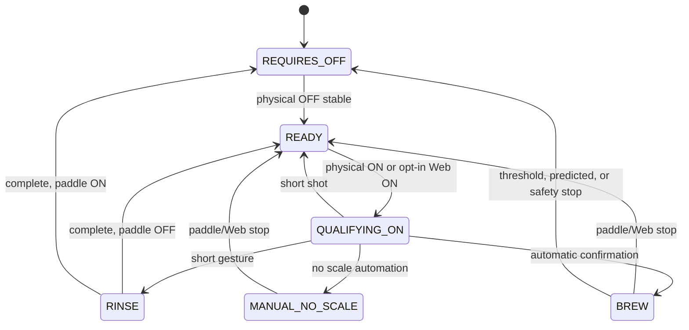
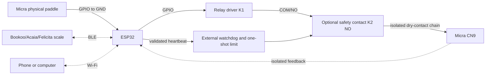

# Micra Shot Stopper

ESP32 firmware that controls the CN9 paddle circuit of a La Marzocco Micra
through an isolated relay contact and uses a compatible Bluetooth Low Energy
scale to automate an extraction by weight.

The Micra physical paddle **does not connect to CN9**: it connects only between
the configured ESP32 GPIO and GND. The relay COM/NO contact is the controller's
only connection to CN9. This lets the software read the paddle and control CN9
independently.

> **Safety notice:** verify continuity, isolation, module polarity, and that the
> relay remains open during startup, reset, and power loss. Complete the entire
> [manual test plan](docs/MANUAL_TEST_PLAN.md) before connecting the machine.
> This project cannot make an unsuitable relay module or unsafe wiring safe.

## Origin and goals

This project explicitly derives from
[tatemazer/AcaiaArduinoBLE](https://github.com/tatemazer/AcaiaArduinoBLE). The
derived library is kept in this repository as a local dependency, while Micra
Shot Stopper is now the main application.

The project was created to achieve these goals:

- Adapt the hardware specifically to the Micra by connecting the paddle to a
  GPIO and reading and actuating it independently from CN9, enabling full
  software control.
- Add features and parameterization, including reminder beeps to return the
  paddle to OFF.
- Remove workarounds such as double tare.
- Add a Web UI that displays status and can eventually publish sensors to
  other platforms such as Home Assistant.
- Remove the need to move the paddle to OFF for the stopper to work: software
  has full control of the hardware.
- Support lower-cost hardware, such as ESP32 boards with integrated magnetic
  relays.
- Provide a solution dedicated to the Micra and its paddle.
- Use more robust, resilient, and fault-tolerant workflows and state machines.
- Improve handling of exceptions and misuse scenarios.

## Main features

- Independent control of the physical paddle and CN9 contact.
- Safe startup: CN9 remains open until a stable physical paddle OFF state is
  detected.
- Short-gesture rinse, manual extraction, and automatic extraction by weight.
- Configurable operational limit and an absolute safety limit of 60 seconds
  for every path that closes CN9.
- Generation-based transactional closing: a timeout during arming invalidates
  the operation, so resumed execution can no longer energize the relay.
- Three timing defenses for CN9: an interrupt-driven GPTimer, `esp_timer`
  timers, and supervisor deadline verification.
- Explicit 5-second Task Watchdog for control, BLE, and network tasks; each
  task registers and feeds only itself after making progress.
- Optional external safety heartbeat and isolated CN9 feedback, with mismatch
  detection and `LOCKOUT`, for integration with a second physical K2 barrier.
- Redundant RTC record of relay commands and unsafe resets; a reset during
  CLOSE or three consecutive unsafe resets requires local recovery.
- Explicit weight-stream and control-authority states. A transient scale loss
  suspends by-weight control and can recover only after three coherent samples;
  it does not silently convert an automatic extraction into manual mode.
- Local Web UI with status, configuration, emergency stop, restart, Wi-Fi,
  factory reset, and a bounded diagnostic log. Virtual paddle and remote rinse
  are opt-in and disabled by default.
- Local BLE library for Acaia, Bookoo, and Felicita scales.
- Two independent WS2812B status indicators: one for scale health and one for
  stopper workflow and safety state.
- Host tests, coverage, and CI builds for ESP32 and ESP32-S3.

## Repository structure

```text
.
├── shotStopper/                    # Main stopper firmware and tests
│   └── shotStopper.ino
├── libraries/
│   └── AcaiaArduinoBLE/            # Local Arduino library and BLE tests
├── docs/
│   ├── audits/                     # Audit reports and remediation tracking
│   ├── plans/                      # Retained implementation plans
│   ├── MANUAL_TEST_PLAN.md
│   └── WIFI_WEB_UI_GUIDE.md
├── .github/workflows/ci.yml
└── LICENSE
```

`shotStopper/` is the main sketch; it is no longer published as a library
example. `libraries/AcaiaArduinoBLE/` follows the standard layout for a local
Arduino library and is included explicitly during compilation.

## Functional behavior

At startup, the relay is open. The controller must detect a stable physical
paddle OFF state before entering `READY`. From `READY`, moving the paddle to ON
closes CN9 and begins gesture qualification.

- Releasing it within the rinse gesture time starts a rinse. CN9 remains closed
  for the configured rinse duration, and subsequent paddle changes are ignored
  until the rinse ends.
- Holding it ON until the confirmation time starts an automatic extraction if
  scale automation was available when the cycle began; otherwise it becomes a
  manual cycle without a scale.
- Releasing it after the rinse window but before confirmation produces a short
  manual extraction and opens CN9.
- Releasing it during an automatic or manual extraction opens CN9 immediately.
- If the scale disconnects or its samples become stale during an automatic
  extraction, weight control is suspended. It recovers only on the current BLE
  generation after three coherent samples. Paddle OFF and timing limits remain
  authoritative throughout.
- After the configured minimum time, two fresh samples at or above
  `goal - offset` stop the extraction directly, independently of regression.
  Prediction remains an earlier stop mechanism. Timer-only mode retains timing
  and tare but disables both mechanisms and learning.
- Every path that closes CN9 is constrained by the configurable operational
  time and an absolute maximum of 60 seconds.



## Scale and prediction

The firmware uses the existing AcaiaArduinoBLE central BLE connection; it does
not expose a BLE configuration peripheral. During an automatic extraction, the
scale session starts with the cycle. A confirmed direct threshold of two fresh
samples at `target - learned offset` is authoritative after the minimum stop
time, while the predictor uses regression over the latest accepted samples to
stop earlier. Abrupt samples are still visible as observed weight but cannot
enter regression or learning. Post-drip analysis updates the offset only after
a continuous, anomaly-free control trajectory.

The status API distinguishes BLE connection, stream freshness and control
authority, and exposes observed versus accepted weight, connection generation,
packet sequence/gaps, rejected packets, reconnects and disconnect reason.

New configurations use a 1,500 ms rinse gesture and enable both the Bookoo
combined tare/start command and **Beep when brew is confirmed**. The latter
sends an independent Bookoo-compatible beep after an automatic extraction is
confirmed; it is ignored in timer-only mode, never tares the scale, and cannot
change BLE connection state.

The default **Scale reminder beep until the physical paddle is switched OFF**
option emits a safe beep every 15 seconds while the physical paddle GPIO is ON,
CN9 is open, and the scale is connected. It warns that the paddle was left ON
after an extraction ends. It is configured from the Web UI and produces sound
only on scales that support an independent beep command, without taring.

The library pins ArduinoBLE 2.1.0 and contains the robustness improvements
documented in the [remediation record](docs/audits/AUDIT_REMEDIATION.md). See
also the
[AcaiaArduinoBLE robustness audit](docs/audits/ACAIA_ARDUINO_BLE_ROBUSTNESS_AUDIT.md)
and the
[Shot Stopper audit](docs/audits/SHOT_STOPPER_ROBUSTNESS_SAFETY_AUDIT.md). The
remaining unbounded wait in ArduinoBLE's HCI transport is a residual dependency
risk and must not be treated as a safety guarantee.

## Web UI and Wi-Fi

The [Wi-Fi and Web UI guide](docs/WIFI_WEB_UI_GUIDE.md) describes STA and AP
modes, authentication, configuration, and recovery. The embedded interface is
in English and provides monitoring, stop, restart, workflow configuration,
Wi-Fi configuration, asynchronous scanning, confirmed factory reset, and a
bounded diagnostic log. Virtual paddle and rinse controls are operational only
in an opt-in remote build.

The interface cannot change the workflow during an active cycle. It neither
owns nor directly accesses GPIO, relay, or BLE resources: it sends bounded
commands to the control loop. A slow HTTP client, scan, DHCP exchange, or NVS
write therefore should not intentionally block control processing.

Web actions that can close CN9 are **disabled by default**. The UI still
supports monitoring, configuration, and STOP, which only opens CN9. A
deliberately enabled build must define `SHOT_STOPPER_ENABLE_REMOTE_CN9=1`; use
it only on a trusted network and preferably with external K2/feedback. Each
remote cycle is bound to its session and a non-reusable lease: another session
may stop it but cannot keep it alive or claim its paddle.

Configuration, NVS, Wi-Fi mutations, and scans use a maintenance reservation.
The reservation confirms a stable physical paddle OFF and open CN9 before work
begins; any physical movement cancels it into a safe state. `202` responses
include a `requestId`, and `GET /api/v1/status` publishes the most recent
terminal state (`APPLIED`, `PERSISTED`, `FAILED`, or `CANCELED`).

There is no shared factory password. During initial provisioning and after a
reset, a unique random password is generated, printed to Serial, and stored as
a hash and salt. Record it before disconnecting the console.

The **CN9 Safety** panel displays supervisor state, the latest fault, Task
Watchdog health, and whether external hardware is configured.
`GET /api/v1/status` also publishes generation, timer health, and feedback
without exposing credentials. The same view shows the maintenance reservation,
latest command result, maximum loop latency, minimum heap, and dropped BLE
events.

## Watchdog and CN9 safety

The firmware configures the ESP-IDF Task Watchdog with a 5-second timeout and
`trigger_panic=true`. It subscribes `loopTask`, `scale_worker`, and
`network_manager` separately; no task feeds another task's watchdog. A
registration or feed failure inhibits new closes, opens CN9, and requests a
restart from the control loop. Compilation fails unless the core enables TWDT
panic, IWDT, reboot after panic, and an IRAM GPTimer handler.

CN9 closes transactionally: `ARMING` is first published with a new generation,
then all deadlines are armed, and only then is the relay energized if the
generation is still current. Opening uses the reverse risk order: the OPEN
electrical level is written first, then timers are stopped. The shortest
deadline also runs through a GPTimer interrupt independently from the loop,
BLE, Wi-Fi, and the `esp_timer` task. Its emergency opening writes the GPIO
register directly from IRAM code, so it does not depend on `digitalWrite()` or
flash cache availability.

Before K1 is energized, the CLOSE command is recorded in RTC memory as a value
and its complement; OPEN is recorded after opening. A WDT reset, panic,
brownout, power glitch, CPU lockup, or reset during CLOSE boots into `LOCKOUT`.
Three consecutive unsafe resets are diagnosed as `BOOT_LOOP`. Web access cannot
rearm it: recovery requires physically moving the paddle to ON and then holding
it stably OFF for one second while timers, watchdog, and feedback are healthy.

These firmware defenses reduce lockups and races, but a reset cannot open a
welded contact or repair a shorted relay transistor. Containing those faults
requires a normally-open second K2 barrier driven by an external heartbeat
detector with a non-retriggerable limit, plus isolated real-state feedback.
Without K2 and feedback, the Web UI reports `external not configured`, and the
protection must be considered **software only**, not a physical guarantee
against relay or GPIO failures.

## Hardware



Use a relay or contact with isolation and ratings suitable for CN9. Never
connect CN9 to GND, VCC, or an ESP32 GPIO, and use COM/NO rather than NC.
Feedback must also be isolated: do not electrically join CN9 and ESP32 GND.
The external detector must drive K2 OPEN when the heartbeat is stuck HIGH,
stuck LOW, absent, or out of frequency; a second relay controlled directly by
the same GPIO does not provide this barrier.

The selected FQBN automatically defines the matching pin block in
`shotStopper.ino`. The two status LEDs are independent one-pixel WS2812B
devices, each with its own data GPIO:

| Board | FQBN | Paddle | Relay | Scale LED | Stopper LED |
| --- | --- | ---: | ---: | ---: | ---: |
| ESP32 Dev Module / DevKit V4 | `esp32:esp32:esp32` | GPIO 27 | GPIO 26 | GPIO 25 | GPIO 33 |
| ESP32-S3 Dev Module | `esp32:esp32:esp32s3` | GPIO 21 | GPIO 38 | GPIO 48 | GPIO 47 |

The code also maps Arduino Nano ESP32 D10/D11 to paddle/relay and D2/D3 to
external WS2812B data inputs. Its built-in common-anode RGB LED is not a
WS2812B and is no longer used. Before energizing CN9, verify every pin for the
specific board and the active polarity of the relay module.

### WS2812B status indicators

A WS2812B is a digital addressable RGB LED controlled through one data line;
it is not an analog LED. This firmware uses two separately wired pixels:

- **Scale LED:** BLE subsystem and scale-link health.
- **Stopper LED:** workflow, operating mode, maintenance, and CN9 safety.

The default brightness is 32 of 255. The LED task is isolated from the control
loop behind a one-item overwrite mailbox: indicator transmission cannot make
the safety loop wait, and old visual states cannot form a backlog. LEDs are
diagnostic only and are never part of the CN9 safety decision.

| Scale LED | Meaning |
| --- | --- |
| Slow blue blink | Firmware is starting |
| Solid green | Scale connected, worker responsive, and weight stream fresh |
| Solid red | Scale disconnected |
| Slow yellow blink | BLE link is connected but worker or weight stream is stale |
| Fast red blink | BLE subsystem or scale worker unavailable |

| Stopper workflow | Automatic palette | Manual/timer-only palette |
| --- | --- | --- |
| Ready | Solid green | Solid salmon |
| Qualifying paddle ON | Medium green blink | Medium salmon blink |
| Brewing | Slow green blink | Slow salmon blink |
| Rinsing | Fast green blink | Fast salmon blink |

Stopper safety and action states override both operating palettes:

| Stopper LED | Meaning |
| --- | --- |
| Slow amber blink | Physical paddle must return to OFF |
| Slow blue blink | Boot-safe initialization or maintenance reservation |
| Fast red blink | Safety lockout, safety trip, watchdog fault, or safety subsystem unavailable |

Slow, medium, and fast use equal ON/OFF phases of 750, 300, and 125 ms,
respectively. Typical combinations are therefore immediately distinguishable:
green + solid green means scale-connected and ready for automatic operation;
green + slow green means automatic brewing; green + fast green means rinsing;
green + solid salmon means timer-only mode with a healthy scale; and red +
salmon means operation without a scale. The complete mapping, legacy behavior,
and board caveats are documented in
[Status indicators](docs/STATUS_INDICATORS.md).

An ESP32-S3 chip does not guarantee an onboard RGB LED. Even Espressif's own
ESP32-S3-DevKitC-1 revisions differ: the initial revision connects an
addressable RGB LED to GPIO 48, while revision 1.1 uses GPIO 38. Both revisions
may be encountered. GPIO 38 is already the default relay output in this
project, so the revision 1.1 onboard LED **must not** be used with the default
pin map; use two external pixels on verified free pins instead. The original
Mazer V3 firmware's GPIO 46/45/47 common-anode RGB mapping describes that
specific Shot Stopper hardware, not every ESP32-S3 board.

Override the status data pins and brightness at compile time. The pins must be
distinct, output-capable, and different from paddle, relay, heartbeat, and
feedback GPIOs:

```sh
mkdir -p build/esp32-s3-custom-leds
arduino-cli compile --fqbn esp32:esp32:esp32s3 --warnings all \
  --build-property \
  'compiler.cpp.extra_flags=-Werror=deprecated-copy -DSHOT_STOPPER_SCALE_LED_GPIO=4 -DSHOT_STOPPER_STOPPER_LED_GPIO=5 -DSHOT_STOPPER_LED_BRIGHTNESS=32' \
  --library libraries/AcaiaArduinoBLE \
  --build-path build/esp32-s3-custom-leds \
  shotStopper
```

GPIO 4 and GPIO 5 above are examples only. Verify the schematic, strapping
requirements, relay integration, and physical board before selecting them.

### Enable external heartbeat and feedback

There are no default K2/feedback pins because they depend on the reviewed board
and circuit. Both must be defined; defining only one causes a compilation
error:

- `SHOT_STOPPER_SAFETY_HEARTBEAT_GPIO`: output to the external detector.
- `SHOT_STOPPER_CN9_FEEDBACK_GPIO`: isolated feedback input.
- `SHOT_STOPPER_CN9_FEEDBACK_CLOSED_LEVEL`: optional; defaults to `LOW`.

Example build for an ESP32 Dev Module where GPIO 16 and GPIO 17 were verified as
free and appropriate on the specific hardware:

```sh
mkdir -p build/esp32-safety
arduino-cli compile --fqbn esp32:esp32:esp32 --warnings all \
  --build-property \
  'compiler.cpp.extra_flags=-Werror=deprecated-copy -DSHOT_STOPPER_SAFETY_HEARTBEAT_GPIO=16 -DSHOT_STOPPER_CN9_FEEDBACK_GPIO=17' \
  --library libraries/AcaiaArduinoBLE \
  --build-path build/esp32-safety \
  shotStopper
```

To also validate opt-in remote actuation, add
`-DSHOT_STOPPER_ENABLE_REMOTE_CN9=1` to `compiler.cpp.extra_flags`. It is not
included in normal builds.

The firmware checks at compile time that both pins differ from paddle, relay,
and LED pins, and that the heartbeat uses an output-capable GPIO. This does not
replace review of pinout, boot strapping pins, schematics, or electrical
measurements on the actual board.

## Prepare the build environment

The project requires `arduino-cli`, a C++ compiler for host tests, and Node.js
to validate Web UI assets. Optional coverage requires LLVM (`llvm-profdata` and
`llvm-cov`). First confirm that Arduino CLI is available:

```sh
arduino-cli version
```

Initialize its configuration only if one does not already exist, then add the
ESP32 board index:

```sh
arduino-cli config init
arduino-cli config add board_manager.additional_urls \
  https://espressif.github.io/arduino-esp32/package_esp32_index.json
```

Install the toolchain and dependency versions validated by this project:

```sh
arduino-cli core update-index
arduino-cli core install esp32:esp32@3.3.3
arduino-cli lib install ArduinoBLE@2.1.0
```

Do not install AcaiaArduinoBLE from Library Manager for this application: the
audited version is included in `libraries/AcaiaArduinoBLE`, and the build
command selects it through `--library`.

## Compile

From the repository root, build for an ESP32 DevKit V4 with:

```sh
mkdir -p build/esp32
arduino-cli compile \
  --fqbn esp32:esp32:esp32 \
  --warnings all \
  --build-property 'compiler.cpp.extra_flags=-Werror=deprecated-copy' \
  --library libraries/AcaiaArduinoBLE \
  --build-path build/esp32 \
  shotStopper
```

For the ESP32-S3 variant, use its FQBN and output directory:

```sh
mkdir -p build/esp32-s3

arduino-cli compile --fqbn esp32:esp32:esp32s3 --warnings all \
  --build-property 'compiler.cpp.extra_flags=-Werror=deprecated-copy' \
  --library libraries/AcaiaArduinoBLE --build-path build/esp32-s3 shotStopper
```

## Upload to the ESP32

Connect the board and determine its port:

```sh
arduino-cli board list
```

After compiling, upload to an ESP32 DevKit by replacing the example port with
the port used by your system:

```sh
arduino-cli upload \
  --port /dev/cu.usbserial-0001 \
  --fqbn esp32:esp32:esp32 \
  --input-dir build/esp32 \
  shotStopper
```

For ESP32-S3, change both `--fqbn` and `--input-dir` to match the compiled
variant. The generated application image is named `shotStopper.ino.bin`.
`arduino-cli upload --input-dir` is recommended because it uploads the
bootloader, partition table, and application at their correct offsets.

## Automated tests

Run the tests before uploading firmware:

```sh
./libraries/AcaiaArduinoBLE/tests/run_host_tests.sh
./shotStopper/tests/run_host_tests.sh
node ./shotStopper/tests/check_web_assets.js
```

To generate the stopper coverage report when LLVM is installed:

```sh
./shotStopper/tests/run_coverage.sh
```

Automated tests do not replace electrical, RF, power-loss, or
[manual test plan](docs/MANUAL_TEST_PLAN.md) verification.

The stopper suite includes host fault injection for a timeout during `ARMING`,
GPTimer failure, task watchdog failure, stuck/disconnected feedback, and
heartbeat faults. CI builds both the base variant and the external safety
interface for ESP32 and ESP32-S3. Bench and HIL testing of the
specific circuit remains mandatory before real use.

## Additional documentation

- [Wi-Fi and Web UI guide](docs/WIFI_WEB_UI_GUIDE.md)
- [Manual test plan](docs/MANUAL_TEST_PLAN.md)
- [Status indicator mapping](docs/STATUS_INDICATORS.md)
- [AcaiaArduinoBLE robustness audit](docs/audits/ACAIA_ARDUINO_BLE_ROBUSTNESS_AUDIT.md)
- [Shot Stopper robustness and safety audit](docs/audits/SHOT_STOPPER_ROBUSTNESS_SAFETY_AUDIT.md)
- [BLE audit remediation](docs/audits/AUDIT_REMEDIATION.md)
- [Main implementation plan](docs/plans/IMPLEMENTATION_PLAN.md)
- [Wi-Fi and Web UI implementation plan](docs/plans/WIFI_WEB_UI_IMPLEMENTATION_PLAN.md)
- [Watchdog and CN9 safety plan](docs/plans/WATCHDOG_CN9_SAFETY_IMPLEMENTATION_PLAN.md)
- [Local library documentation](libraries/AcaiaArduinoBLE/README.md)

## License and acknowledgements

The project retains the MIT license in [LICENSE](LICENSE) and acknowledges the
work of the original
[tatemazer/AcaiaArduinoBLE](https://github.com/tatemazer/AcaiaArduinoBLE)
project, as well as the sources and contributors listed in the
[local library documentation](libraries/AcaiaArduinoBLE/README.md#acknowledgement).
