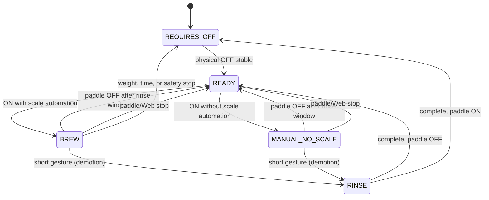
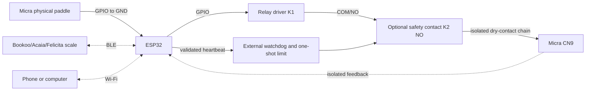

# Micra Shot Stopper

ESP32 firmware that controls the CN9 paddle circuit of a La Marzocco Micra
through an isolated relay contact and uses a compatible Bluetooth Low Energy
scale to automate an extraction by weight.

The Micra physical paddle **does not connect to CN9**: it connects only between
the configured ESP32 GPIO and GND. The relay COM/NO contact is the controller's
only connection to CN9. This lets the software read the paddle and control CN9
independently.

> **Safety notice:** verify continuity, isolation, module polarity, and that the
> relay remains open during startup, reset, and power loss. Complete the entire
> [manual test plan](docs/MANUAL_TEST_PLAN.md) before connecting the machine.
> This project cannot make an unsuitable relay module or unsafe wiring safe.
> See the [Disclaimer](#disclaimer) — use at your own risk.

## Origin and evolution

This project began from
[tatemazer/AcaiaArduinoBLE](https://github.com/tatemazer/AcaiaArduinoBLE) — the
original ESP32 firmware and library for stopping an extraction by weight over
BLE. What started as small Micra-specific changes grew into a **new product
concept and an almost complete rewrite**. Micra Shot Stopper is now the main
application; the derived library remains in this repository as a local
dependency.

### Compared to the original firmware

| | Original AcaiaArduinoBLE stopper | Micra Shot Stopper |
| --- | --- | --- |
| **Scope** | Generic, intended to work on several machines | Dedicated to the Micra and its independent paddle |
| **Architecture** | Simple, mostly single-threaded | FreeRTOS tasks, queues, and isolation between control, BLE, and network |
| **Features** | Minimal brew-by-weight stop | Rich workflow: retare, BBW protection, rinse, shot history, Web UI, diagnostics, safety layers |
| **Paddle machines** | Assumes you can work within the original machine constraints | Reads the physical paddle on GPIO and controls CN9 independently — no need to “fight” the paddle wiring |
| **Resilience** | Straightforward happy path | Explicit state machines, watchdogs, transactional CN9 close, stream validation, recovery paths |

The original firmware proved that BLE scale stop was possible; this project
**removed the original’s limitations on paddle-equipped machines** and invested
heavily in robustness: real thread boundaries, CN9 safety defenses, fault
handling, and persistence that survives resets and misconfiguration.

### What was added along the way

Examples that did not exist (or barely existed) in the original stopper sketch:

- **Intelligent retare** and BBW protection so late cup placement does
  not break the shot.
- **Embedded Web UI** with Wi-Fi, diagnostics, configuration, and optional
  remote control — no extra display or buttons on the machine.
- **Shot history** (duration, weight, flow, first drop, cut type, extraction guard
  telemetry) with export.
- **Fast extraction guard** — optional extension when target weight is reached
  too quickly (minimum brew time + max recovery weight); on by default.
- **Slow extraction guard** — optional floor when the shot is still under
  target at max brew time (max brew time + min recovery weight); on by default.
- **Auto-to-manual time guard** — on by default; caps CN9 time if an automatic
  shot loses the scale mid-brew (Auto trend or Manual limit); reconnect stays
  preferred for the whole cycle.
- **Advanced workflow settings** (rinse, Max BBW time, reminders, scale options).
- **Safety and observability** — supervisor, task watchdog, optional external
  K2/feedback, structured debug log, hardware monitor.
- **OTA over Wi-Fi** — planned; see [Not yet implemented](#not-yet-implemented).

The codebase is intentionally **more complex to implement and configure** so
that day-to-day use can stay **simple**.

## Design philosophy

The real goal is to use **brew by weight without noticing the DIY controller is
there**:

- Put the cup **before** the shot or **right when** the shot starts.
- Flip the paddle, brew, walk away.
- No extra screen on the espresso bar, no accessory buttons, no ritual double
  tare, no “did the stopper accept my cup?” — the firmware handles timing,
  retare, BBW protection, stop, and reminders in the background.

Complexity lives in firmware parameters, state machines, and safety — not in
the barista workflow. Defaults and automatic behaviors (retare, BBW protection,
offset learning, paddle-return beeps) exist so most users never touch the Web
UI after initial setup. If something feels unexpected, see the
[FAQ (Spanish)](docs/FAQ.md). The UI and API are there for tuning and diagnosis, not
for operating every shot.

In short: **hard to build, easy to live with.**

## Main features

### Micra paddle and CN9 control

- Independent read of the **physical paddle** (GPIO ↔ GND) and control of **CN9**
  through an isolated relay COM/NO contact.
- Safe startup: CN9 stays open until a stable physical paddle OFF is detected
  (`REQUIRES_OFF` → `READY`).
- Short-gesture **quick rinse** (configurable gesture time and rinse duration),
  manual extraction, and automatic **brew by weight** when a scale is available.
- **Physical paddle has priority** over every remote path. Web commands never
  bypass paddle safety or an active local cycle.
- Configurable **Max BBW time** per cycle (5–60 s; default 50 s) plus a firmware hard cap of
  60 s on every close path.
- Learned **stop offset** (default 1.5 g, capped at 5.0 g) updated from
  post-drip analysis; resettable from the Web UI to a configurable baseline
  (factory default 1.5 g).
- **Polarity:** physical paddle ON = GPIO **LOW**; relay closed (CN9
  energized) = GPIO **LOW**.

### Shot presets

Brew settings live in **named presets** (factory **Single** / **Double**, plus customs). The active preset supplies goal weight, BBW/guards, learned stop offset and its baseline, and A→M samples. Changing preset persists only the active id (no copy-on-select). Manage presets under **Settings → Brew** (dense cards: New · Duplicate · Load · Save · Delete; rename on the card). **New** seeds firmware Double defaults (not the saved Double in NVS). **Home → Quick Settings** has **Brew by weight** (session Manual), plus **No-scale BBW** (machine), **Fast extraction guard**, **Slow extraction guard**, and **A→M time guard**. Guard switches persist immediately (machine config for No-scale; active preset for the other three) and become read-only when Brew by weight is off. Machine/scale, alerts, Wi‑Fi, and password stay outside the recipe.

### Brew and weight settings

All workflow parameters below are editable from the Web UI **Settings**
panel and persisted in **NVS** (`Preferences`, dual slots `settingsA` /
`settingsB`, config schema **v30**). Defaults are shown in parentheses.

| Setting | What it does |
| --- | --- |
| **Target (g)** | Goal weight for brew by weight (10–200 g; default 36 g). |
| **Max BBW time (s)** | Maximum brew-by-weight cycle time (5–60 s; default 50 s). |
| **Baseline offset (g)** | Seed for **Reset learned stop offset to baseline** (0–5 g; factory default 1.5 g). Save before reset. |
| **Fast extraction guard** | **On by default**. See [Fast extraction guard](#fast-extraction-guard). |
| **Slow extraction guard** | **On by default**. See [Slow extraction guard](#slow-extraction-guard). |
| **Auto-to-manual time guard** | **On by default**. See [Auto-to-manual time guard](#auto-to-manual-time-guard). |
| **Automatic tare** | Send an initial tare when an automatic shot starts (default ON). |
| **Brew by weight** | **On by default**. Stop the shot by scale weight. Off keeps tare/timer but disables weight stop, BBW protection, automatic retare, and offset learning (same as the former Timer only setting). |
| **Bookoo combined command** | Use the scale’s combined tare + start-timer command (requires auto tare; default ON). |
| **Mute scale in Buzzer only** | Bookoo/generic: when enabled (default ON), send silence (volume 0) on connect/reconnect, when Output channel is saved as Buzzer only, and when this option is turned on. Applies only in **Buzzer only**. |
| **Scale volume** | Bookoo/generic: on connect/reconnect, set scale volume 1–5 (default 4) or Disabled. Applies only in **Scale only** and **Scale priority**. |
| **Automatic retare** | Allow one late-cup retare during the retare window (default ON). |
| **Retare window (s)** | Time after shot start to detect and retare a late-placed cup (default 4 s). |
| **Minimum cup weight (g)** | Stable load threshold that qualifies as a cup for retare (default 10 g). |
| **Retare stability** | Samples (default 3), tolerance (default 2.0 g), max sample gap (default 0.5 s), and min stable time (default 0.3 s) required before retare fires. |
| **BBW protection (s)** | **Pre-arm / accidental-weight protection window** at shot start for automatic BBW: inhibits automatic weight stop until the timeout expires (default 12 s; minimum retare window + 3 s). Runs in parallel with retare and first-drop detection; first drops do not end this window. Skipped when Brew by weight is off. |
| **Avoid BBW shot without scale** | **On by default**. Machine-level (Settings → Machine and scale, first group; not per-preset). With Brew by weight on and no usable scale, a paddle ON longer than the **quick rinse gesture** **does not close CN9**. A shorter ON→OFF is a rinse: CN9 closes and the guard stays **Armed**. The no-scale triple beep still plays on paddle ON (brew or rinse) whenever BBW is on and the scale is missing. The next start after a blocked shot runs as a manual no-scale shot. Re-arms on boot, when the scale becomes available, or after **Last shot cooldown**. |
| **Always use this scale** | **On by default** (`scaleMacCacheMode=full`). Name-scan for compatible scales; when a preferred MAC is set, only that MAC is connected; other compatible advertisements are stored in history (up to 8) without connecting. Off connects the first compatible scale and does not lock preferred. |
| **Preferred scale** | Dropdown of BLE-seen scales (history). Select which MAC is preferred, or **Clear preferred** (30 s discovery pause; history kept). |
| **Last shot cooldown (min)** | Time after a blocked start or a finished (non-rinse) shot before the no-scale guard re-arms (default 60 min; 5–240). Boot and scale reconnect re-arm immediately. |
| **Quick rinse gesture (s)** | Maximum paddle ON time that still counts as a quick rinse when released (default 1 s). |
| **Quick rinse duration (s)** | How long CN9 stays closed after a quick rinse starts (default 4 s). |
| **Timezone offset (min)** | Wall-clock offset for shot history labels (default UTC+0). |
| **NTP server** | Preset (default **pool**) or custom hostname for time sync. |

Additional fixed protections (not separately configurable):

- **Post-tare baseline grace (2 s):** after a tare, weight must settle within
  ±50 g before the stream is trusted for stop decisions.
- **Direct threshold stop:** two fresh samples at `target − learned offset`
  after BBW protection ends.
- **Predictive stop:** linear regression over recent accepted samples can stop
  earlier than the direct threshold.
- **Scale loss handling:** BLE disconnect or stale stream suspends weight
  control; recovery requires three coherent samples on the current connection
  generation. Paddle OFF and time limits remain authoritative.

### Alerts and reminders

Machine-level (not per-preset). Sounds are **event-first**: tare/start/stop,
first drop, paddle reminder, completion extra, and the triple alerts are
routed by **Output channel** when a local buzzer is compiled in.

| Setting | What it does |
| --- | --- |
| **Output channel** | Shown only with `SHOT_STOPPER_ENABLE_BUZZER`. Default is **Buzzer only** when a local buzzer is compiled in, and **Scale only** without buzzer support. **Buzzer only**: all alert sound via the local buzzer (for a silent scale). **Scale only**: scale path only; scale-incapable triples are muted. **Scale priority**: scale when connected/able, else buzzer; never both for one event. In Buzzer only (and Scale priority when the scale is not usable), tare/start/stop sounds follow CN9/paddle/retare immediately and do not wait for the BLE round-trip. |
| **Beep when coffee starts** | One beep on first coffee drops during an automatic shot (default ON; ignored when Brew by weight is off). |
| **Paddle-off reminder** | Repeat beeps while the **physical paddle stays ON** and **CN9 is open** (default ON). |
| **Paddle reminder interval (s)** | Time between reminder beeps (5–60 s; default 10 s). |
| **Paddle reminder limit (min)** | Stop beeping after this duration even if the paddle remains ON (1–60 min; default 15 min). |
| **Scale lost / ATM / manual-no-scale** | Triple beeps on the local buzzer (shown with buzzer support; disabled when Output channel is Scale only). |
| **Scale connected** | Distinctive echo when a scale connects or reconnects. Shown only when Output channel is **Buzzer only** (default ON). |
| **Extended shot pulse** | Local-buzzer pulses while Fast or Slow extraction guard keeps the shot running past the normal BBW cut. Dropdown: Disabled, Slow, Medium, **Fast (default)**, Rapid. Shown with buzzer support; disabled when Output channel is Scale only. Active and passive buzzers use the same on/off timing. |

Shot completion still adds one extra beep after stop (not configurable). Without
buzzer support, Output channel and the triple checkboxes are hidden.

### Shot history

- Up to **120** completed extractions stored in NVS (shot log schema **v6**;
  migrates older v2–v5 stores; writes a compact blob of only used records;
  minimum duration 10 s; rinses and very short gestures are excluded).
- Each record includes: local time (when NTP synced), duration, goal weight,
  actual weight, `actual_weight_source` (`post_drip` / `last_known` / `none`),
  error and error %, learned offset used, average flow (g/s), first-drop time,
  shot type (`auto`, `timer_only`, `manual`), **cut type**
  (`auto`, `manual`, `limit` — how CN9 opened), **stop detail**
  (`normal_target`, `extended_max_weight`, `extended_min_time`,
  `auto_to_manual`, `other`), and when the fast extraction guard was active:
  whether the shot was extended, `targetReachedEarlyS`, and the max recovery
  weight / minimum brew time that applied.
- Web UI table with **CSV export**, authenticated **clear all**, and
  **per-shot delete**.
- Timezone offset and NTP server (preset or custom) configure wall-clock labels;
  manual **Sync now** when signed in.

### Web UI, Wi-Fi, and API

See [Factory credentials (first use)](#factory-credentials-first-use) for AP
name, default passwords, and step-by-step first connection.

- Fully **embedded Web UI** SPA with routes (`/`, `/presets`, `/settings`,
  `/history`, `/admin`, `/debug`, `/log`): same-origin assets only (no CDN). Authoring
  budget HTML ≤ **40 KiB**, JS ≤ **64 KiB**, combined HTML+JS ≤ **100 KiB**;
  gzip HTML ≤ **8 KiB**, gzip JS ≤ **16 KiB**, gzip CSS ≤ **6 KiB**, gzip logo ≤
  **4 KiB**, combined ≤ **28 KiB**. Reloads
  revalidate HTML with `ETag` (`Cache-Control: no-cache`) so unchanged firmware
  returns **304**. Shared script is `GET /app.js`, stylesheet is `GET /app.css`,
  and brand mark is `GET /logo.svg` (all gzip, versioned query, long-lived
  `immutable` cache). Inactive views do not poll their APIs.
- **STA** when credentials are saved and the home network is reachable;
  **SoftAP** (`MicraShotStopperAP` at `192.168.4.1`) when there are no
  credentials, or only after STA association fails (~15 s) while credentials
  exist. While SoftAP is up and credentials exist, the firmware keeps retrying
  STA in concurrent **AP+STA** mode; once STA connects, SoftAP is stopped and
  HTTP is rebound on the STA IP. STA addressing is **DHCP** or **static IP**,
  with a **3-minute confirm-or-revert** window after save.
- SoftAP stays available while unassociated after that STA-first window (no
  idle 3-minute shutdown). Once STA connects, HTTP remains on the STA IP.
  After logout, sessions still expire by heartbeat / remember-me rules; SoftAP
  itself is not torn down for idle UI.
- **Public read-only** home (shot + status), shot history, diagnostic log,
  settings preview, and firmware version footer without signing in.
- Authenticated session (factory password **`Micra1234`** — same as the AP;
  changeable from the Web UI or USB serial CLI) unlocks configuration, Wi-Fi
  scan/save, calibration reset, factory reset, Stop, and Restart. Up to **2**
  concurrent web sessions. Login responses include a CSRF token
  (`X-CSRF-Token` on mutating requests); repeated failed logins return
  `429 LOGIN_RATE_LIMITED`.
- **Live shot panel:** current/goal weight, progress bar, elapsed time, first
  drop, retare state, shot type, scale protocol, and **last-shot** guard state
  for extraction (`Off` / `On` / extended), A→M (`Off` / `Idle` / `Armed` /
  `A→M · Ns`), and no-scale (`Off` / `Armed` / `Idle`). **Status** shows the
  same three guards as **current** machine state (`Off` / `Idle` / `Armed`,
  plus in-shot detail).
- **REST API** (`/api/v1/…`):
  - Read: `GET /status`, `GET /log`, `GET /shots`
  - Auth: `POST /login`, `POST /logout`, `POST /heartbeat` (UI polls every
    **10 s** while signed in)
  - Config: `POST /config`, `POST /calibration/reset`, `POST /time/sync`,
    `POST /access-point/password`
  - Network: `POST /network` (`save` / `forget` / `confirm`), `POST /network/scan`,
    `GET /network/scan` (async, max **12** networks, **120 s** timeout;
    cancelable via maintenance lease). `save` accepts `ipMode` (`dhcp`|
    `static`) plus static fields `ip`/`netmask`/`gateway`/`dns1`/`dns2`.
  - Control: `POST /control/paddle`, `/control/rinse`, `/control/stop`,
    `/control/restart`
  - Maintenance: `POST /factory-reset` (confirm `ERASE_ALL_SETTINGS`),
    `POST /shots/clear` (confirm `CLEAR_SHOT_LOG`), `POST /shots/delete`
  - Wi-Fi (STA/AP) and the HTTP server start regardless of paddle position;
    **configuration changes** still use a maintenance lease that requires
    stable paddle OFF and open CN9.
- **Factory reset** erases Wi-Fi, settings, calibration, shot history, and
  restores the AP/UI password to **`Micra1234`**, then restarts.

**Diagnostics** (Status panel + Log panel + API):

- Paddle state, CN9 relay state, CN9 safety supervisor (state, fault, watchdog,
  external hardware present, recovery required).
- Live **extraction**, **A→M**, and **no-scale** guard state (Off / Idle / Armed
  or in-shot detail). The Shot panel keeps the values from the last cycle.
- Control source (physical vs web), maintenance lease, last command result.
- Scale link: BLE availability, protocol, stream/control state, observed vs
  accepted weight, packet gaps, rejected packets, reconnects, disconnect reason.
- Loop health: max loop gap, free/min heap, dropped debug events.
- Hardware monitor: CPU usage, chip temperature (and peak), RAM total/used/free,
  uptime, and last ESP reset reason.
- NTP/time sync state and configured timezone.
- **Diagnostic log:** bounded ring of **192** events with severity levels
  (Critical / Error / Warning / Info / Debug), categories (including Boot and
  System), uptime or wall-clock timestamps when NTP is synced, level + category
  filters, dropped-event counter, copy, and clear view (client-side only);
  also available via `GET /api/v1/log`. Serial and UI share the same structured
  pipeline (`logEmit`); the Web log ring retains Info by default. USB debug
  print is **off** by default (`serialDebugOutput`); enable it from Debug or
  `SERIAL_DEBUG_ON`. CLI replies on the same port stay on.
- **USB serial CLI** at **115200** baud for recovery and provisioning without the
  Web UI: factory reset, AP/UI password, STA Wi-Fi, shot-history clear, serial
  debug on/off, and a `HELLO` probe. See [USB serial CLI](#usb-serial-cli).

**Web paddle and remote control** (opt-in build only):

- **Virtual paddle** toggle (`POST /api/v1/control/paddle`) starts and ends a
  remote cycle when signed in and remote CN9 is enabled. Remote paddle
  sessions time out after **15 s** without a UI heartbeat.
- **Start quick rinse**, **Stop shot** (opens CN9 only), and **Restart
  controller** from the Actions panel.
- **Remote CN9 actuation for new cycles is disabled by default.** Virtual
  paddle and remote quick rinse require compile-time
  `SHOT_STOPPER_ENABLE_REMOTE_CN9=1`. **Stop** always opens CN9 in every
  build (when authenticated). Monitoring, diagnostics, and configuration work
  without the flag. Physical paddle always has priority.

### Scale support

Scale compatibility depends on the
[AcaiaArduinoBLE](https://github.com/tatemazer/AcaiaArduinoBLE) library by
**[tatemazer](https://github.com/tatemazer)**. This project vendors a local
copy under `libraries/AcaiaArduinoBLE/` and aims to stay aligned with upstream
releases, new scale types, and protocol fixes as they land in that repository.

- Local **AcaiaArduinoBLE** library (vendored in-repo) for **Acaia** (legacy and
  current), **Bookoo/generic**, and **Felicita** scales over BLE central.
- Dedicated **`scale_worker`** FreeRTOS task isolates BLE polling, connection
  retries, tare/start/stop commands, and beeps from the control loop via
  bounded command and event queues.

### Runtime architecture

Work is split so paddle/CN9 timing never waits on BLE or HTTP:

| Task | Role |
| --- | --- |
| **`loopTask` (Arduino `loop`)** | Paddle debounce, state machine, CN9 arm/open, weight-stop logic, shot logging, web command dispatch, safety supervisor feed. |
| **`scale_worker`** | BLE connection, weight stream, scale commands and beeps. |
| **`network_manager`** | Wi-Fi STA/AP, HTTP server, NTP, NVS writes for config/network. |
| **`status_indicator`** | WS2812B LED updates via a one-slot mailbox (never blocks control). Only built when `SHOT_STOPPER_ENABLE_ALED=1`. |

`loopTask`, `scale_worker`, and `network_manager` each register a **5 s Task
Watchdog** subscription. `status_indicator` does **not** subscribe to the TWDT
(it only drives LEDs).

### Safety and indicators

- Generation-based **transactional CN9 close**; three timing defenses (GPTimer
  IRAM handler, `esp_timer`, supervisor deadline).
- Optional **external heartbeat + CN9 feedback** for a second K2 barrier
  (compile-time GPIO pins).
- Redundant RTC relay-command log; unsafe reset during CLOSE or repeated boot
  loops require **local paddle recovery** (ON then stable OFF).
- Optional two independent **WS2812B** pixels (`SHOT_STOPPER_ENABLE_ALED=1`):
  scale/BLE health and stopper workflow / safety state (diagnostic only, not
  part of CN9 decisions).
- **Host tests** for workflow, persistence, safety, remote policy, BLE library,
  and embedded Web UI asset validation.

## Not yet implemented

The following items are planned but **not present in the current firmware**:

- **OTA (over-the-air firmware updates)** — remote flash of new builds over
  Wi-Fi without USB.
- **Home Assistant integration** — publish status, sensors, and/or controls to
  Home Assistant (MQTT, REST, or native integration).

## Optional hardware: local buzzer

Compile with `-DSHOT_STOPPER_ENABLE_BUZZER=1` (passive piezo) or `=2` (active
buzzer) and wire the buzzer between `SHOT_STOPPER_BUZZER_GPIO` (board default, or
override) and GND: marked **+** to the GPIO, unmarked pin to GND. Default GPIO
is 32 (ESP32 Dev), 14 (ESP32-S3), or 5 (Nano ESP32).

Identify the part with 3.3 V DC on `+` vs GND: a constant tone is **active**
(`=2`); a click or silence is **passive** (`=1`). Beep on/gap durations are the
same catalog for both; only the drive (PWM vs GPIO HIGH/LOW) differs. Omit the
flag or set `=0` for builds without that hardware. Output channel then defaults
to **Scale only**.

When enabled, Alerts shows **Output channel** (default **Buzzer only**; also
Scale priority / Scale only) plus checkboxes for scale-lost / ATM-end / manual-without-scale
triple beeps, **Scale connected** (Buzzer only, default ON), and **Extended shot pulse**
(Disabled / Slow / Medium / Fast / Rapid; default Fast). All alert events (including
tare/start/stop feedback when the channel routes to the buzzer) go through that
setting. Debug short/long/double/triple, Slow/Medium/Fast/Rapid (3 s), and
Chime/Swing/Echo/Morse/Snap buttons play the same catalog as the live alerts.

## Optional hardware: WS2812B status LEDs (ALED)

Compile with `-DSHOT_STOPPER_ENABLE_ALED=1` to include the addressable-LED
driver, GPIOs, and `status_indicator` task. Default builds (`=0` or omit the
flag) compile without LED support. See [WS2812B status indicators](#ws2812b-status-indicators).

## Repository structure

```text
.
├── VERSION                         # Release version (SemVer)
├── scripts/gen_version.sh          # Build-time version header generator
├── package.json                    # Node tooling (Terser) for Web UI minify
├── scripts/gen_web_ui.js           # Gzip-precompressed Web UI/JS/CSS/logo header generator
├── shotStopper/web/app.js          # Authored Web UI JavaScript (embedded via generator)
├── shotStopper/web/app.css         # Authored Web UI stylesheet (embedded via generator)
├── shotStopper/web/logo.svg        # Authored Web UI brand mark (embedded via generator)
├── shotStopper/                    # Main firmware sketch and host tests
│   ├── shotStopper.ino
│   ├── ShotStopperSerialCli.h      # USB serial command parser
│   └── tests/                      # Host tests, web asset + firmware checks
├── libraries/
│   └── AcaiaArduinoBLE/            # Local Arduino library and BLE tests
├── docs/
│   ├── FAQ.md
│   └── MANUAL_TEST_PLAN.md
└── LICENSE
```

`shotStopper/` is the main sketch. `libraries/AcaiaArduinoBLE/` is included
explicitly during compilation with `--library`.

## Functional behavior

At startup, the relay is open. The controller must detect a stable physical
paddle OFF state before entering `READY`. From `READY`, moving the paddle to ON
closes CN9 and starts a brew (or a manual cycle if scale automation is
unavailable). Retare and BBW protection run in parallel from that moment.

- Releasing the paddle within the rinse gesture time **demotes** the cycle to a
  rinse. CN9 remains closed for the configured rinse duration, and subsequent
  paddle changes are ignored until the rinse ends.
- Holding it ON past the rinse gesture keeps the brew. Automatic by-weight stop
  is available when scale automation was present at start; otherwise the cycle
  stays manual without a scale.
- Releasing it after the rinse window ends the brew and opens CN9.
- Releasing it during an automatic or manual extraction (after the rinse window)
  opens CN9 immediately.
- If the scale disconnects or its samples become stale during an automatic
  extraction, weight control is suspended. It recovers only on the current BLE
  generation after three coherent samples. Paddle OFF and timing limits remain
  authoritative throughout.
- After BBW protection ends, two fresh samples at or above
  `goal - offset` stop the extraction directly, independently of regression.
  Prediction remains an earlier stop mechanism. Timer-only mode retains timing
  and tare but disables both mechanisms and learning.
- Every path that closes CN9 is constrained by the configurable operational
  time and an absolute maximum of 60 seconds.



## Scale stop logic

During an automatic extraction the scale session starts with the cycle. The
cycle enters `BREW` (or `MANUAL_NO_SCALE`) immediately at paddle ON. Retare and
BBW protection run in parallel from shot start and do not delay that entry.

1. **Automatic retare** (if enabled): stable cup load after shot start triggers
   a second tare without restarting the shot timer.
2. **BBW protection / pre-arm** (always active for automatic BBW): runs for the
   configured timeout from shot start. Automatic stop by weight is inhibited
   while retare or BBW protection still blocks. First drops beep and log but
   do not end this window.
3. **Brew by weight**: after both windows end, weight stop is armed
   immediately (same predicted-weight tool as every other recipe weight cut).

Manual stop, CN9 time limits, paddle OFF, and all safety mechanisms remain
active throughout. Timer-only and manual-no-scale cycles skip retare and
BBW protection. Abrupt or implausible samples are visible as observed weight but
cannot enter regression or offset learning.

The status API distinguishes BLE connection, stream freshness, control
authority, observed versus accepted weight, connection generation, packet
gaps, rejected packets, reconnects, and disconnect reason.

## Fast extraction guard

Optional brew-by-weight enhancement, **enabled by default**. It addresses
shots that reach the target weight too quickly — often a sign of channeling or
a grind that is too coarse — where stopping immediately would yield a thin,
under-extracted cup.

When enabled, you still set a mandatory **target weight** (same as today). You
also configure:

| Setting | Default | Role |
| --- | --- | --- |
| **Enable** | ON | Master switch for the extended-shot recovery |
| **Max recovery weight (g)** | 42.5 | Hard ceiling if the shot must be extended |
| **Minimum brew time (s)** | 28 | Minimum extraction time for a normal target stop |

### How it works

1. **Normal stop** — the scale reaches the target at or after the minimum brew
   time → CN9 opens at the target (`normal_target`). BBW does not run before
   that minimum time.
2. **Too fast** — the target is reached *before* the minimum brew time → BBW
   is inhibited and the shot enters **extended** mode until either:
   - **Max recovery weight** (same weight-cut tool as BBW: predicted time plus
     a real-weight backup) → `extended_max_weight`, or
   - **Minimum brew time** is reached *and* the scale still shows at least the
     target weight (stops even if below max recovery) → `extended_min_time`.

Elapsed time is measured from cycle start (CN9 close), consistent with other
timing in the firmware. The learned stop offset applies to both target and max
recovery thresholds.

### Why it is useful

If coffee hits 36 g in ~22 s but you know a good shot needs ~28 s, the guard
lets the extraction continue toward 42.5 g or until the minimum time passes —
similar to manually allowing the shot to reach your next weight checkpoint
without watching the scale.

### Telemetry

The live shot panel shows when the guard is off, on, or **extended** (with the
active stop weight and time remaining). Shot history and CSV export record
`ext_guard`, `ext`, `stop`, `max_rec_g`, `min_brew_s`, `early_s`, plus
`shot_type` and `cut_type`.

## Slow extraction guard

Optional brew-by-weight enhancement, **enabled by default**. It is the inverse
of Fast extraction guard: shots that have **not** reached the BBW target by a
maximum brew time — often a sign of a grind that is too fine or a stalled
extraction — should not wait all the way to the CN9 wall.

When enabled, you still set a mandatory **target weight** (same as today). You
also configure:

| Setting | Default | Role |
| --- | --- | --- |
| **Enable** | ON | Master switch for the slow-shot recovery |
| **Min recovery weight (g)** | 30 (Double) / 14 (Single) | Floor if the shot must be extended past max brew time |
| **Max brew time (s)** | 44 | Latest time to wait for the normal BBW target |

### How it works

1. **Normal stop** — the scale reaches the BBW target at or before the max brew
   time → CN9 opens at the target (`normal_target`). Slow does not fire.
2. **Too slow** — max brew time is reached *without* the BBW target:
   - If the scale is already at or above **min recovery** → cut now
     (`slow_max_time`).
   - If it is still below that floor → the shot enters **extended** mode until
     **min recovery weight** (same weight-cut tool as BBW: predicted time plus
     a real-weight backup) → `slow_min_weight`, or until the CN9 wall.

BBW wins by weight: a shot that hits the target on time is a normal BBW stop.
Fast extended and Slow extended are mutually exclusive; Slow does not interrupt
a shot that Fast already extended (that shot already reached BBW).

Elapsed time is measured from cycle start (CN9 close), consistent with other
timing in the firmware. The learned stop offset applies to the min recovery
threshold (`min recovery − offset`), the same way it applies to Fast’s max
recovery. Prediction is only a tool; the logged reason is always the mechanism
(`slow_max_time` / `slow_min_weight`), never `SCALE_PREDICTION`.

Max brew time is a **decision point**, not a replacement for the CN9 wall. If
the shot is already over the floor at 44 s, it cuts there and the 60 s wall is
rarely used. If it is still under the floor, it may continue toward min
recovery **or** hit the CN9 wall, which remains the hard cap.

When Fast is also ON, max brew time must be greater than min brew time so the
normal BBW window sits between them (28 s–44 s on factory Double).

### Why it is useful

If coffee is only at 20 g at 44 s and you know a drinkable cup needs at least
30 g, the guard either cuts at 44 s (when already over the floor) or lets the
shot continue toward 30 g instead of waiting for 36 g or the 60 s wall.

### Telemetry

The live shot panel shows when the guard is off, idle, on, or **extended**
(with the active stop weight). Shot history and CSV export record `slow_guard`,
`slow_ext`, and `stop` (`slow_max_time` / `slow_min_weight`). Compact history
does not store the min-g / max-s recipe values; those live on the preset.

## Auto-to-manual time guard

Safety layer for automatic brew-by-weight shots that lose the scale mid-
extraction. **Enabled by default.** It does not apply to shots that start
manual (`MANUAL_NO_SCALE`), timer-only mode, or rinse cycles.

### Why it exists

When BLE drops during an automatic shot, weight stop is suspended while the
firmware keeps trying to reconnect for the **entire** cycle. That transition
is easy to miss at the bar: the paddle stays closed, the shot keeps running,
and the only hard stop left may be the CN9 time limit. The guard closes CN9
on a shorter, predictable deadline so a silent auto→manual fallback does not
turn into an over-extracted shot.

There is **no** permanent lockout to manual after a fixed reconnect window.
Reconnect remains preferred; if the scale returns with three coherent samples,
weight control (including Fast or Slow extraction guard, if enabled) resumes and A→M
enforcement clears. A later disconnect in the same cycle reuses the same
absolute deadline from cycle start.

### Configuration

| Setting | Default | Role |
| --- | --- | --- |
| **Enable A→M time guard** | ON | Master switch for the CN9 deadline |
| **Limit mode** | Auto | **Auto** = linear trend of the last five good shot durations; **Manual** = fixed seconds |
| **Manual limit (s)** | 32 | Used when Limit mode is Manual (clamped to 10 s … Max BBW time) |
| **Trend (s)** | ~32 | Read-only; current Auto prediction (always shown) |
| **Baseline duration (s)** | 32 | Seed used by **Reset A→M samples** (five equal values). Factory default for Manual limit |

Deadline = cycle start + limit. Limit is computed once when an automatic brew
is confirmed. Enforcement starts on the first scale-loss suspend after arming;
the live shot panel has a dedicated **A→M time guard** line (`Off` / `Idle` /
`Armed` / `A→M · Ns` while enforced). **Status** shows the current A→M state;
**Shot** keeps the last-shot value after the cycle ends.

### Duration samples

Successful shots continuously feed a ring of five durations (deciseconds),
independent of whether the guard is enabled or which limit mode is selected:

- Total shot duration; error ≤ 10 % vs goal; not Fast/Slow extraction-extended; not rinse;
  not stopped by this guard; post-drip weight available
- Auto and manual shots qualify when weight/error criteria are met
- Fresh devices restore five logical **32 s** samples. **Reset A→M samples to
  baseline** fills all five with the configured **Baseline duration**
  (`POST /api/v1/calibration/reset-guard-samples`; save baseline first)

### Telemetry

- Live panel **A→M time guard** line: `Off` / `Idle` / `Armed` / `A→M · Ns`
  when enforced (separate from Fast and Slow extraction guards)
- History: `stop_detail = auto_to_manual`, `cut_type = limit`;
  `actual_weight_source` may be `last_known` when logged without post-drip weight
- CSV export includes `actual_weight_source`

## Factory credentials (first use)

On a fresh flash (or after **factory reset**), use these defaults to reach the
controller over Wi‑Fi. The **same password** protects the fallback access point
and the Web UI login.

| | Value |
| --- | --- |
| **Fallback Wi‑Fi (AP) name** | `MicraShotStopperAP` |
| **Fallback Wi‑Fi (AP) password** | `Micra1234` |
| **Web UI address (AP mode)** | `http://192.168.4.1` |
| **Web UI login password** | `Micra1234` |

Passwords are **case-sensitive** (`M` uppercase, rest lowercase).

### Connect on first boot (no home Wi‑Fi saved yet)

1. Power the ESP32 and wait for boot (scale LED activity is normal).
2. On your phone or laptop, open Wi‑Fi settings and join **`MicraShotStopperAP`**
   using password **`Micra1234`**.
3. Open a browser to **`http://192.168.4.1`**. Status, live shot, history, and
   the diagnostic log are visible without signing in.
4. Click **Sign in** (or open the Configuration panel) and enter
   **`Micra1234`** to change settings, save your home Wi‑Fi, or run
   maintenance actions.

The SoftAP stays available when there is no home Wi‑Fi saved, and after saved
credentials fail to associate for about **15 seconds** (STA is tried first).
There is no idle SoftAP shutdown timer.

### After home Wi‑Fi (STA) is saved

Once STA credentials are stored and the device joins your network, SoftAP is
stopped and the Web UI is at **`http://<device-ip>`** (find the IP in your
router’s DHCP list, the saved static IP, or serial logs at **115200** baud).
If STA drops, the device retries STA first; SoftAP returns only after that
window fails, while STA retries continue. Use the same Web UI password
**`Micra1234`** (or the password you set under **Web UI password**). Factory
reset restores all values in the table above. If you lose STA or the UI
password, recover over SoftAP or USB with the
[USB serial CLI](#usb-serial-cli) (`HELLO`, `RESET_AP_PASSWORD`, `CLEAR_WIFI`,
or `FACTORY_RESET`).

STA addressing can be **DHCP** (default) or **static IP** from the Wi‑Fi panel.
After any STA save, the new settings stay **pending** until you sign in at the
device IP within **3 minutes**; otherwise the previous (last-known-good)
network settings are restored and SoftAP recovery opens again while STA
retries continue when credentials remain.

## Web UI and Wi-Fi (details)

See **Web UI, Wi-Fi, and API** under [Main features](#main-features) for
diagnostics, virtual paddle control, and the full capability list. Operational
notes:

- The interface cannot change workflow settings during an active cycle.
- Virtual paddle and remote quick rinse require
  `SHOT_STOPPER_ENABLE_REMOTE_CN9=1` on a trusted network. **Stop** works in
  every build when authenticated.
- Each remote cycle is bound to its session and a non-reusable lease.
- Configuration, NVS, Wi-Fi save, and scan operations use a **maintenance
  reservation** that requires stable paddle OFF and open CN9; physical movement
  cancels it. Read-only status and the web UI remain available while the paddle
  is ON.
- `202` responses include a `requestId`; `GET /api/v1/status` publishes the
  terminal command state (`APPLIED`, `PERSISTED`, `FAILED`, `CANCELED`).
- You may optionally change the default password from the Web UI on a trusted
  network (see [Factory credentials](#factory-credentials-first-use)); it is
  not required to unlock controls.

## Watchdog and CN9 safety

The firmware configures the ESP-IDF Task Watchdog with a 5-second timeout and
`trigger_panic=true`. It subscribes `loopTask`, `scale_worker`, and
`network_manager` separately; `status_indicator` is not subscribed. No task
feeds another task's watchdog. A registration or feed failure inhibits new
closes, opens CN9, and requests a restart from the control loop. Compilation
fails unless the core enables TWDT panic, IWDT, reboot after panic, and an
IRAM GPTimer handler.

CN9 closes transactionally: `ARMING` is first published with a new generation,
then all deadlines are armed, and only then is the relay energized if the
generation is still current. Opening uses the reverse risk order: the OPEN
electrical level is written first, then timers are stopped. The shortest
deadline also runs through a GPTimer interrupt independently from the loop,
BLE, Wi-Fi, and the `esp_timer` task. Its emergency opening writes the GPIO
register directly from IRAM code, so it does not depend on `digitalWrite()` or
flash cache availability.

Before K1 is energized, the CLOSE command is recorded in RTC memory as a value
and its complement; OPEN is recorded after opening. A WDT reset, panic,
brownout, power glitch, CPU lockup, or reset during CLOSE boots into `LOCKOUT`.
Three consecutive unsafe resets are diagnosed as `BOOT_LOOP`. Web access cannot
rearm it: recovery requires physically moving the paddle to ON and then holding
it stably OFF for one second while timers, watchdog, and feedback are healthy.

These firmware defenses reduce lockups and races, but a reset cannot open a
welded contact or repair a shorted relay transistor. Containing those faults
requires a normally-open second K2 barrier driven by an external heartbeat
detector with a non-retriggerable limit, plus isolated real-state feedback.
Without K2 and feedback, the Web UI reports `external not configured`, and the
protection must be considered **software only**, not a physical guarantee
against relay or GPIO failures.

## Hardware



Use a relay or contact with isolation and ratings suitable for CN9. Never
connect CN9 to GND, VCC, or an ESP32 GPIO, and use COM/NO rather than NC.
Feedback must also be isolated: do not electrically join CN9 and ESP32 GND.
The external detector must drive K2 OPEN when the heartbeat is stuck HIGH,
stuck LOW, absent, or out of frequency; a second relay controlled directly by
the same GPIO does not provide this barrier.

The selected FQBN automatically defines the matching pin block in
`shotStopper.ino`. With `-DSHOT_STOPPER_ENABLE_ALED=1`, the two status LEDs are
independent one-pixel WS2812B devices, each with its own data GPIO:

| Board | FQBN | Paddle | Relay | Scale LED | Stopper LED |
| --- | --- | ---: | ---: | ---: | ---: |
| ESP32 Dev Module / DevKit V4 | `esp32:esp32:esp32` | GPIO 27 | GPIO 26 | GPIO 25 | GPIO 33 |
| ESP32-S3 Dev Module | `esp32:esp32:esp32s3` | GPIO 21 | GPIO 38 | GPIO 48 | GPIO 47 |

The code also maps Arduino Nano ESP32 D10/D11 to paddle/relay and D2/D3 to
external WS2812B data inputs when ALED is enabled. Its built-in common-anode RGB
LED is not a WS2812B and is no longer used. Before energizing CN9, verify every
pin for the specific board and the active polarity of the relay module.

### WS2812B status indicators

Requires `-DSHOT_STOPPER_ENABLE_ALED=1`. Without that flag the driver, LED
GPIOs, and `status_indicator` task are not compiled.

A WS2812B is a digital addressable RGB LED controlled through one data line;
it is not an analog LED. This firmware uses two separately wired pixels:

- **Scale LED:** BLE subsystem and scale-link health.
- **Stopper LED:** workflow, operating mode, maintenance, and CN9 safety.

The default brightness is 32 of 255. The LED task is isolated from the control
loop behind a one-item overwrite mailbox: indicator transmission cannot make
the safety loop wait, and old visual states cannot form a backlog. LEDs are
diagnostic only and are never part of the CN9 safety decision.

| Scale LED | Meaning |
| --- | --- |
| Slow blue blink | Firmware is starting |
| Solid green | Scale connected, worker responsive, and weight stream fresh |
| Solid red | Scale disconnected |
| Slow yellow blink | BLE link is connected but worker or weight stream is stale |
| Fast red blink | BLE subsystem or scale worker unavailable |

| Stopper workflow | Automatic palette | Manual/timer-only palette |
| --- | --- | --- |
| Ready | Solid green | Solid salmon |
| Qualifying paddle ON | Medium green blink | Medium salmon blink |
| Brewing | Slow green blink | Slow salmon blink |
| Rinsing | Fast green blink | Fast salmon blink |

Stopper safety and action states override both operating palettes:

| Stopper LED | Meaning |
| --- | --- |
| Slow amber blink | Physical paddle must return to OFF |
| Slow blue blink | Boot-safe initialization or maintenance reservation |
| Fast red blink | Safety lockout, safety trip, watchdog fault, or safety subsystem unavailable |

Slow, medium, and fast use equal ON/OFF phases of 750, 300, and 125 ms,
respectively. Typical combinations: green + solid green = scale connected and
ready for automatic operation; green + slow green = automatic brewing; salmon
palette = timer-only or manual-no-scale mode; red + any = scale disconnected.

An ESP32-S3 chip does not guarantee an onboard RGB LED. Even Espressif's own
ESP32-S3-DevKitC-1 revisions differ: the initial revision connects an
addressable RGB LED to GPIO 48, while revision 1.1 uses GPIO 38. Both revisions
may be encountered. GPIO 38 is already the default relay output in this
project, so the revision 1.1 onboard LED **must not** be used with the default
pin map; use two external pixels on verified free pins instead. The original
Mazer V3 firmware's GPIO 46/45/47 common-anode RGB mapping describes that
specific Shot Stopper hardware, not every ESP32-S3 board.

Override the status data pins and brightness at compile time (ALED must be
enabled). The pins must be distinct, output-capable, and different from paddle,
relay, heartbeat, and feedback GPIOs:

```sh
mkdir -p build/esp32-s3-custom-leds
arduino-cli compile --fqbn esp32:esp32:esp32s3 --warnings all \
  --build-property \
  'compiler.cpp.extra_flags=-Werror=deprecated-copy -DSHOT_STOPPER_ENABLE_ALED=1 -DSHOT_STOPPER_SCALE_LED_GPIO=4 -DSHOT_STOPPER_STOPPER_LED_GPIO=5 -DSHOT_STOPPER_LED_BRIGHTNESS=32' \
  --library libraries/AcaiaArduinoBLE \
  --build-path build/esp32-s3-custom-leds \
  shotStopper
```

GPIO 4 and GPIO 5 above are examples only. Verify the schematic, strapping
requirements, relay integration, and physical board before selecting them.

### Enable external heartbeat and feedback

There are no default K2/feedback pins because they depend on the reviewed board
and circuit. Both must be defined; defining only one causes a compilation
error:

- `SHOT_STOPPER_SAFETY_HEARTBEAT_GPIO`: output to the external detector.
- `SHOT_STOPPER_CN9_FEEDBACK_GPIO`: isolated feedback input.
- `SHOT_STOPPER_CN9_FEEDBACK_CLOSED_LEVEL`: optional; defaults to `LOW`.

Example build for an ESP32 Dev Module where GPIO 16 and GPIO 17 were verified as
free and appropriate on the specific hardware:

```sh
mkdir -p build/esp32-safety
arduino-cli compile --fqbn esp32:esp32:esp32 --warnings all \
  --build-property \
  'compiler.cpp.extra_flags=-Werror=deprecated-copy -DSHOT_STOPPER_SAFETY_HEARTBEAT_GPIO=16 -DSHOT_STOPPER_CN9_FEEDBACK_GPIO=17' \
  --library libraries/AcaiaArduinoBLE \
  --build-path build/esp32-safety \
  shotStopper
```

The README [compile examples](#compile) enable remote CN9 actuation with
`-DSHOT_STOPPER_ENABLE_REMOTE_CN9=1`. Omit that flag for local-only builds.

The firmware checks at compile time that both pins differ from paddle, relay,
and LED pins, and that the heartbeat uses an output-capable GPIO. This does not
replace review of pinout, boot strapping pins, schematics, or electrical
measurements on the actual board.

## Prepare the build environment

The project requires `arduino-cli`, a C++ compiler for host tests, and Node.js
to validate Web UI assets. Optional coverage requires LLVM (`llvm-profdata` and
`llvm-cov`). First confirm that Arduino CLI is available:

```sh
arduino-cli version
```

Initialize its configuration only if one does not already exist, then add the
ESP32 board index:

```sh
arduino-cli config init
arduino-cli config add board_manager.additional_urls \
  https://espressif.github.io/arduino-esp32/package_esp32_index.json
```

Install the toolchain and dependency versions validated by this project:

```sh
arduino-cli core update-index
arduino-cli core install esp32:esp32@3.3.3
arduino-cli lib install ArduinoBLE@2.1.0
./scripts/patch_arduinoble.sh
```

`./scripts/patch_arduinoble.sh` is required: stock ArduinoBLE 2.1.0 scans
active at 20/20 ms (100% duty). The patch sets active 40/20 ms (50% duty) so
SCAN_RSP names stay visible while leaving airtime for the Wi-Fi AP. The
script is idempotent and also converts a leftover 100/30 patch. Set
`ARDUINO_BLE_HOME` if ArduinoBLE is not in the default Arduino libraries path.

Idle discovery does not start or stop GAP every 1 s or 3 s. Those timers are
retry (only when scan is down), a software tick for logs, and log throttle.
The radio stays in scan; the controller runs the 40/20 cycle. The only
periodic GAP restart is the 60 s HCI watchdog.

Do not install AcaiaArduinoBLE from Library Manager for this application: the
audited version is included in `libraries/AcaiaArduinoBLE`, and the build
command selects it through `--library`.

## Firmware version

Release version lives in `VERSION` at the repository root (`MAJOR.MINOR.PATCH`).
Bump it manually when publishing a release. The git commit hash is appended
automatically on every build (`1.0.0+abc1234`, or `-dirty` with uncommitted
changes).

Before compiling or running host tests, install Node deps once (for Terser),
then generate the version and gzip Web UI headers:

```sh
npm install
./scripts/gen_version.sh
node ./scripts/gen_web_ui.js
```

This writes `shotStopper/ShotStopperVersion.h` and
`shotStopper/ShotStopperWebAssetsGzip.h` (both gitignored). The generator reads
`shotStopper/ShotStopperWebAssets.h`, `shotStopper/web/app.js`,
`shotStopper/web/app.css`, and `shotStopper/web/logo.svg` (JS is minified with
Terser). The installed firmware reports the version on Serial boot, in
`GET /api/v1/status` as `firmwareVersion`, and in the Web UI footer. `GET /`
(and `/history`, `/log`, `/settings`, `/debug`) serves the SPA HTML as gzip with an
`ETag` derived from that version. `GET /app.js`, `GET /app.css`, and
`GET /logo.svg` are gzip with a long-lived cache and the same ETag family. Use
`curl --compressed` if you fetch HTML/JS/CSS/SVG from the command line.

To verify a compiled binary without flashing:

```sh
strings build/esp32/shotStopper.ino.bin | grep -E '^[0-9]+\\.[0-9]+\\.[0-9]+\\+'
```

## Compile

From the repository root, install Node deps if needed, generate the version and
Web UI headers, and build for an ESP32 DevKit V4 with:

```sh
npm install
./scripts/gen_version.sh
node ./scripts/gen_web_ui.js
mkdir -p build/esp32
arduino-cli compile \
  --fqbn esp32:esp32:esp32:PartitionScheme=min_spiffs \
  --warnings all \
  --build-property 'compiler.cpp.extra_flags=-Werror=deprecated-copy -DSHOT_STOPPER_ENABLE_REMOTE_CN9=1 -DSHOT_STOPPER_ENABLE_BUZZER=1 -DSHOT_STOPPER_ENABLE_ALED=1' \
  --library libraries/AcaiaArduinoBLE \
  --build-path build/esp32 \
  shotStopper
```

`-DSHOT_STOPPER_ENABLE_REMOTE_CN9=1` exposes virtual paddle and remote quick
rinse over the Web UI and API. **Stop** is always available when authenticated,
even without this flag. Use remote actuation only on a trusted network.

`-DSHOT_STOPPER_ENABLE_BUZZER=1` enables a **passive** piezo (LEDC 2700 Hz).
Use `=2` for an **active** buzzer (GPIO HIGH/LOW). Alerts and debug beeps are
the same either way. Omit the flag or set `=0` for builds without that hardware.

`-DSHOT_STOPPER_ENABLE_ALED=1` enables the two WS2812B status pixels and the
`status_indicator` task. Omit it (or set `=0`) for builds without addressable
LEDs.

The `min_spiffs` partition scheme gives a **1.9 MB** application slot. The
default scheme only allows **1.25 MB** (`1310720` bytes); this firmware is
larger than that limit and will not boot if compiled with the default
partition table.

After compiling, verify the on-disk image fits when using the default OTA
slot (optional sanity check):

```sh
wc -c < build/esp32/shotStopper.ino.bin
```

For the ESP32-S3 variant, generate the version and Web UI headers and use its
FQBN and output directory. Use the same **`min_spiffs`** partition scheme as the
classic ESP32 build:

```sh
npm install
./scripts/gen_version.sh
node ./scripts/gen_web_ui.js
mkdir -p build/esp32-s3

arduino-cli compile \
  --fqbn esp32:esp32:esp32s3:PartitionScheme=min_spiffs \
  --warnings all \
  --build-property 'compiler.cpp.extra_flags=-Werror=deprecated-copy -DSHOT_STOPPER_ENABLE_REMOTE_CN9=1 -DSHOT_STOPPER_ENABLE_BUZZER=1 -DSHOT_STOPPER_ENABLE_ALED=1' \
  --library libraries/AcaiaArduinoBLE \
  --build-path build/esp32-s3 \
  shotStopper
```

## Upload to the ESP32

Connect the board and determine its port:

```sh
arduino-cli board list
```

After compiling, upload to an ESP32 DevKit by replacing the example port with
the port used by your system:

```sh
arduino-cli upload \
  --port /dev/cu.usbserial-0001 \
  --fqbn esp32:esp32:esp32:PartitionScheme=min_spiffs \
  --input-dir build/esp32 \
  shotStopper
```

For ESP32-S3, change `--fqbn` (include `PartitionScheme=min_spiffs`) and
`--input-dir` to match the compiled variant. The generated application image is named `shotStopper.ino.bin`.
`arduino-cli upload --input-dir` is recommended because it uploads the
bootloader, partition table, and application at their correct offsets.

## Serial monitor

Connect the board over USB and list available ports:

```sh
arduino-cli board list
```

On macOS the port is usually `/dev/cu.usbserial-XXXX` (use the `cu.*` device,
not `tty.*`, for monitoring). On Linux it is often `/dev/ttyUSB0` or
`/dev/ttyACM0`.

Open the monitor with `arduino-cli`, replacing the port with yours.
Use **115200** for ESP32 boot messages and Shot Stopper logs and CLI (same
rate after the app starts). Debug paddle/CN9/Wi-Fi traces are **off** by
default; enable them from Debug (**Serial debug output**) or `SERIAL_DEBUG_ON`.

```sh
arduino-cli monitor -p /dev/cu.usbserial-0001 -c baudrate=115200
```

You should see CLI replies immediately. With serial debug on, lines such as
`Shot Stopper Micra …` and `Goal weight: …` also appear.
Press **RST** on the board if the monitor was already open. Exit with
`Ctrl+C`.

### USB serial CLI

The firmware accepts **line-based commands** on the same USB serial port as the
logs (**115200** baud). Commands are case-insensitive; SSIDs and passwords are
case-sensitive. Destructive commands use the same safety gate as the Web UI:
physical paddle **OFF**, CN9 open, state **Ready**, no active cycle.
`SERIAL_DEBUG_ON` / `SERIAL_DEBUG_OFF` are allowed at any time.

Do not type into the scrolling monitor if you cannot see what you send. Close
any other serial client, then **pipe** the command with `arduino-cli monitor`.
The `sleep 4` waits for the USB-serial chip to reopen (opening the port often
resets the ESP32). Replace the port with yours from `arduino-cli board list`.

| Command | Parameters | Effect |
| --- | --- | --- |
| `HELLO` | none | Replies `how are you` (probe that serial commands work) |
| `FACTORY_RESET` | none | Erases Wi-Fi, workflow settings, calibration, and shot history; restores AP/UI password **`Micra1234`**; restarts |
| `RESET_AP_PASSWORD` | none | Restores AP and Web UI password to **`Micra1234`** (does not change STA Wi-Fi) |
| `SET_AP_PASSWORD` | `<password>` | Sets AP and Web UI password (8–63 characters; cannot be `Micra1234`) |
| `SET_WIFI` | `<ssid> <password>` | Saves home Wi-Fi (STA, DHCP) and restarts. Password 8–63 characters. Open network: omit the password. SSID/password with spaces: wrap in double quotes |
| `CLEAR_WIFI` | none | Forgets saved STA Wi-Fi only (AP/UI password unchanged); restarts |
| `CLEAR_SHOTS` | none | Clears recorded shot history |
| `RESET_NETWORK_UI` | none | Convenience combo: forgets STA Wi-Fi **and** restores AP/UI password to **`Micra1234`**; restarts |
| `SERIAL_DEBUG_ON` | none | Enables USB debug traces (paddle/CN9/Wi-Fi) and persists; allowed during a cycle |
| `SERIAL_DEBUG_OFF` | none | Disables USB debug traces (CLI replies stay on) and persists; replies before silencing |

Successful mutating commands print `OK queued …` (or `OK shots cleared` /
`OK serial debug on` / `OK serial debug off` / `how are you`). Rejections print
`ERR …`. Passwords are not echoed in the OK line.

Probe:

```sh
(sleep 4; printf 'HELLO\n'; sleep 2) | arduino-cli monitor -p /dev/cu.usbserial-0001 -c baudrate=115200
```

Factory reset:

```sh
(sleep 4; printf 'FACTORY_RESET\n'; sleep 6) | arduino-cli monitor -p /dev/cu.usbserial-0001 -c baudrate=115200
```

Restore AP/Web UI password to `Micra1234`:

```sh
(sleep 4; printf 'RESET_AP_PASSWORD\n'; sleep 4) | arduino-cli monitor -p /dev/cu.usbserial-0001 -c baudrate=115200
```

Set AP/Web UI password:

```sh
(sleep 4; printf 'SET_AP_PASSWORD password1234\n'; sleep 4) | arduino-cli monitor -p /dev/cu.usbserial-0001 -c baudrate=115200
```

Set home Wi-Fi SSID and password:

```sh
(sleep 4; printf 'SET_WIFI ssid_de_wifi pass_del_wifi\n'; sleep 6) | arduino-cli monitor -p /dev/cu.usbserial-0001 -c baudrate=115200
```

SSID with spaces:

```sh
(sleep 4; printf 'SET_WIFI "Cafe LAN" SecretPass1\n'; sleep 6) | arduino-cli monitor -p /dev/cu.usbserial-0001 -c baudrate=115200
```

Open network (no password):

```sh
(sleep 4; printf 'SET_WIFI OpenNet\n'; sleep 6) | arduino-cli monitor -p /dev/cu.usbserial-0001 -c baudrate=115200
```

Forget saved Wi-Fi only:

```sh
(sleep 4; printf 'CLEAR_WIFI\n'; sleep 6) | arduino-cli monitor -p /dev/cu.usbserial-0001 -c baudrate=115200
```

Clear shot history:

```sh
(sleep 4; printf 'CLEAR_SHOTS\n'; sleep 2) | arduino-cli monitor -p /dev/cu.usbserial-0001 -c baudrate=115200
```

`SET_WIFI` always uses **DHCP**. Static IP must still be set from the Web UI.
After `SET_WIFI` / `CLEAR_WIFI` / `FACTORY_RESET` the board restarts; the
monitor session may drop — run `arduino-cli monitor` again if you need logs.

### Troubleshooting serial output

Not every baud rate works on every board. The correct speed depends on the
USB‑serial chip (CP2102, CH340, FTDI, native USB CDC), the ESP32 variant, and
whether you are reading the **bootloader** or the **running firmware**. If the
monitor shows garbage (random symbols and repeated characters), try another rate and press **RST** after
each change.

| Baud rate | Typical use |
| --- | --- |
| **115200** | Shot Stopper application logs and CLI (this firmware); also common ESP32 Arduino boot messages |
| **74880** | ESP32 ROM bootloader right after reset |
| **57600** | Some CH340 / clone adapters and older sketches |
| **38400** | Fallback on misconfigured or bridged setups |
| **19200** | Rare; worth trying if nothing else is readable |
| **230400** | High-speed debug builds (not used by this project) |

Example — try another rate:

```sh
arduino-cli monitor -p /dev/cu.usbserial-0001 -c baudrate=74880
```

If output is still unreadable at every rate:

- Confirm the port with `arduino-cli board list` and use the `cu.*` device on
  macOS.
- Close other programs that may hold the port (Arduino IDE, another monitor).
- Try a different USB cable or port (must be data, not charge-only).
- Re-flash the firmware and watch **115200** or **74880** during reset for
  partition or boot errors.

If you see `Image length … doesn't fit in partition length …`, recompile with
`PartitionScheme=min_spiffs` (see [Compile](#compile)) and upload again.

## Automated tests

Run the tests before uploading firmware:

```sh
npm install
./libraries/AcaiaArduinoBLE/tests/run_host_tests.sh
./shotStopper/tests/run_host_tests.sh
node ./shotStopper/tests/check_web_assets.js
node ./shotStopper/tests/check_firmware_size.js build/esp32/shotStopper.ino.bin
```

The firmware size check verifies the application binary fits the default OTA
slot (`1310720` bytes). Skip it if you have not compiled yet, or pass another
`.bin` path as the first argument.

To generate the stopper coverage report when LLVM is installed:

```sh
./shotStopper/tests/run_coverage.sh
```

Automated tests do not replace electrical, RF, power-loss, or
[manual test plan](docs/MANUAL_TEST_PLAN.md) verification.

The stopper suite includes host fault injection for a timeout during `ARMING`,
GPTimer failure, task watchdog failure, stuck/disconnected feedback, and
heartbeat faults. Bench and HIL testing of the specific circuit remains
mandatory before real use.

## Additional documentation

- [FAQ (Spanish)](docs/FAQ.md) — confusing automatic behaviors, defaults, and compatibility
- [Manual test plan](docs/MANUAL_TEST_PLAN.md)
- [Local AcaiaArduinoBLE library](libraries/AcaiaArduinoBLE/README.md)

## License and acknowledgements

The project retains the MIT license in [LICENSE](LICENSE).

Micra Shot Stopper is a derivative work that **would not exist without**
[tatemazer/AcaiaArduinoBLE](https://github.com/tatemazer/AcaiaArduinoBLE): the
original proved BLE brew-by-weight stop and shared the core scale protocol work.
This repository acknowledges that project and the contributors listed in the
[local library documentation](libraries/AcaiaArduinoBLE/README.md#acknowledgement).
The application firmware, safety model, Web UI, and Micra-specific workflow are
substantial new work on top of that foundation.

## Disclaimer

**Use at your own risk.** Anyone who builds, installs, configures, or operates
firmware from this repository does so **under their sole responsibility**. The
authors and contributors **accept no liability** for any harm, loss, or damage
whatsoever — including but not limited to **personal injury, death, property
damage, equipment damage, business interruption, or psychological distress** —
arising from the use or misuse of this software, documentation, or any
derivative work.

You are solely responsible for:

- **Designing and building a correct, safe circuit** — suitable relay or contact,
  electrical isolation, ratings, polarity, feedback, and any external safety
  barrier (e.g. K2) appropriate for your machine and jurisdiction.
- **Installing and verifying that circuit** on your equipment, including bench
  tests and the full [manual test plan](docs/MANUAL_TEST_PLAN.md) before
  connecting to a live espresso machine.
- **Configuring the firmware correctly and safely** — including GPIO assignment,
  compile-time pin maps, polarity, CN9 limits, and workflow parameters — so
  that paddle readback, CN9 control, and automatic stop behavior match your
  hardware. GPIO and other safety-critical pin assignments are **not**
  configurable from the Web UI; they must be set in source and verified at
  build time (see [FAQ](docs/FAQ.md)).

**Espresso machines are inherently hazardous.** A machine such as the La
Marzocco Linea Micra contains **pressurized boilers, hot water, and steam at high
temperature**. Adding automatic or remote control — including brew-by-weight
stop, relay actuation, Wi‑Fi commands, and timer-based limits — can increase
risk if wiring, isolation, configuration, or software behavior is wrong.
Malfunction or misconfiguration could leave the brew circuit energized too long,
defeat intended safety interlocks, or cause scalding, flooding, electrical
hazard, or fire. **Do not connect this firmware to mains-powered espresso
equipment unless you understand these risks and have validated your entire
system on the bench first.**

This project provides software and documentation only. It **does not**
certify, warrant, or guarantee safe operation on any machine. No statement in
this repository should be interpreted as professional electrical, plumbing, or
machinery safety advice.

### Development assistance

This project was developed with substantial assistance from artificial
intelligence tools. AI helped with design, implementation, documentation, and
testing workflows; human review, hardware validation, and safety judgment remain
the author’s responsibility. Use on real espresso equipment only after you have
verified wiring, isolation, and behavior on your own setup.
