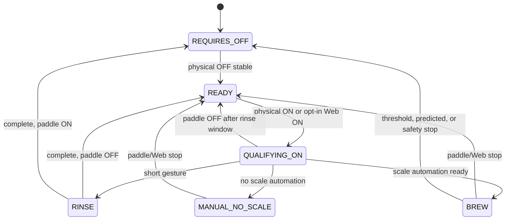
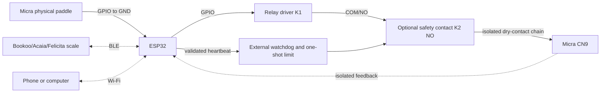

# Micra Shot Stopper

ESP32 firmware that controls the CN9 paddle circuit of a La Marzocco Micra
through an isolated relay contact and uses a compatible Bluetooth Low Energy
scale to automate an extraction by weight.

The Micra physical paddle **does not connect to CN9**: it connects only between
the configured ESP32 GPIO and GND. The relay COM/NO contact is the controller's
only connection to CN9. This lets the software read the paddle and control CN9
independently.

> **Safety notice:** verify continuity, isolation, module polarity, and that the
> relay remains open during startup, reset, and power loss. Complete the entire
> [manual test plan](docs/MANUAL_TEST_PLAN.md) before connecting the machine.
> This project cannot make an unsuitable relay module or unsafe wiring safe.

## Origin and evolution

This project began from
[tatemazer/AcaiaArduinoBLE](https://github.com/tatemazer/AcaiaArduinoBLE) — the
original ESP32 firmware and library for stopping an extraction by weight over
BLE. What started as small Micra-specific changes grew into a **new product
concept and an almost complete rewrite**. Micra Shot Stopper is now the main
application; the derived library remains in this repository as a local
dependency.

### Compared to the original firmware

| | Original AcaiaArduinoBLE stopper | Micra Shot Stopper |
| --- | --- | --- |
| **Scope** | Generic, intended to work on several machines | Dedicated to the Micra and its independent paddle |
| **Architecture** | Simple, mostly single-threaded | FreeRTOS tasks, queues, and isolation between control, BLE, and network |
| **Features** | Minimal brew-by-weight stop | Rich workflow: retare, confirmation windows, rinse, shot history, Web UI, diagnostics, safety layers |
| **Paddle machines** | Assumes you can work within the original machine constraints | Reads the physical paddle on GPIO and controls CN9 independently — no need to “fight” the paddle wiring |
| **Resilience** | Straightforward happy path | Explicit state machines, watchdogs, transactional CN9 close, stream validation, recovery paths |

The original firmware proved that BLE scale stop was possible; this project
**removed the original’s limitations on paddle-equipped machines** and invested
heavily in robustness: real thread boundaries, CN9 safety defenses, fault
handling, and persistence that survives resets and misconfiguration.

### What was added along the way

Examples that did not exist (or barely existed) in the original stopper sketch:

- **Intelligent retare** and brew-start confirmation so late cup placement does
  not break the shot.
- **Embedded Web UI** with Wi-Fi, diagnostics, configuration, and optional
  remote control — no extra display or buttons on the machine.
- **Shot history** (duration, weight, flow, first drop, cut type, extraction guard
  telemetry) with export.
- **Fast extraction guard** — optional extension when target weight is reached
  too quickly (minimum brew time + max recovery weight); off by default.
- **Advanced workflow settings** (rinse, CN9 limits, reminders, scale options).
- **Safety and observability** — supervisor, task watchdog, optional external
  K2/feedback, structured debug log, hardware monitor.
- **OTA over Wi-Fi** — planned; see [Not yet implemented](#not-yet-implemented).

The codebase is intentionally **more complex to implement and configure** so
that day-to-day use can stay **simple**.

## Design philosophy

The real goal is to use **brew by weight without noticing the DIY controller is
there**:

- Put the cup **before** the shot or **right when** the shot starts.
- Flip the paddle, brew, walk away.
- No extra screen on the espresso bar, no accessory buttons, no ritual double
  tare, no “did the stopper accept my cup?” — the firmware handles timing,
  retare, confirmation, stop, and reminders in the background.

Complexity lives in firmware parameters, state machines, and safety — not in
the barista workflow. Defaults and automatic behaviors (retare, confirmation,
offset learning, paddle-return beeps) exist so most users never touch the Web
UI after initial setup. The UI and API are there for tuning and diagnosis, not
for operating every shot.

In short: **hard to build, easy to live with.**

## Main features

### Micra paddle and CN9 control

- Independent read of the **physical paddle** (GPIO ↔ GND) and control of **CN9**
  through an isolated relay COM/NO contact.
- Safe startup: CN9 stays open until a stable physical paddle OFF is detected
  (`REQUIRES_OFF` → `READY`).
- Short-gesture **quick rinse** (configurable gesture time and rinse duration),
  manual extraction, and automatic **brew by weight** when a scale is available.
- **Physical paddle has priority** over every remote path. Web commands never
  bypass paddle safety or an active local cycle.
- Configurable **CN9 limit** per cycle (5–60 s) plus a firmware hard cap of
  60 s on every close path.
- Learned **stop offset** (default 1.5 g, capped at 5.0 g) updated from
  post-drip analysis; resettable from the Web UI.
- **Polarity:** physical paddle ON = GPIO **LOW**; relay closed (CN9
  energized) = GPIO **LOW**.

### Brew and weight settings

All workflow parameters below are editable from the Web UI **Configuration**
panel and persisted in **NVS** (`Preferences`, dual slots `settingsA` /
`settingsB`, config schema **v13**). Defaults are shown in parentheses.

| Setting | What it does |
| --- | --- |
| **Target (g)** | Goal weight for brew by weight (10–200 g; default 36 g). |
| **CN9 limit (s)** | Maximum CN9 closed time per cycle (5–60 s; default 60 s). |
| **Fast extraction guard** | Optional; **off by default**. See [Fast extraction guard](#fast-extraction-guard). |
| **Automatic tare** | Send an initial tare when an automatic shot starts (default ON). |
| **Timer only** | Keep tare/timer but disable weight stop and offset learning. |
| **Bookoo combined command** | Use the scale’s combined tare + start-timer command (requires auto tare; default ON). |
| **Automatic retare** | Allow one late-cup retare during the retare window (default ON). |
| **Retare window (s)** | Time after shot start to detect and retare a late-placed cup (default 4 s). |
| **Minimum cup weight (g)** | Stable load threshold that qualifies as a cup for retare (default 10 g). |
| **Retare stability** | Samples (default 3), tolerance (default 2.0 g), max sample gap (default 0.5 s), and min stable time (default 0.3 s) required before retare fires. |
| **Brew start confirmation (s)** | **Accidental-weight protection window** at shot start for automatic BBW: inhibits automatic weight stop until first drops are confirmed or the timeout expires (default 12 s; minimum retare window + 3 s). Skipped in timer-only mode. |
| **Quick rinse gesture (s)** | Maximum paddle ON time that still counts as a quick rinse when released (default 1.5 s). |
| **Quick rinse duration (s)** | How long CN9 stays closed after a quick rinse starts (default 3 s). |
| **Timezone offset (min)** | Wall-clock offset for shot history labels (default UTC+0). |
| **NTP server** | Preset (default **pool**) or custom hostname for time sync. |

Additional fixed protections (not separately configurable):

- **Post-tare baseline grace (2 s):** after a tare, weight must settle within
  ±50 g before the stream is trusted for stop decisions.
- **Direct threshold stop:** two fresh samples at `target − learned offset`
  after confirmation ends.
- **Predictive stop:** linear regression over recent accepted samples can stop
  earlier than the direct threshold.
- **Scale loss handling:** BLE disconnect or stale stream suspends weight
  control; recovery requires three coherent samples on the current connection
  generation. Paddle OFF and time limits remain authoritative.

### Alerts and reminders

| Setting | What it does |
| --- | --- |
| **Beep when coffee starts** | One scale beep on first coffee drops during an automatic shot (default ON; ignored in timer-only mode). |
| **Scale reminder beep until paddle OFF** | Repeat scale beeps while the **physical paddle stays ON**, **CN9 is open**, and the scale is connected — i.e. after the brew circuit opened but the paddle was left ON (default ON). |
| **Paddle reminder interval (s)** | Time between reminder beeps (5–60 s; default 10 s). |
| **Paddle reminder limit (min)** | Stop beeping after this duration even if the paddle remains ON (1–60 min; default 15 min). |

### Shot history

- Up to **120** completed extractions stored in NVS (shot log schema **v5**;
  minimum duration 10 s; rinses and very short gestures are excluded).
- Each record includes: local time (when NTP synced), duration, goal weight,
  actual weight, error and error %, learned offset used, average flow (g/s),
  first-drop time, shot type (`auto`, `timer_only`, `manual`), **cut type**
  (`auto`, `manual`, `limit` — how CN9 opened), **stop detail**
  (`normal_target`, `prediction`, `extended_max_weight`, `extended_min_time`,
  `other` — why weight stop fired when applicable), and when the fast
  extraction guard was active: whether the shot was extended,
  `targetReachedEarlyS`, and the max recovery weight / minimum brew time that
  applied.
- Web UI table with **CSV export**, authenticated **clear all**, and
  **per-shot delete**.
- Timezone offset and NTP server (preset or custom) configure wall-clock labels;
  manual **Sync now** when signed in.

### Web UI, Wi-Fi, and API

- Fully **embedded Web UI** (no external assets; **44 KiB** asset budget) served
  over Wi-Fi.
- **STA** mode when credentials are saved; **fallback AP**
  (`MicraShotStopperAP` at `192.168.4.1`) when STA is unavailable. Modes are
  **exclusive** (STA or AP, not concurrent AP+STA).
- AP fallback stays up for **3 minutes** after boot if nobody signs in, then
  shuts down until the next restart. Once STA connects, HTTP/Wi-Fi remain
  available (no visibility timer). After logout on AP, a **3-minute grace**
  window keeps the UI reachable.
- **Public read-only** status, live shot panel, shot history, diagnostic log,
  and firmware version footer without signing in.
- **Authenticated** session (factory AP/UI password **`Micra1234`**, stored as
  hash + salt; changeable from the Web UI) unlocks configuration, Wi-Fi
  scan/save, calibration reset, factory reset, Stop, and Restart. Up to **2**
  concurrent web sessions. Login responses include a CSRF token
  (`X-CSRF-Token` on mutating requests); repeated failed logins return
  `429 LOGIN_RATE_LIMITED`.
- **Live shot panel:** current/goal weight, progress bar, elapsed time, first
  drop, retare state, shot type, scale protocol, and **extraction guard**
  state (off / on / extended).
- **REST API** (`/api/v1/…`):
  - Read: `GET /status`, `GET /log`, `GET /shots`
  - Auth: `POST /login`, `POST /logout`, `POST /heartbeat` (UI polls every
    **10 s** while signed in)
  - Config: `POST /config`, `POST /calibration/reset`, `POST /time/sync`,
    `POST /access-point/password`
  - Network: `POST /network` (`save` / `forget`), `POST /network/scan`,
    `GET /network/scan` (async, max **12** networks, **120 s** timeout;
    cancelable via maintenance lease)
  - Control: `POST /control/paddle`, `/control/rinse`, `/control/stop`,
    `/control/restart`
  - Maintenance: `POST /factory-reset` (confirm `ERASE_ALL_SETTINGS`),
    `POST /shots/clear` (confirm `CLEAR_SHOT_LOG`), `POST /shots/delete`
  - Wi-Fi (STA/AP) and the HTTP server start regardless of paddle position;
    **configuration changes** still use a maintenance lease that requires
    stable paddle OFF and open CN9.
- **Factory reset** erases Wi-Fi, settings, calibration, shot history, and
  restores the AP/UI password to **`Micra1234`**, then restarts.

**Diagnostics** (Status panel + Log panel + API):

- Paddle state, CN9 relay state, CN9 safety supervisor (state, fault, watchdog,
  external hardware present, recovery required).
- Control source (physical vs web), maintenance lease, last command result.
- Scale link: BLE availability, protocol, stream/control state, observed vs
  accepted weight, packet gaps, rejected packets, reconnects, disconnect reason.
- Loop health: max loop gap, free/min heap, dropped debug events.
- Hardware monitor: CPU usage, chip temperature (and peak), RAM total/used/free,
  uptime, and last ESP reset reason.
- NTP/time sync state and configured timezone.
- **Diagnostic log:** bounded ring of **128** events (Scale, State, Relay,
  Paddle, Network, Config, Web, Security) with category filter, copy, and
  clear view (client-side only; firmware log unchanged); also available via
  `GET /api/v1/log`.

**Web paddle and remote control** (opt-in build only):

- **Virtual paddle** toggle (`POST /api/v1/control/paddle`) starts and ends a
  remote cycle when signed in and remote CN9 is enabled. Remote paddle
  sessions time out after **15 s** without a UI heartbeat.
- **Start quick rinse**, **Stop shot** (opens CN9 only), and **Restart
  controller** from the Actions panel.
- **Remote CN9 actuation for new cycles is disabled by default.** Virtual
  paddle and remote quick rinse require compile-time
  `SHOT_STOPPER_ENABLE_REMOTE_CN9=1`. **Stop** always opens CN9 in every
  build (when authenticated). Monitoring, diagnostics, and configuration work
  without the flag. Physical paddle always has priority.

### Scale support

Scale compatibility depends on the
[AcaiaArduinoBLE](https://github.com/tatemazer/AcaiaArduinoBLE) library by
**[tatemazer](https://github.com/tatemazer)**. This project vendors a local
copy under `libraries/AcaiaArduinoBLE/` and aims to stay aligned with upstream
releases, new scale types, and protocol fixes as they land in that repository.

- Local **AcaiaArduinoBLE** library (vendored in-repo) for **Acaia** (legacy and
  current), **Bookoo/generic**, and **Felicita** scales over BLE central.
- Dedicated **`scale_worker`** FreeRTOS task isolates BLE polling, connection
  retries, tare/start/stop commands, and beeps from the control loop via
  bounded command and event queues.

### Runtime architecture

Work is split so paddle/CN9 timing never waits on BLE or HTTP:

| Task | Role |
| --- | --- |
| **`loopTask` (Arduino `loop`)** | Paddle debounce, state machine, CN9 arm/open, weight-stop logic, shot logging, web command dispatch, safety supervisor feed. |
| **`scale_worker`** | BLE connection, weight stream, scale commands and beeps. |
| **`network_manager`** | Wi-Fi STA/AP, HTTP server, NTP, NVS writes for config/network. |
| **`status_indicator`** | WS2812B LED updates via a one-slot mailbox (never blocks control). |

`loopTask`, `scale_worker`, and `network_manager` each register a **5 s Task
Watchdog** subscription. `status_indicator` does **not** subscribe to the TWDT
(it only drives LEDs).

### Safety and indicators

- Generation-based **transactional CN9 close**; three timing defenses (GPTimer
  IRAM handler, `esp_timer`, supervisor deadline).
- Optional **external heartbeat + CN9 feedback** for a second K2 barrier
  (compile-time GPIO pins).
- Redundant RTC relay-command log; unsafe reset during CLOSE or repeated boot
  loops require **local paddle recovery** (ON then stable OFF).
- Two independent **WS2812B** pixels: scale/BLE health and stopper workflow /
  safety state (diagnostic only, not part of CN9 decisions).
- **Host tests** for workflow, persistence, safety, remote policy, BLE library,
  and embedded Web UI asset validation.

## Not yet implemented

The following items are planned but **not present in the current firmware**:

- **External buzzer** — piezo or speaker on a dedicated GPIO to alert when the
  scale is unavailable (e.g. paddle-return reminder without a connected scale).
  Today, audible alerts use the scale’s own beep command when BLE is connected.
- **OTA (over-the-air firmware updates)** — remote flash of new builds over
  Wi-Fi without USB.
- **Home Assistant integration** — publish status, sensors, and/or controls to
  Home Assistant (MQTT, REST, or native integration).

## Repository structure

```text
.
├── VERSION                         # Release version (SemVer)
├── scripts/gen_version.sh          # Build-time version header generator
├── shotStopper/                    # Main firmware sketch and host tests
│   ├── shotStopper.ino
│   └── tests/                      # Host tests, web asset + firmware checks
├── libraries/
│   └── AcaiaArduinoBLE/            # Local Arduino library and BLE tests
├── docs/
│   └── MANUAL_TEST_PLAN.md
└── LICENSE
```

`shotStopper/` is the main sketch. `libraries/AcaiaArduinoBLE/` is included
explicitly during compilation with `--library`.

## Functional behavior

At startup, the relay is open. The controller must detect a stable physical
paddle OFF state before entering `READY`. From `READY`, moving the paddle to ON
closes CN9 and begins gesture qualification.

- Releasing it within the rinse gesture time starts a rinse. CN9 remains closed
  for the configured rinse duration, and subsequent paddle changes are ignored
  until the rinse ends.
- Holding it ON past the rinse gesture starts an automatic extraction if scale
  automation was available when the cycle begins; otherwise it becomes a manual
  cycle without a scale. Entry to `BREW` is brief (debounce/BLE only) and does
  not wait for retare or brew-start confirmation.
- Releasing it after the rinse window ends the qualifying gesture as a completed
  brew and opens CN9.
- Releasing it during an automatic or manual extraction opens CN9 immediately.
- If the scale disconnects or its samples become stale during an automatic
  extraction, weight control is suspended. It recovers only on the current BLE
  generation after three coherent samples. Paddle OFF and timing limits remain
  authoritative throughout.
- After brew-start confirmation ends, two fresh samples at or above
  `goal - offset` stop the extraction directly, independently of regression.
  Prediction remains an earlier stop mechanism. Timer-only mode retains timing
  and tare but disables both mechanisms and learning.
- Every path that closes CN9 is constrained by the configurable operational
  time and an absolute maximum of 60 seconds.



## Scale stop logic

During an automatic extraction the scale session starts with the cycle. Entry to
`BREW` is brief (debounce/BLE only) and does not wait for retare or brew-start
confirmation — those windows run in parallel from shot start.

1. **Automatic retare** (if enabled): stable cup load after shot start triggers
   a second tare without restarting the shot timer.
2. **Brew start confirmation** (always active for automatic BBW): waits for
   reliable first drops or times out. Automatic stop by weight is inhibited
   while retare or confirmation still blocks.
3. **Brew by weight**: after both windows end, direct threshold and predictive
   stop are armed immediately.

Manual stop, CN9 time limits, paddle OFF, and all safety mechanisms remain
active throughout. Timer-only and manual-no-scale cycles skip retare and
confirmation. Abrupt or implausible samples are visible as observed weight but
cannot enter regression or offset learning.

The status API distinguishes BLE connection, stream freshness, control
authority, observed versus accepted weight, connection generation, packet
gaps, rejected packets, reconnects, and disconnect reason.

## Fast extraction guard

Optional brew-by-weight enhancement, **disabled by default**. It addresses
shots that reach the target weight too quickly — often a sign of channeling or
a grind that is too coarse — where stopping immediately would yield a thin,
under-extracted cup.

When enabled, you still set a mandatory **target weight** (same as today). You
also configure:

| Setting | Default | Role |
| --- | --- | --- |
| **Max recovery weight (g)** | 42.5 | Hard ceiling if the shot must be extended |
| **Minimum brew time (s)** | 26 | Minimum extraction time for a normal target stop |

### How it works

1. **Normal stop** — the scale reaches the target at or after the minimum brew
   time → CN9 opens at the target (unchanged behavior).
2. **Too fast** — the target is reached *before* the minimum brew time → the
   shot enters **extended** mode and keeps running until either:
   - **Max recovery weight** is reached (always stops), or
   - **Minimum brew time** is reached *and* the scale still shows at least the
     target weight (stops even if below max recovery).

Elapsed time is measured from cycle start (CN9 close), consistent with other
timing in the firmware. The learned stop offset applies to both target and max
recovery thresholds.

### Why it is useful

If coffee hits 36 g in ~22 s but you know a good shot needs ~26 s, the guard
lets the extraction continue toward 42.5 g or until the minimum time passes —
similar to manually allowing the shot to reach your next weight checkpoint
without watching the scale.

### Telemetry

The live shot panel shows when the guard is off, on, or **extended** (with the
active stop weight and time remaining). Shot history and CSV export record
`ext_guard`, `ext`, `stop`, `max_rec_g`, `min_brew_s`, `early_s`, plus
`shot_type` and `cut_type`.

## Web UI and Wi-Fi (details)

See **Web UI, Wi-Fi, and API** under [Main features](#main-features) for
diagnostics, virtual paddle control, and the full capability list. Operational
notes:

- The interface cannot change workflow settings during an active cycle.
- Virtual paddle and remote quick rinse require
  `SHOT_STOPPER_ENABLE_REMOTE_CN9=1` on a trusted network. **Stop** works in
  every build when authenticated.
- Each remote cycle is bound to its session and a non-reusable lease.
- Configuration, NVS, Wi-Fi save, and scan operations use a **maintenance
  reservation** that requires stable paddle OFF and open CN9; physical movement
  cancels it. Read-only status and the web UI remain available while the paddle
  is ON.
- `202` responses include a `requestId`; `GET /api/v1/status` publishes the
  terminal command state (`APPLIED`, `PERSISTED`, `FAILED`, `CANCELED`).
- Factory AP/UI password is **`Micra1234`** (hash + salt in NVS). Change it
  from the Web UI after first login on a trusted network.

## Watchdog and CN9 safety

The firmware configures the ESP-IDF Task Watchdog with a 5-second timeout and
`trigger_panic=true`. It subscribes `loopTask`, `scale_worker`, and
`network_manager` separately; `status_indicator` is not subscribed. No task
feeds another task's watchdog. A registration or feed failure inhibits new
closes, opens CN9, and requests a restart from the control loop. Compilation
fails unless the core enables TWDT panic, IWDT, reboot after panic, and an
IRAM GPTimer handler.

CN9 closes transactionally: `ARMING` is first published with a new generation,
then all deadlines are armed, and only then is the relay energized if the
generation is still current. Opening uses the reverse risk order: the OPEN
electrical level is written first, then timers are stopped. The shortest
deadline also runs through a GPTimer interrupt independently from the loop,
BLE, Wi-Fi, and the `esp_timer` task. Its emergency opening writes the GPIO
register directly from IRAM code, so it does not depend on `digitalWrite()` or
flash cache availability.

Before K1 is energized, the CLOSE command is recorded in RTC memory as a value
and its complement; OPEN is recorded after opening. A WDT reset, panic,
brownout, power glitch, CPU lockup, or reset during CLOSE boots into `LOCKOUT`.
Three consecutive unsafe resets are diagnosed as `BOOT_LOOP`. Web access cannot
rearm it: recovery requires physically moving the paddle to ON and then holding
it stably OFF for one second while timers, watchdog, and feedback are healthy.

These firmware defenses reduce lockups and races, but a reset cannot open a
welded contact or repair a shorted relay transistor. Containing those faults
requires a normally-open second K2 barrier driven by an external heartbeat
detector with a non-retriggerable limit, plus isolated real-state feedback.
Without K2 and feedback, the Web UI reports `external not configured`, and the
protection must be considered **software only**, not a physical guarantee
against relay or GPIO failures.

## Hardware



Use a relay or contact with isolation and ratings suitable for CN9. Never
connect CN9 to GND, VCC, or an ESP32 GPIO, and use COM/NO rather than NC.
Feedback must also be isolated: do not electrically join CN9 and ESP32 GND.
The external detector must drive K2 OPEN when the heartbeat is stuck HIGH,
stuck LOW, absent, or out of frequency; a second relay controlled directly by
the same GPIO does not provide this barrier.

The selected FQBN automatically defines the matching pin block in
`shotStopper.ino`. The two status LEDs are independent one-pixel WS2812B
devices, each with its own data GPIO:

| Board | FQBN | Paddle | Relay | Scale LED | Stopper LED |
| --- | --- | ---: | ---: | ---: | ---: |
| ESP32 Dev Module / DevKit V4 | `esp32:esp32:esp32` | GPIO 27 | GPIO 26 | GPIO 25 | GPIO 33 |
| ESP32-S3 Dev Module | `esp32:esp32:esp32s3` | GPIO 21 | GPIO 38 | GPIO 48 | GPIO 47 |

The code also maps Arduino Nano ESP32 D10/D11 to paddle/relay and D2/D3 to
external WS2812B data inputs. Its built-in common-anode RGB LED is not a
WS2812B and is no longer used. Before energizing CN9, verify every pin for the
specific board and the active polarity of the relay module.

### WS2812B status indicators

A WS2812B is a digital addressable RGB LED controlled through one data line;
it is not an analog LED. This firmware uses two separately wired pixels:

- **Scale LED:** BLE subsystem and scale-link health.
- **Stopper LED:** workflow, operating mode, maintenance, and CN9 safety.

The default brightness is 32 of 255. The LED task is isolated from the control
loop behind a one-item overwrite mailbox: indicator transmission cannot make
the safety loop wait, and old visual states cannot form a backlog. LEDs are
diagnostic only and are never part of the CN9 safety decision.

| Scale LED | Meaning |
| --- | --- |
| Slow blue blink | Firmware is starting |
| Solid green | Scale connected, worker responsive, and weight stream fresh |
| Solid red | Scale disconnected |
| Slow yellow blink | BLE link is connected but worker or weight stream is stale |
| Fast red blink | BLE subsystem or scale worker unavailable |

| Stopper workflow | Automatic palette | Manual/timer-only palette |
| --- | --- | --- |
| Ready | Solid green | Solid salmon |
| Qualifying paddle ON | Medium green blink | Medium salmon blink |
| Brewing | Slow green blink | Slow salmon blink |
| Rinsing | Fast green blink | Fast salmon blink |

Stopper safety and action states override both operating palettes:

| Stopper LED | Meaning |
| --- | --- |
| Slow amber blink | Physical paddle must return to OFF |
| Slow blue blink | Boot-safe initialization or maintenance reservation |
| Fast red blink | Safety lockout, safety trip, watchdog fault, or safety subsystem unavailable |

Slow, medium, and fast use equal ON/OFF phases of 750, 300, and 125 ms,
respectively. Typical combinations: green + solid green = scale connected and
ready for automatic operation; green + slow green = automatic brewing; salmon
palette = timer-only or manual-no-scale mode; red + any = scale disconnected.

An ESP32-S3 chip does not guarantee an onboard RGB LED. Even Espressif's own
ESP32-S3-DevKitC-1 revisions differ: the initial revision connects an
addressable RGB LED to GPIO 48, while revision 1.1 uses GPIO 38. Both revisions
may be encountered. GPIO 38 is already the default relay output in this
project, so the revision 1.1 onboard LED **must not** be used with the default
pin map; use two external pixels on verified free pins instead. The original
Mazer V3 firmware's GPIO 46/45/47 common-anode RGB mapping describes that
specific Shot Stopper hardware, not every ESP32-S3 board.

Override the status data pins and brightness at compile time. The pins must be
distinct, output-capable, and different from paddle, relay, heartbeat, and
feedback GPIOs:

```sh
mkdir -p build/esp32-s3-custom-leds
arduino-cli compile --fqbn esp32:esp32:esp32s3 --warnings all \
  --build-property \
  'compiler.cpp.extra_flags=-Werror=deprecated-copy -DSHOT_STOPPER_SCALE_LED_GPIO=4 -DSHOT_STOPPER_STOPPER_LED_GPIO=5 -DSHOT_STOPPER_LED_BRIGHTNESS=32' \
  --library libraries/AcaiaArduinoBLE \
  --build-path build/esp32-s3-custom-leds \
  shotStopper
```

GPIO 4 and GPIO 5 above are examples only. Verify the schematic, strapping
requirements, relay integration, and physical board before selecting them.

### Enable external heartbeat and feedback

There are no default K2/feedback pins because they depend on the reviewed board
and circuit. Both must be defined; defining only one causes a compilation
error:

- `SHOT_STOPPER_SAFETY_HEARTBEAT_GPIO`: output to the external detector.
- `SHOT_STOPPER_CN9_FEEDBACK_GPIO`: isolated feedback input.
- `SHOT_STOPPER_CN9_FEEDBACK_CLOSED_LEVEL`: optional; defaults to `LOW`.

Example build for an ESP32 Dev Module where GPIO 16 and GPIO 17 were verified as
free and appropriate on the specific hardware:

```sh
mkdir -p build/esp32-safety
arduino-cli compile --fqbn esp32:esp32:esp32 --warnings all \
  --build-property \
  'compiler.cpp.extra_flags=-Werror=deprecated-copy -DSHOT_STOPPER_SAFETY_HEARTBEAT_GPIO=16 -DSHOT_STOPPER_CN9_FEEDBACK_GPIO=17' \
  --library libraries/AcaiaArduinoBLE \
  --build-path build/esp32-safety \
  shotStopper
```

The README [compile examples](#compile) enable remote CN9 actuation with
`-DSHOT_STOPPER_ENABLE_REMOTE_CN9=1`. Omit that flag for local-only builds.

The firmware checks at compile time that both pins differ from paddle, relay,
and LED pins, and that the heartbeat uses an output-capable GPIO. This does not
replace review of pinout, boot strapping pins, schematics, or electrical
measurements on the actual board.

## Prepare the build environment

The project requires `arduino-cli`, a C++ compiler for host tests, and Node.js
to validate Web UI assets. Optional coverage requires LLVM (`llvm-profdata` and
`llvm-cov`). First confirm that Arduino CLI is available:

```sh
arduino-cli version
```

Initialize its configuration only if one does not already exist, then add the
ESP32 board index:

```sh
arduino-cli config init
arduino-cli config add board_manager.additional_urls \
  https://espressif.github.io/arduino-esp32/package_esp32_index.json
```

Install the toolchain and dependency versions validated by this project:

```sh
arduino-cli core update-index
arduino-cli core install esp32:esp32@3.3.3
arduino-cli lib install ArduinoBLE@2.1.0
```

Do not install AcaiaArduinoBLE from Library Manager for this application: the
audited version is included in `libraries/AcaiaArduinoBLE`, and the build
command selects it through `--library`.

## Firmware version

Release version lives in `VERSION` at the repository root (`MAJOR.MINOR.PATCH`).
Bump it manually when publishing a release. The git commit hash is appended
automatically on every build (`1.0.0+abc1234`, or `-dirty` with uncommitted
changes).

Before compiling or running host tests, generate the version header:

```sh
./scripts/gen_version.sh
```

This writes `shotStopper/ShotStopperVersion.h` (gitignored). The installed
firmware reports the version on Serial boot, in `GET /api/v1/status` as
`firmwareVersion`, and in the Web UI footer.

To verify a compiled binary without flashing:

```sh
strings build/esp32/shotStopper.ino.bin | grep -E '^[0-9]+\\.[0-9]+\\.[0-9]+\\+'
```

## Compile

From the repository root, generate the version header and build for an ESP32
DevKit V4 with:

```sh
./scripts/gen_version.sh
mkdir -p build/esp32
arduino-cli compile \
  --fqbn esp32:esp32:esp32:PartitionScheme=min_spiffs \
  --warnings all \
  --build-property 'compiler.cpp.extra_flags=-Werror=deprecated-copy -DSHOT_STOPPER_ENABLE_REMOTE_CN9=1' \
  --library libraries/AcaiaArduinoBLE \
  --build-path build/esp32 \
  shotStopper
```

`-DSHOT_STOPPER_ENABLE_REMOTE_CN9=1` exposes virtual paddle and remote quick
rinse over the Web UI and API. **Stop** is always available when authenticated,
even without this flag. Use remote actuation only on a trusted network.

The `min_spiffs` partition scheme gives a **1.9 MB** application slot. The
default scheme only allows **1.25 MB** (`1310720` bytes); this firmware is
larger than that limit and will not boot if compiled with the default
partition table.

After compiling, verify the on-disk image fits when using the default OTA
slot (optional sanity check):

```sh
wc -c < build/esp32/shotStopper.ino.bin
```

For the ESP32-S3 variant, generate the version header and use its FQBN and
output directory. Use the same **`min_spiffs`** partition scheme as the
classic ESP32 build:

```sh
./scripts/gen_version.sh
mkdir -p build/esp32-s3

arduino-cli compile \
  --fqbn esp32:esp32:esp32s3:PartitionScheme=min_spiffs \
  --warnings all \
  --build-property 'compiler.cpp.extra_flags=-Werror=deprecated-copy -DSHOT_STOPPER_ENABLE_REMOTE_CN9=1' \
  --library libraries/AcaiaArduinoBLE \
  --build-path build/esp32-s3 \
  shotStopper
```

## Upload to the ESP32

Connect the board and determine its port:

```sh
arduino-cli board list
```

After compiling, upload to an ESP32 DevKit by replacing the example port with
the port used by your system:

```sh
arduino-cli upload \
  --port /dev/cu.usbserial-0001 \
  --fqbn esp32:esp32:esp32:PartitionScheme=min_spiffs \
  --input-dir build/esp32 \
  shotStopper
```

For ESP32-S3, change `--fqbn` (include `PartitionScheme=min_spiffs`) and
`--input-dir` to match the compiled variant. The generated application image is named `shotStopper.ino.bin`.
`arduino-cli upload --input-dir` is recommended because it uploads the
bootloader, partition table, and application at their correct offsets.

## Serial monitor

Connect the board over USB and list available ports:

```sh
arduino-cli board list
```

On macOS the port is usually `/dev/cu.usbserial-XXXX` (use the `cu.*` device,
not `tty.*`, for monitoring). On Linux it is often `/dev/ttyUSB0` or
`/dev/ttyACM0`.

Open the monitor with `arduino-cli`, replacing the port with yours:

```sh
arduino-cli monitor -p /dev/cu.usbserial-0001 -c baudrate=115200
```

Use **115200** right after reset to read ESP32 boot messages (including image
size or partition errors). After the app starts, switch to **9600** for Shot
Stopper logs:

```sh
arduino-cli monitor -p /dev/cu.usbserial-0001 -c baudrate=9600
```

You should see lines such as `Shot Stopper Micra …` and `Goal weight: …`.
Press **RST** on the board if the monitor was already open. Exit with
`Ctrl+C`.

### Troubleshooting serial output

Not every baud rate works on every board. The correct speed depends on the
USB‑serial chip (CP2102, CH340, FTDI, native USB CDC), the ESP32 variant, and
whether you are reading the **bootloader** or the **running firmware**. If the
monitor shows garbage (random symbols and repeated characters), try another rate and press **RST** after
each change.

| Baud rate | Typical use |
| --- | --- |
| **9600** | Shot Stopper application logs (this firmware) |
| **115200** | ESP32 Arduino boot / early startup messages |
| **74880** | ESP32 ROM bootloader right after reset |
| **57600** | Some CH340 / clone adapters and older sketches |
| **38400** | Fallback on misconfigured or bridged setups |
| **19200** | Rare; worth trying if nothing else is readable |
| **230400** | High-speed debug builds (not used by this project) |

Example — try another rate:

```sh
arduino-cli monitor -p /dev/cu.usbserial-0001 -c baudrate=74880
```

If output is still unreadable at every rate:

- Confirm the port with `arduino-cli board list` and use the `cu.*` device on
  macOS.
- Close other programs that may hold the port (Arduino IDE, another monitor).
- Try a different USB cable or port (must be data, not charge-only).
- Re-flash the firmware and watch **115200** or **74880** during reset for
  partition or boot errors.

If you see `Image length … doesn't fit in partition length …`, recompile with
`PartitionScheme=min_spiffs` (see [Compile](#compile)) and upload again.

## Automated tests

Run the tests before uploading firmware:

```sh
./libraries/AcaiaArduinoBLE/tests/run_host_tests.sh
./shotStopper/tests/run_host_tests.sh
node ./shotStopper/tests/check_web_assets.js
node ./shotStopper/tests/check_firmware_size.js build/esp32/shotStopper.ino.bin
```

The firmware size check verifies the application binary fits the default OTA
slot (`1310720` bytes). Skip it if you have not compiled yet, or pass another
`.bin` path as the first argument.

To generate the stopper coverage report when LLVM is installed:

```sh
./shotStopper/tests/run_coverage.sh
```

Automated tests do not replace electrical, RF, power-loss, or
[manual test plan](docs/MANUAL_TEST_PLAN.md) verification.

The stopper suite includes host fault injection for a timeout during `ARMING`,
GPTimer failure, task watchdog failure, stuck/disconnected feedback, and
heartbeat faults. Bench and HIL testing of the specific circuit remains
mandatory before real use.

## Additional documentation

- [Manual test plan](docs/MANUAL_TEST_PLAN.md)
- [Local AcaiaArduinoBLE library](libraries/AcaiaArduinoBLE/README.md)

## License and acknowledgements

The project retains the MIT license in [LICENSE](LICENSE).

Micra Shot Stopper is a derivative work that **would not exist without**
[tatemazer/AcaiaArduinoBLE](https://github.com/tatemazer/AcaiaArduinoBLE): the
original proved BLE brew-by-weight stop and shared the core scale protocol work.
This repository acknowledges that project and the contributors listed in the
[local library documentation](libraries/AcaiaArduinoBLE/README.md#acknowledgement).
The application firmware, safety model, Web UI, and Micra-specific workflow are
substantial new work on top of that foundation.

## Disclaimer

This project was developed with substantial assistance from artificial
intelligence tools. AI helped with design, implementation, documentation, and
testing workflows; human review, hardware validation, and safety judgment remain
the author’s responsibility. Use on real espresso equipment only after you have
verified wiring, isolation, and behavior on your own setup.
