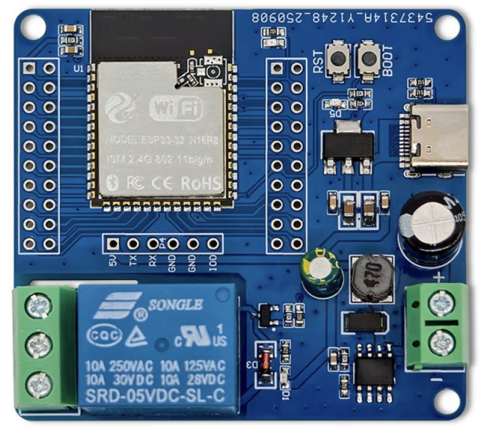

# Hardware

Development board used for this firmware, default GPIO map, and wiring
warnings.

**TODO:** bill of materials, schematic, and step-by-step brew-switch wiring.

On the Linea Micra, the intercepted brew-switch connector is labelled **CN9**.
This firmware treats that contact as the **machine circuit** — the isolated
path that makes the machine run — not as a Micra-specific name. Other machines
intercept a different brew/run circuit with the same relay contract. User-facing
copy (Web UI, Settings, status JSON) always says **machine circuit**, never CN9.

Until that write-up exists, treat the photo and pin table below as the known
facts, and complete the [manual test plan](MANUAL_TEST_PLAN.md) on the bench
before connecting a live machine.

## Development board

Firmware was developed on an **ESP32-S3 1-channel relay** board (WROOM-1
**N16R8** module: 16 MB flash, 8 MB OPI PSRAM, USB-C, onboard Songle relay
with COM / NO / NC screw terminals).



The firmware **default GPIO map matches this board**. It is not a generic
DevKit pinout.

You can still compile for **n8r4** (8 MB flash, 4 MB QSPI PSRAM) if that is
the module you have. Paddle and relay GPIOs stay the same; only flash size
and PSRAM type change. Classic ESP32 and Arduino Nano ESP32 are **not
supported**.

Pins live in [`shotStopper/ShotStopperHardware.h`](../shotStopper/ShotStopperHardware.h).
They are **not** editable from the Web UI.

## Default GPIOs

| Function | GPIO | Level |
| --- | ---: | --- |
| Activator (to GND) | **21** | Active **LOW** (internal pull-up; ON = GPIO LOW). Paddle or switch, depending on machine type. |
| Reed (momentary+reed builds) | **4** | Active **LOW** (internal pull-up; ON = GPIO LOW). Compile `SHOT_STOPPER_MACHINE_TYPE=2`. Override with `-DSHOT_STOPPER_REED_GPIO`. Must stay distinct from activator, relay, LED, buzzer, and safety GPIOs. |
| Onboard relay coil | **2** | Active **HIGH** (HIGH energizes the coil and closes NO) |
| Scale-connected LED | **1** | Active HIGH while a BLE scale is connected (switchable in Alerts) |
| Optional buzzer | **14** | Compile with `SHOT_STOPPER_ENABLE_BUZZER=1` (passive piezo, RTTTL on the same pin) or `=2` (active on/off beep) |

Optional external K2 safety (both pins or neither; no defaults, because they
depend on a reviewed board):

- `SHOT_STOPPER_SAFETY_HEARTBEAT_GPIO`
- `SHOT_STOPPER_CIRCUIT_FEEDBACK_GPIO`
- `SHOT_STOPPER_CIRCUIT_FEEDBACK_CLOSED_LEVEL` (optional; default LOW)

Compile example:

```sh
./scripts/build-idf --arch n16r8 \
  --flags "-DSHOT_STOPPER_ENABLE_REMOTE_MACHINE_CONTROL=1 \
-DSHOT_STOPPER_SAFETY_HEARTBEAT_GPIO=16 -DSHOT_STOPPER_CIRCUIT_FEEDBACK_GPIO=17"
```

To use a different paddle, relay, LED, or buzzer pin, edit
`ShotStopperHardware.h` (or the matching `-D` override) and rebuild. Wrong
pins can leave machine circuit closed or misread the paddle.

## Isolation (must)

- The machine circuit connects only to the relay **COM/NO** contact. Never to GND, VCC, or an
  ESP32 GPIO.
- Do not use NC as the brew path.
- Feedback, if you add it, must also be isolated. Do not join machine circuit ground to
  ESP32 ground.
- The onboard relay is **not** a certified safety barrier. A welded contact
  or a shorted driver needs a second, normally-open contact (K2) driven by an
  independent heartbeat. Without that, protection is software-only.

Verify continuity, module polarity, and that the relay stays **open** during
startup, reset, and power loss.

## Scale-connected LED

GPIO 1 is HIGH while a BLE scale is connected and **Settings → Alerts → Blue
LED while scale connected** is on. It is diagnostic only and is never part of
the machine-circuit decision.

Override at compile time with `-DSHOT_STOPPER_SCALE_CONNECTED_LED_GPIO=…`.
The pin must be output-capable and distinct from paddle, relay, buzzer,
heartbeat, and feedback.

## Local buzzer

Wire between `SHOT_STOPPER_BUZZER_GPIO` (default 14) and GND: marked **+** to
the GPIO. Identify the part with 3.3 V DC on `+` vs GND: a constant tone is
**active** (`=2`); a click or silence is **passive** (`=1`). See
[Alerts](alerts.md) and [Build environment](BUILD.md).

Related: [Disclaimer](../README.md#disclaimer), [FAQ](FAQ.md).
