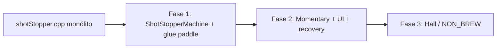
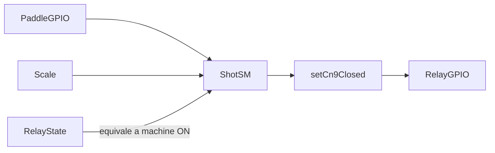
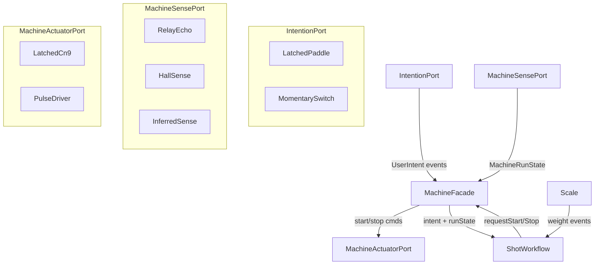
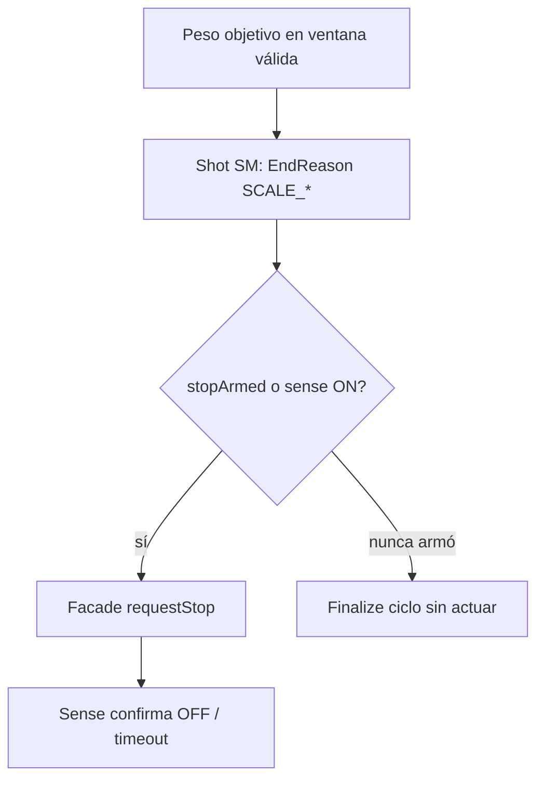
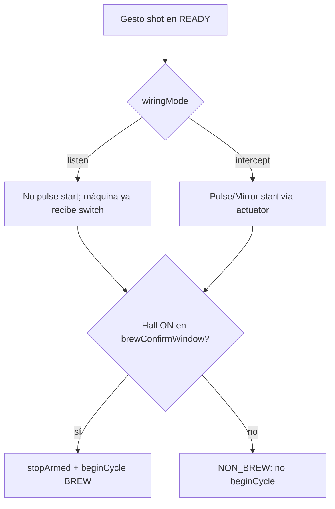

# Abstracción MachinePort (Paddle/CN9 vs Momentary±Hall)

Design plan for separating user intention, machine actuation, and ON/OFF observation from the existing shot workflow, so Paddle+latched CN9 and Momentary (±Hall/Reed) share the same BBW / first-drop / protection logic and only swap the machine “driver”.

**Status:** design / not implemented  
**Phases:** (0/1) Extraer `ShotStopperMachine` sin Momentary, (2) Momentary + UI + recovery, (3) Hall/NON_BREW, (4) UX hardening

## Invariante no negociable: lógicas de BREW intactas

**Todas las lógicas que hoy gobiernan el BREW no tienen que ser modificadas ni cambiadas.**

Eso incluye, sin excepción de semántica:

- `StopperState` y transiciones de ciclo (`REQUIRES_OFF` / `READY` / `BREW` / `RINSE` / `MANUAL_NO_SCALE`) en su significado de shot
- BBW protection (p.ej. 12 s), retare, first drop, umbral de peso, confirmaciones de stop
- Fast / slow extraction guards, A→M, cup protection, no-scale guard
- `PaddleMode` Natural / Original / Auto **cuando el perfil es paddle** (misma política que hoy)
- Criterios de `EndReason`, shot log, tare/timer-only

Lo único que puede cambiar es la **capa de máquina** debajo: cómo se interpreta la intención (paddle vs momentary), cómo se actúa (CN9 latched vs pulse) y cómo se observa ON/OFF (relay echo vs Hall vs inferred). El shot SM sigue consumiendo “start / stop / machine running / elapsed” — no se reescribe el brew-by-weight ni se inventa otra máquina de estados de extracción.

Cualquier PR de este plan que altere comportamiento BREW en path paddle/Micra es un fallo de alcance.

## Orden de entrega: factoría primero, Momentary después

**Sí: la separación `ShotStopperMachine.h/.cpp` se hace antes de implementar el nuevo modo de funcionamiento.**

No es opcional ni “si sobra tiempo”: es el **primer entregable**, en un PR (o serie) que:

1. Extrae types + facade de paddle/CN9/relay-echo desde el monólito.
2. Deja [`shotStopper.cpp`](../shotStopper/shotStopper.cpp) como shot SM + glue (llama al facade; no conoce Momentary todavía).
3. Cablea `machineElapsedMs`, `requestStart`/`requestStop` gated/`stopArmed` sobre el path **solo paddle**.
4. Mantiene `machineType = paddle` fijo (UI sin sección Momentary aún).
5. Pasa la suite host existente **sin cambio de semántica** Micra/BREW.

Solo cuando ese facade exista y los tests paddle estén verdes se abre Fase 2 (Momentary, wiring, gestos, recovery momentary). Así se evita mezclar un refactor grande con comportamiento nuevo y se puede testear el facade sin el web stack.



---

## Diagnóstico del modelo

La separación propuesta encaja con el gap actual del FW:

- Hoy **“máquina ON” ≡ `cn9Closed`** y **intención ≡ `paddleOn` (latch)**. Eso es verdad en Marzocco (paddle con estado + CN9 controlado por el stopper), y es falso en Silvia Pro X (switch momentary + la máquina tiene su propio latch interno).
- El shot workflow (`StopperState`, BBW 12 s, first drop, fast/slow, umbral de peso) **no debería conocer** si el ON vino de un relay latched o de un pulso+Hall. Solo necesita: “máquina corriendo / no”, “usuario pidió start/stop”, y “corta la máquina”. **Esas lógicas de BREW permanecen intactas** (ver invariante arriba).
- Hall **no define el shot**; solo mejora la **confianza** del estado de máquina. Sin Hall, OFF/ON se infieren con más error — y la balanza sigue siendo la autoridad para **terminar** el shot.

Matiz respecto a “sin Hall”:

- Inferir “la siguiente señal es STOP” solo por “después de 12 s la balanza se comporta como shot” es frágil (rinse, flush, false start). Mejor: **toggle de intención con hysteresis + evidencia de escala**, no un flip binario duro a los 12 s.
- Con Hall: `CONFIRMED_OFF` cuando Hall=OFF; `ASSUMED_ON` / `CONFIRMED_ON` tras correlación. Nunca tratar Hall=ON como “estado de shot”.

## Estado actual (acoplamiento)

Todo vive en [`shotStopper/shotStopper.cpp`](../shotStopper/shotStopper.cpp):

- Intención: `updatePaddleInput()` → `paddleOn` / edges
- Actuación + “estado de máquina”: `setCn9Closed()` / `RelaySafetySnapshot`
- Shot SM: `beginCycle` / `finalizeCycle` / `stateMachineTask` llama directamente al relay
- Timing de brew: `cycleShotElapsedMs()` usa **tiempo de relay cerrado**, no un “machine running” abstracto
- Stubs GATT `reedSwitch_` / `momentary_` en [`ShotStopperBleCompanion.h`](../shotStopper/ShotStopperBleCompanion.h) **no participan** en control (legacy upstream)



## Diseño objetivo: tres puertos + un facade



### 1. IntentionPort (interpretación de intención)

Salida unificada (eventos por loop, no estado crudo de GPIO):

- `RequestStart` / `RequestStop`
- `HoldActive` (solo latched paddle; sirve a Original/Auto)
- `StableIdle` (equivale a paddle OFF estable → salir de `REQUIRES_OFF`)

| Hardware | Mapping |
| -------- | ------- |
| Paddle latch | ON edge → Start; OFF edge → Stop (o Hold released); nivel ON → `HoldActive` |
| Momentary | Flanco/gesto → **candidato** Start o Stop según `MachineRunState` + contexto de sesión |

`PaddleMode` (Natural/Original/Auto) **permanece solo en perfil latched**. En momentary no hay “mantener paddle ON”: el análogo de Original/Auto es “start → el stopper corta por peso/pulso/stop”, sin hold override.

### 2. MachineActuatorPort (control)

| Perfil | `requestStart()` | `requestStop()` | Semántica de seguridad |
| ------ | ---------------- | --------------- | ---------------------- |
| **Latched CN9** (actual) | `setCn9Closed(true)` | `setCn9Closed(false)` | Walls/timers sobre tiempo cerrado (ya existe) |
| **Pulse** | Pulso corto en el circuito de brew | Otro pulso | Walls sobre **tiempo de machine-ON observado/inferido** |

El pulse driver reutiliza el mismo GPIO de relay pero con semántica de edge (duración configurable, anti-reentrada, cooldown entre pulsos).

### 3. MachineSensePort (estado de máquina ≠ estado de shot)

```cpp
enum class MachineRunState : uint8_t {
  CONFIRMED_OFF,   // Hall OFF, o relay open en latched, o post-stop confirmado
  ASSUMED_ON,      // Start asumido; Hall aún no confirma / sin Hall
  CONFIRMED_ON,    // Hall ON, o relay closed en latched
  UNKNOWN          // Transición / timeout de correlación
};
```

| Sense backend | OFF | ON |
| ------------- | --- | -- |
| **RelayEcho** (Micra hoy) | relay open | relay closed |
| **Hall** | Hall inactive → `CONFIRMED_OFF` | Hall active tras start → `CONFIRMED_ON`; sin correlación reciente → ON no atribuido al stopper |
| **Inferred** (momentary sin Hall) | Tras stop pulse + timeout / idle | Tras start → `ASSUMED_ON`; escala post-protección refuerza ON |

### Regla de oro: escala corta el shot; sense gatea la actuación

**La escala manda el corte del shot** cuando el peso objetivo se alcanza en ventana válida. Sense **no** decide el shot; solo informa si la máquina “está haciendo algo” para correlacionar intención y **autorizar** actuación.

Implicaciones obligatorias (especialmente en pulse / Silvia):

1. **La escala nunca enciende la máquina.** Un umbral de peso solo puede generar `requestStop()`, nunca `requestStart()`.
2. **Stop actuado** si `cycle.active && (sense ON || stopArmed)`. Soft finalize sin pulso solo si el ciclo **nunca** armó stop.
3. En Momentary/Pulse, un “stop” con la máquina ya OFF es en la práctica un **start**.
4. En Latched CN9 el mismo gate es correcto: `setCn9Closed(false)` con relay ya open es no-op.



### 4. MachineFacade (única API hacia el shot SM)

El workflow deja de llamar `setCn9Closed` / leer `paddleOn` crudo. Consume:

- `pollIntention()` → events
- `machineRunState()` / `isMachineRunning()`
- `machineElapsedMs()` — fuente de tiempo de brew
- `requestStart()` / `requestStop()` — gated / idempotente a nivel eléctrico

`StopperState` y BBW **no cambian de significado**.

## Política Momentary (sin y con Hall)

**Común**

1. Start solo si sense OFF (o idle) y shot SM en `READY`.
2. Tras confirm de brew → `stopArmed` + `beginCycle` (reloj BBW desde confirm).
3. Corte por peso / walls / web → `requestStop` si `stopArmed` / sense ON.
4. Con ciclo activo, **cualquier** gesto de usuario → `RequestStop`. Rinse solo desde idle.
5. Sense OFF mid-cycle sin haber armado stop → finalize blando sin pulso.

**Sin Hall (InferredSense)**

- Segundo pulso con ciclo activo → siempre intenta stop.
- Sin discriminación menú vs brew; hint de UI recomienda Reed/Hall para Silvia.

**Con Hall / Reed**

- Gesto shot + Hall ON en ventana → `beginCycle`.
- Gesto shot + Hall no confirma → `NON_BREW` (pleno sentido en **listen**).
- Post-stop: Hall OFF o retry acotado + alerta “Machine still on”.

## Análisis: usabilidad, huecos lógicos, implementación

### Mejoras de usabilidad / UI

1. Separar fieldsets **Machine** vs **Scale**.
2. Home: labels según `machineType` (Switch / Machine / Actuator), no solo Paddle/Relay.
3. Confirmación + bloqueo al cambiar Type con ciclo activo.
4. Presets (`Silvia Pro X`, `Generic momentary`, `Custom`) como atajos.
5. Hints cortos + FAQ de wiring.
6. Validación cruzada: shot ≠ rinse, umbrales, `hallSupported`.
7. Dry-run de gestos en Diagnostic.
8. Ocultar paddle-reminder en momentary; alerta si Hall queda ON tras stop.
9. Web copy “Start/Stop” en momentary, no “virtual paddle”.

### Huecos lógicos (cerrados en el diseño)

1. **Pulse-then-Hall** puede encender brew en press de menú → `wiringMode` **listen** vs **intercept**. NON_BREW requiere listen + Hall.
2. **`beginCycle` solo tras brew confirmado** (Hall o relay echo).
3. **`stopArmed`** por ciclo para no perder stop si Hall flicker.
4. Gesto en BREW → siempre stop.
5. Rinse listen vs intercept (evitar doble pulso).
6. Gestos mirror/fixed vs **auto-stop siempre fixed pulse**.
7. Política `UNKNOWN` (failed start / retry stop).
8. Rechazar cambio de type en caliente.
9. Web start/stop con mismos gates.
10. Emergency **stop pulse** en walls/ISR (pulse mode).
11. Hall ON sin gesto shot reciente → observar, no inventar shot.

### Mejoras de implementación

1. **`ShotStopperMachine.h/.cpp` primero (Fase 1, antes de Momentary)** — PR aparte; `shotStopper.cpp` = SM + glue; tests facade sin web stack. No mezclar con el modo nuevo.
2. Tabla pura Intention × Sense × StopperState (testeable).
3. `UserDriveMode` separado de `autoStopPulseMs`.
4. `wiringMode`, `hallSupported` en status JSON.
5. Migración NVS → default `machineType=paddle`.
6. Tests host: peso@OFF, stopArmed+flicker, NON_BREW, gesture-in-BREW, type change rejected.
7. API: `machineRunState` / `actuatorActive`; paneles de shot usan `machineRunning || cycle.active`.
8. Log: `lastIntentClass`, gesture ms, hall latency ms.

### Ajustes adoptados

| Tema | Antes | Ahora |
| ---- | ----- | ----- |
| Topología | Implícita intercept | `wiringMode` listen vs intercept; Silvia default listen |
| Hall confirm | Pulse then wait | Listen: observe; pulse mostly for stop |
| beginCycle | Al gesto | Tras confirm |
| Stop gate | Solo sense ON | `stopArmed` por ciclo |
| Gesto en BREW | Ambiguo | Siempre stop |
| Drive mode | Global | Gestos mirror/fixed; auto-stop fixed pulse |
| UI Home | Paddle/Relay | Labels según type |
| Cambio Type | Sin regla | Bloquear si ciclo activo + confirm |

## Configuración y operación (UI + runtime)

Hoy Settings tiene el fieldset **Machine and scale** ([`shotStopper/web/html/settings.html`](../shotStopper/web/html/settings.html)). Reorganizar: sección **Machine** paralela a **Scale**.

### Capacidades genéricas + presets opcionales

1. **`machineType`:** `paddle` | `momentary` | `momentary_reed`
2. Subsettings condicionales en `RuntimeConfig` / NVS (save machine settings, no brew preset).
3. Presets nombrados solo rellenan campos.

### UI propuesta (sección Machine)

```
Machine
├─ Type: [ Paddle | Momentary | Momentary + Reed/Hall ]
├─ (si Momentary*) Wiring: Listen | Intercept
├─ (si Paddle)
│   ├─ Paddle mode: Natural / Original / Auto
│   └─ Quick rinse: gesture + duration
├─ (si Momentary*)
│   ├─ Gesture drive: Mirror | Fixed pulse
│   ├─ Fixed pulse width (ms)
│   ├─ Auto-stop pulse (ms)
│   ├─ Shot gesture: Short | Long
│   ├─ Rinse gesture: None | Short | Long
│   ├─ Long-press threshold (ms)
│   └─ (si + Reed) Hall polarity + brew-confirm window (ms)
└─ Home/Diagnostic: machineRunState, hallActive, lastIntentClass, wiringMode
```

| Setting | Paddle | Momentary | Momentary+Reed |
| ------- | ------ | --------- | -------------- |
| Paddle mode | sí | oculto | oculto |
| Quick rinse (paddle ON time) | sí | oculto | oculto |
| Drive / gestos shot-rinse | no | sí | sí |
| Hall confirm window | no | no | sí |
| Wiring mode | no | sí | sí |

Ejemplo preset Silvia Pro X: `momentary_reed`, wiring=listen, shot=Short, rinse=Long, auto-stop pulse ~300 ms.

### Hall / Reed y usos desconocidos del botón



NON_BREW con sentido pleno requiere **listen + Hall**. En intercept, un pulse ya actuó; el mismo botón no sirve para menú de forma segura.

## Hardware (compile) vs UI

- Compile-time: pines Hall/reed, polaridad, pin relay/actuador.
- Runtime: `machineType` + subsettings. Sin pin Hall → rechazar o degradar `momentary_reed` con warning.

## Fases de implementación

### Fase 1 — Extraer `ShotStopperMachine` **antes** de Momentary (PR independiente)

**Prerrequisito obligatorio.** Sin comportamiento momentary todavía.

- Crear [`ShotStopperMachine.h`](../shotStopper/ShotStopperMachine.h) / `.cpp` (types + facade).
- Mover/envolver: debounce paddle, `setCn9Closed` / safety timers, `RelayEcho` sense.
- `shotStopper.cpp` = SM de shot + glue; llama `pollIntention` / `requestStart` / `requestStop` / `machineElapsedMs`.
- `machineType` fijo `paddle`; NVS/UI sin campos nuevos de momentary (o presentes pero ignorados/default paddle).
- Gate `requestStop` / `stopArmed` en path paddle (no-op eléctrico si ya open).
- Tests host existentes verdes; opcional: tests unitarios del facade aislados del web stack.
- **No** aterrizar Mirror/Fixed pulse, Short/Long, Hall, ni settings Machine type en este PR.

### Fase 2 — Momentary + UI Machine + InferredSense

- Fieldsets Machine vs Scale; labels Home; confirm al cambiar type
- `wiringMode`; gesture drive vs `autoStopPulseMs`
- Tabla de decisión + tests
- Emergency stop pulse en walls/ISR
- Gesto en BREW → stop; rinse solo idle
- **Recovery momentary:** mismo `RecoveryGestureRecognizer` (boot con switch held → 3/5 clicks OFF→ON en 5 s → quiet 3 s); actuator inhibido; docs EMERGENCY_RECOVERY

### Fase 3 — Reed/Hall + NON_BREW

- Confirm window; `beginCycle` tras confirm
- NON_BREW en listen; Diagnostic dry-run
- Opcional: preset Silvia Pro X + GATT

### Fuera de alcance inicial

- **Modificar o cambiar cualquier lógica que gobierne BREW** (BBW, first drop, guards, paddle modes en perfil paddle, EndReasons de shot, etc.) — **prohibido**; solo abstracción de máquina
- Emular menú/confirm de fábrica
- Matriz completa de perfiles por marca

## Recovery mode compatible con Momentary

El recovery actual del paddle ([`docs/Recovery mode.md`](Recovery%20mode.md), [`ShotStopperRecoveryGesture.h`](../shotStopper/ShotStopperRecoveryGesture.h), [`docs/EMERGENCY_RECOVERY.md`](EMERGENCY_RECOVERY.md)) es **reutilizable** para momentary sin cambiar gestos ni ventanas.

### Por qué es válido

`RecoveryGestureRecognizer` no conoce un “paddle latched”: solo ve un nivel booleano debounced + edges `turnedOn` / `turnedOff`, y cuenta ciclos **OFF→ON** tras arrancar en ON.

| Concepto paddle | Equivalente momentary |
| --------------- | --------------------- |
| Nivel ON | Switch **presionado** (estable ≥ debounce) |
| Nivel OFF | Switch **suelto** |
| Ciclo `OFF→ON` | Un **click** completo: soltar → volver a pulsar |
| Entrada: power-on con paddle ON | Power-on del Shot Stopper con switch **mantenido presionado** |
| CN9 siempre abierto en recovery | Actuator **nunca** cierra / **nunca** emite pulse de brew |

Misma semántica de gestos (sin rediseñar contadores):

1. Entrar solo en `POWERON` real con switch establemente pressed (no tras soft reset / WDT / panic).
2. Beep de entrada 1,5 s; ventana total 60 s; red/BLE/Web no arrancan.
3. Dentro de 5 s desde el primer release: exactamente **3** ciclos OFF→ON → network/AP reset (tras 3 s quietos); exactamente **5** → factory reset.
4. 1 / 2 / 4 / >5 o fuera de ventana → intento inválido; se puede reintentar dentro de los 60 s.
5. Acciones confirmadas, beeps 3/5, intención NVS idempotente: **iguales** al path paddle.

Implementación: alimentar el recognizer con `switchPressed` mapeado como `paddleOn` (o renombrar a `inputHeld` en el facade). Un solo recognizer sirve a ambos `machineType`.

### Reglas extra en Momentary / Pulse

- Durante recovery: **cero** `requestStart`, **cero** pulse, **cero** mirror al circuito de brew (equivalente a CN9 open).
- Shot SM no corre; Hall se puede muestrear solo para diagnóstico, no para armar brew.
- **Listen topology:** al mantener el switch al encender el ESP, la máquina de café podría ver ese hold si comparte el mismo botón. Documentar: preferir alimentar solo el Shot Stopper en recovery, o aceptar un hold inocuo en la máquina; el FW del stopper no actuará el relay.
- **Intercept:** el hold solo llega al ESP → recovery más limpio; documentar igual en `EMERGENCY_RECOVERY.md` (sección Momentary).
- Home/Settings no aplican hasta salir de recovery (igual que hoy).

### Docs / tests a actualizar (cuando se implemente)

- Ampliar `EMERGENCY_RECOVERY.md` y FAQ: diagrama momentary (`press held at boot` → `release→press ×3|×5` → hold quiet 3 s).
- Tests host: mismos vectores de gesto con señal momentary; assert `actuatorPulseCount == 0` durante recovery.
- No cambiar REST/BLE públicas.

## Riesgos

- Walls vía `machineElapsedMs()` (no mezclar relay-latched vs pulse).
- Ciclo activo ⇒ pulso usuario = stop.
- Stop-cuando-OFF = Start en pulse → gate + tests.
- Mirror + long press: caps de duración.
- ISR hard-open no apaga Silvia → emergency stop pulse; kill switch externo sigue siendo necesario.
- Original hold no aplica en momentary.
- Recovery listen: hold al boot puede afectar la máquina física; documentar procedimiento.

## Checklist de trabajo

- [ ] **Invariante:** no modificar lógicas de BREW (BBW, first drop, guards, paddle modes, EndReasons); solo capa máquina
- [ ] **Fase 1 (antes de Momentary):** `ShotStopperMachine.h/.cpp` + glue paddle; `machineElapsedMs` + stop gated; tests host; sin UI/modo momentary
- [ ] Fase 2: UI Machine + Momentary listen/intercept + InferredSense + emergency stop pulse
- [ ] Fase 2b: Recovery momentary = mismo recognizer (held-at-boot + 3/5 clicks); actuator inhibido; docs EMERGENCY_RECOVERY
- [ ] Fase 3: Hall + NON_BREW (listen) + beginCycle tras confirm; Diagnostic dry-run; preset Silvia opcional
- [ ] UX: split Machine/Scale; Home labels; confirm al cambiar type; validación cruzada gestos
