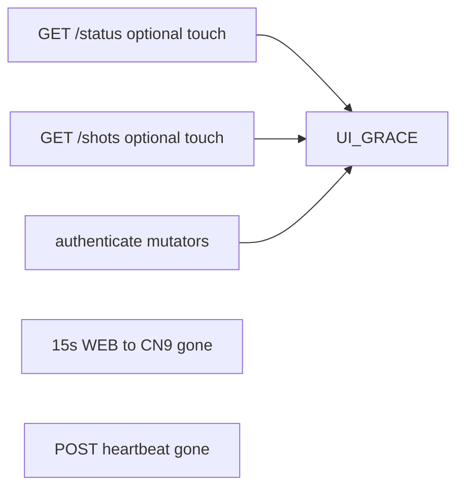

# Plan: sockets WebUI, sesión sin heartbeat POST, logo

Documento de diseño para implementación posterior. Capturado desde la revisión de límites httpd / WebUI (2026-08-16).

## Objetivo

- `max_open_sockets = 5`, `backlog_conn = 5`
- `DEVICE_MAX_INFLIGHT` (default **1**, editable en código; no UI)
- `Connection: close` en estáticos HTML/JS/CSS
- Eliminar logo
- Eliminar dead-man web→CN9 por pérdida de UI
- Renovar sesión sin POST `/heartbeat` y **eliminar** ese endpoint

## Checklist de implementación

1. FW: `max_open_sockets` / `backlog_conn` = 5; `Connection: close` en `rootHandler` / `jsHandler` / `cssHandler` (incl. 304)
2. FE: cola en `api()` con `const DEVICE_MAX_INFLIGHT = 1`; gates scan / clear-delete-logout
3. Quitar logo: `web/logo.svg`, markup/CSS `.brandLogo`, `logoHandler`, `gen_web_ui.js`; `max_uri_handlers` ajustado
4. Quitar timeout 15s WEB→CN9; docs/tests M17/M31/W17/README (solo UI→CN9, no K2)
5. Touch de sesión en `authenticate` + status/shots opcionales; quitar POST `/heartbeat` FE+FW
6. Regenerar `ShotStopperWebAssets` gzip
7. Alinear `check_web_assets.js` + host tests

## Corrección clave

`GET /status` y `GET /shots` son **read-only sin `authenticate()`** (a propósito). El FE igual manda tokens en `api()` cuando hay sesión, pero el FW **no** los mira → un bump solo en `authenticate()` **no** renueva la sesión en home/history.

Por eso el plan incluye:

1. Helper p. ej. `touchSessionIfPresent(request)` — si vienen headers de sesión válidos, actualiza `lastHeartbeatMs` (y flags relacionados); si no, no falla la request.
2. Llamarlo desde **`statusHandler`** y **`shotsHandler`** (poll de home/settings/admin/debug e history).
3. En **`authenticate()`** (rutas mutadoras / CSRF): mismo bump al aceptar token (como hoy el heartbeat handler).

`GET /log` sigue sin auth → en `/log` sin remember-me la gracia puede caducar a 3 min. Aceptable (remember-me es default).

## Sesión + quitar heartbeat

**Quitar:** FE timer/`heartbeat()`; FW `heartbeatHandler` + ruta; docs/tests del poll heartbeat; `max_uri_handlers` **34** (36 − logo − heartbeat).

**No tocar:** heartbeat K2 externo, `AcaiaArduinoBLE::heartbeat()`, `requestStopForSession` en logout/invalidate/replace.

## Dead-man web→CN9

Quitar bloque 15 s en `serviceSessions`, `WEB_PADDLE_HEARTBEAT_TIMEOUT_MS`, README (solo el de UI→CN9, no K2), M17/M31 (ajustados), W17.

## Resto

- Cola `DEVICE_MAX_INFLIGHT` + gates scan / clear-delete-logout
- Borrar `logo.svg`, markup/CSS `.brandLogo`, `logoHandler`, gen_web_ui sin logo
- Regenerar assets; actualizar `check_web_assets.js` y host tests

## Fuera de alcance

- Renombrar `STOP_HEARTBEAT` / `EndReason::WEB_HEARTBEAT_TIMEOUT` (pueden quedar para logout)
- Auth obligatoria en `/log`
- Inline de JS/CSS en HTML

## Verificación

- Tests web/host
- Sin remember-me: home con status mantiene sesión; matar pestaña no abre CN9; logout sí puede soltar lease web
- Boot: 3 assets + `Connection: close`; API ≤ `DEVICE_MAX_INFLIGHT`

## Contexto de producto

- El POST `/heartbeat` no era el cuello de sockets; sí el dead-man CN9 (15 s) y la gracia de sesión sin remember-me.
- Preferencia de producto: **no** abrir CN9 solo porque murió el browser.
- Keep-alive en estáticos no aporta con cache immutable/`?v=`; `Connection: close` libera slots del httpd.
