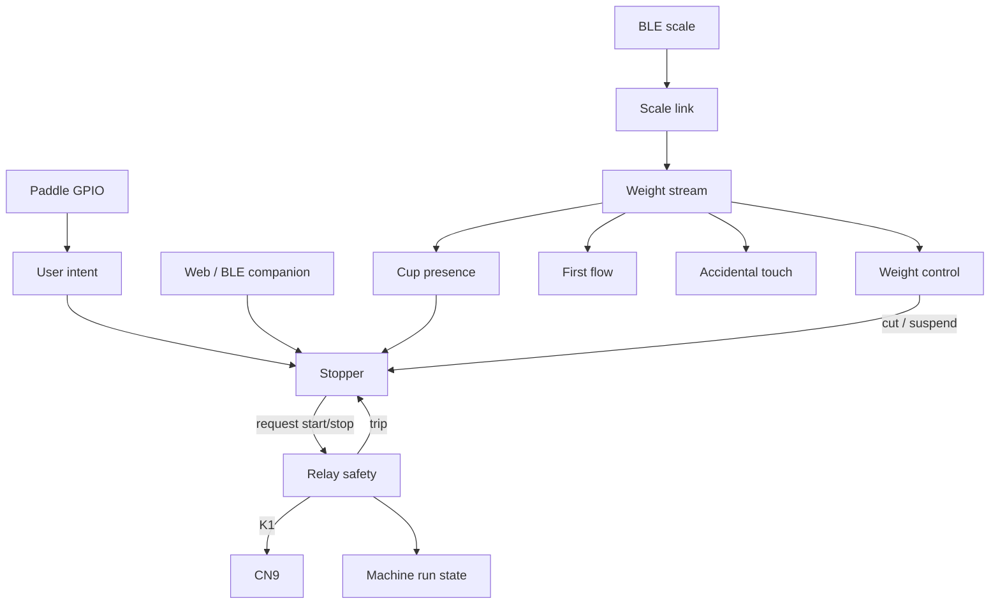

# Firmware state machines

This page is a map of the **runtime finite-state machines** in Micra Shot
Stopper. It is written for someone who already knows the product
(paddle → CN9 → scale) and wants to know **what each machine is for**,
**what each state means**, and **which events move it**.

Enums that are not machines (settings, log codes, buzzer patterns) are
omitted. Source names match the firmware.

Related product docs: [Brew by weight](features/brew-by-weight.md),
[Cup protection](features/cup-protection.md),
[A→M time guard](features/auto-to-manual.md),
[OTA](features/ota.md),
[Emergency recovery](EMERGENCY_RECOVERY.md),
[Hardware](HARDWARE.md).

## How to read this

Each section has:

1. **Purpose** — why the machine exists (what would go wrong without it).
2. **States** — the current mode.
3. **Events** — inputs that can change the mode (GPIO, BLE packets,
   timers, Web UI commands). Not every enum is an event; some machines
   are derived (they recompute from another machine every loop).

The control task in `shotStopper.cpp` is the orchestrator. One machine
is special: **relay safety can open CN9 without waiting for brew
policy**. Everything else *requests* close/open; safety *owns* the
contact.

## Layers

| Layer | Machines | Privilege |
| --- | --- | --- |
| Electrical | Relay safety | Can de-energize K1 from an ISR or trip path. Hard 60 s cap. |
| Machine view | Machine run state, user intent | Derived. Status/UI only; they do not drive GPIO themselves. |
| Brew orchestrator | Stopper | Decides rinse vs shot vs idle, and *requests* CN9 start/stop. |
| In-shot sensing | Weight stream, weight control, cup presence, first flow, accidental touch | Consume scale samples. Only **weight control** can ask the stopper to cut. |
| Scale link | BLE link + scale command/result | Connects the pan; does not close CN9. |
| Off-brew | STA, Wi-Fi scan, NTP, OTA, Web command results, recovery gesture | Must not leave CN9 closed. OTA and recovery keep the relay open. |

## How the machines interact

**Idle.** Stopper is `READY`. Relay safety is `OPEN`. Machine run state
is `CONFIRMED_OFF`. The scale link may be `CONNECTED` or
`DISCONNECTED`; that only matters when a shot starts.

**Start.** A debounced paddle ON (or a Web start, if remote CN9 is
compiled in) is `REQUEST_START`. The stopper may **block** that start
(no-scale BBW guard, cup-to-start guard) without closing CN9. A short
ON→OFF in the rinse window is not a failed start: it becomes `RINSE`.

If the start is accepted, the stopper calls `machineRequestStart`.
Relay safety goes `OPEN → ARMING → CLOSED` (or refuses and the stopper
goes to `REQUIRES_OFF`). Machine run state follows: `ASSUMED_ON` while
arming, then `CONFIRMED_ON`.

**During a shot.** The stopper is `BREW` or `MANUAL_NO_SCALE`. Weight
control is `ACTIVE` only if the cycle started with a usable scale and
brew-by-weight is on. Fresh BLE weights update the stream, cup
presence, first-flow, and accidental-touch detectors. A lost or stale
stream **suspends** weight control; the stopper stays in `BREW` and
A→M may still cut later. Cup `REMOVED` can cut if that option is on.

**Stop.** Brew policy (`SCALE_THRESHOLD`, paddle OFF, guards, Web Stop)
or a safety trip asks to open CN9. `machineRequestStop` drives safety
back to `OPEN` unless it already tripped. If the paddle is still ON,
the stopper lands in `REQUIRES_OFF` until a stable OFF (`STABLE_IDLE`).
Otherwise it returns to `READY`.

**Independence.** A 60 s (or operational-wall) timer ISR can trip
safety while the control task is in BLE or flash I/O. The next loop
sees `TRIPPED` / `LOCKOUT` and finalizes the cycle with
`RELAY_SAFETY_FAILURE`. Network, OTA, and NTP never close CN9. A
maintenance lease (Wi-Fi scan, some admin work) forces CN9 open and
parks the stopper in `REQUIRES_OFF` if the paddle is ON.

---

## 1. Stopper (`StopperState`)

**Purpose.** The brew *workflow*: idle, rinse, automatic shot, or
manual no-scale shot. It is the only machine that decides *when* to
request CN9 close, and *why* a cycle ended (`EndReason`).

Source: `ShotStopperBrewTypes.h`, orchestrated in `shotStopper.cpp`.

### States

| State | Meaning |
| --- | --- |
| `REQUIRES_OFF` | Cycle over (or start refused after a trip) while the paddle is still ON. CN9 must stay open until a stable paddle OFF. Prevents an immediate re-close. |
| `READY` | Idle. Waiting for a start gesture. CN9 is open. |
| `BREW` | Shot in progress with weight and/or timer policy. CN9 is closed (unless safety already opened it). Includes timer-only BBW-off shots that started with a scale. |
| `RINSE` | Timed group-head rinse. Paddle edges are ignored until the rinse duration elapses. Not stored in shot history. |
| `MANUAL_NO_SCALE` | Shot in progress without weight stop (no usable scale at start, or BBW off without treating it as timer-only brew). Ends on paddle OFF, rinse demotion, or a time/safety limit. |

### Events (inputs)

| Event | From | Effect |
| --- | --- | --- |
| Paddle ON (`REQUEST_START`) | User intent | From `READY`: `beginCycle`. May be held/blocked by no-scale or cup-start guards. |
| Paddle OFF inside rinse window | User intent | From `READY` with a held guard: start `RINSE`. From `BREW` / `MANUAL_NO_SCALE`: demote to `RINSE` if still inside the gesture window. |
| Paddle OFF after rinse window | User intent | Natural mode: end shot (`EndReason::PADDLE` → `READY`). Original/Auto BBW: may keep CN9 closed (walk-away). |
| Paddle ON during Original BBW | User intent | Promotes the rest of that shot to Natural (paddle OFF will then end it). |
| Weight cut due | Weight control | `finalizeCycle` with `SCALE_THRESHOLD` or a guard `EndReason`. |
| Cup removed | Cup presence | Optional cut (`CUP_REMOVED`) if cup-stop is enabled. |
| A→M deadline | Weight control suspended | Cut (`AUTO_TO_MANUAL_GUARD`) if the guard is enforced. |
| Rinse duration elapsed | Timer | `RINSE_COMPLETE` → `READY` or `REQUIRES_OFF`. |
| Web Stop / Web start / rinse | Web command | Same as paddle, but `ControlSource::WEB`. Physical paddle always wins (`PHYSICAL_OVERRIDE`). |
| Safety trip / arm failure | Relay safety | `RELAY_SAFETY_FAILURE` or wall/hard-limit reasons; next state `REQUIRES_OFF` if the paddle is ON. |
| Physical paddle while Web cycle | User intent | Immediate finalize, `PHYSICAL_OVERRIDE`. |

Typical path: `READY → BREW → READY` (or `REQUIRES_OFF` if the paddle
was left ON). Rinse: `READY → RINSE → READY`.

---

## 2. Relay safety (`RelaySafetyState`)

**Purpose.** Own the brew contact. Policy can *ask* to close; this
machine arms independent timers **before** energizing K1, and can
de-energize from an ISR if the control task is stuck. This is the
last firmware line of defence short of a second hardware barrier
(K2). See [Hardware](HARDWARE.md).

Source: `ShotStopperSafety.h`, `ShotStopperMachine.h`.

### States

| State | Meaning |
| --- | --- |
| `BOOT_SAFE` | Power-on default before supervisors are judged. CN9 is commanded open. |
| `OPEN` | Relay de-energized. Close is allowed if watchdogs and timers are ready. |
| `ARMING` | Close requested: generation bumped, hard/operational timers started, GPIO not yet committed (or about to be). A timeout here still trips. |
| `CLOSED` | K1 energized. `commandedClosed` is latched in RTC so a reset mid-close is treated as unsafe. |
| `TRIPPED` | Opened by a limit or fault with **no lockout**. Control must still treat CN9 as forbidden until the cycle is finalized. |
| `LOCKOUT` | Opened by a fault that must not silently retry (stuck feedback, watchdog missing, unsafe reset, boot loop). New closes are refused until the fault is cleared by a safe boot path. |

### Events / faults (`RelaySafetyFault`)

| Fault | Typical cause | Trip style |
| --- | --- | --- |
| `NONE` | Healthy. | — |
| `INITIALIZATION_FAILED` | Clock or software timers not ready at boot. | Lockout |
| `WATCHDOG_UNAVAILABLE` | Task WDT not subscribed. | Lockout |
| `INVALID_LIMIT` | Close requested with a bad operational limit. | Lockout |
| `TIMER_ARM_FAILED` | Could not start the deadline timers. | Lockout |
| `HARD_LIMIT` | 60 s cap (`HARD_MAX_CN9_CLOSED_MS`). ISR-safe. | Trip (not lockout) |
| `OPERATIONAL_LIMIT` | Configured Max BBW time (default 50 s), or Original-mode wall after paddle release. | Trip |
| `FEEDBACK_STUCK_CLOSED` | Optional echo GPIO already closed before arm. | Lockout |
| `FEEDBACK_FAILED_TO_CLOSE` | Echo never matched a commanded close. | Lockout |
| `FEEDBACK_CHANGED_UNEXPECTEDLY` | Echo flipped while closed/open unexpectedly. | Lockout |
| `TASK_WATCHDOG_FAILURE` | Control task missed WDT. | Lockout |
| `RESET_DURING_CLOSE` | Reboot while RTC said commanded-closed. | Lockout |
| `UNSAFE_RESET` | Reset reason treated as unsafe. | Lockout |
| `BOOT_LOOP` | Repeated unsafe resets. | Lockout |

**Events that are not faults:** `machineRequestStart` (OPEN→ARMING→CLOSED),
`machineRequestStop` (CLOSED/ARMING→OPEN, unless already TRIPPED/LOCKOUT).

Machine run state is **derived** from this machine (next section). The
stopper observes trips on the next control-loop pass.

---

## 3. Machine run state (`MachineRunState`)

**Purpose.** A coarse, UI-facing view of “is the group brewing?”,
without exposing ARMING vs CLOSED vs TRIPPED. It does not command
GPIO.

Source: `ShotStopperMachineTypes.h`, `machineRunState()` in
`ShotStopperMachine.h`.

### States

| State | Meaning |
| --- | --- |
| `CONFIRMED_OFF` | Relay not closed. Safety is OPEN, or tripped/lockout with contact open. |
| `ASSUMED_ON` | Safety is `ARMING`: close is in flight, echo may not yet match. |
| `CONFIRMED_ON` | Safety `CLOSED` or `relay.closed`. |
| `UNKNOWN` | Safety TRIPPED/LOCKOUT but the contact still reads closed (should not last). |

### Events

None of its own. Recomputed every time status is sampled from relay
safety.

---

## 4. User intent (`UserIntent`)

**Purpose.** Debounced paddle as a *request*, not as CN9. The Micra
paddle is only a GPIO; this machine is how brew policy hears the
barista.

Source: `ShotStopperMachineTypes.h`, `machinePollIntention()`.

### States (snapshot, not latched)

| State | Meaning |
| --- | --- |
| `NONE` | No classified edge this sample (transient). |
| `REQUEST_START` | Rising edge after debounce (`paddleTurnedOn`). |
| `REQUEST_STOP` | Falling edge (`paddleTurnedOff`). |
| `HOLD_ACTIVE` | Paddle is ON, no new edge. |
| `STABLE_IDLE` | Paddle OFF long enough to leave `REQUIRES_OFF`. |

Raw vs stable: `rawPaddleOn` is the pin; `paddleOn` is after
`PADDLE_DEBOUNCE_MS`. The stopper uses both so a bounce cannot re-close
CN9.

---

## 5. Weight control (`WeightControlState`)

**Purpose.** Whether **this cycle** may use the pan to stop. Losing
the scale must not slam CN9 open; it **suspends** automation and lets
A→M / paddle / walls decide.

Source: `ShotStopperScaleTypes.h`, `setWeightControlState()` in
`shotStopper.cpp`.

### States

| State | Meaning |
| --- | --- |
| `INACTIVE` | This cycle will not stop on weight (no scale at start, or timer-only). |
| `VALIDATING` | Last sample was implausible (range, slew, reconnect). Need coherent recovery samples before trusting a cut. |
| `ACTIVE` | Samples are accepted into the trajectory; threshold/guards may cut. |
| `SUSPENDED` | Scale link or freshness lost mid-shot. A→M becomes **enforced** if it was armed. Reconnect with three coherent samples can return to `ACTIVE`. |
| `FAULT_STOPPED` | Weight path gave up for this cycle (e.g. persistent overload policy). No further automatic cut from weight. |

### Events

| Event | Effect |
| --- | --- |
| Cycle start with usable scale + BBW | `INACTIVE`/`—` → `ACTIVE`. |
| Cycle start without scale or timer-only | Stays `INACTIVE`. |
| Stream stale / disconnect / generation change | `ACTIVE`/`VALIDATING` → `SUSPENDED` (A→M armed → enforced). |
| Three coherent recovery samples | `SUSPENDED`/`VALIDATING` → `ACTIVE` (A→M enforcement cleared). |
| Out-of-range / overload sample | `ACTIVE` → `VALIDATING`, stream `OVERLOAD`. |
| Tare / post-tare grace | May promote `VALIDATING` → `ACTIVE` so the new zero is used. |

---

## 6. Weight stream (`WeightStreamState`)

**Purpose.** Quality of the **latest** sample, for diagnostics and for
deciding whether control may use it. Not the same as weight control:
the stream can be `FRESH` while control is `SUSPENDED` after a gap, or
`STALE` while control is still `ACTIVE` until the next loop notices.

Source: `ShotStopperScaleTypes.h`.

### States

| State | Meaning |
| --- | --- |
| `NO_SAMPLE` | No usable weight this boot / this link. |
| `FRESH` | Last accepted sample is within `MAX_AUTOMATION_WEIGHT_AGE_MS` (1 s) on the current connection generation. |
| `STALE` | Age exceeded or link dropped during `BREW` while control was still tracking. |
| `ANOMALOUS` | Sample failed slew/plausibility vs the accepted trajectory. |
| `OVERLOAD` | Absolute weight outside the automation window (pan slammed or protocol glitch). |

### Events

New BLE `WEIGHT` samples, connection generation changes, and the
1 s freshness timer. Overload/anomaly are classified in
`recordWeightSampleWithProvenance`.

---

## 7. Cup presence (`CupPresenceState`)

**Purpose.** Infer cup on / cup off from weight **hysteresis**, so a
late cup can retare and a lifted cup can stop. A tare must **not**
flip presence (the zero moves; the cup did not leave).

Source: `ShotStopperScaleTypes.h`, `ShotStopperCupPresence.h`.

### States

| State | Meaning |
| --- | --- |
| `ABSENT` | No stable mass ≥ **Minimum cup weight** (default 10 g). |
| `PRESENT` | Stable load at or above that threshold (or a put-back from a negative hole after a lift). |

Transitions can be **held** during post-tare grace so the zeroing
transient is not a remove/place.

### Events

| Event | Meaning |
| --- | --- |
| `NONE` | Sample did not complete a transition (still counting stability or confirmations). |
| `PLACED` | ABSENT → PRESENT after N stable samples within the retare stability window. Drives automatic retare when the window is open. |
| `REMOVED` | PRESENT → ABSENT after consecutive samples below **Cup removed** (default −3 g). May set `cupRemovedPending` on the stopper. |

Tare notification (`notifyCupPresenceTare`) clears the “negative hole”
bookkeeping without changing `PRESENT`/`ABSENT`.

---

## 8. First flow (`FirstFlowPhase` / `FirstFlowClass`)

**Purpose.** Tell first coffee from a finger or a cup put-down, so the
first-drop beep and shot clock are not fooled. It does **not** stop
the shot.

Source: `ShotStopperScaleTypes.h` (`stepFirstFlow`).

### States (`FirstFlowPhase`)

| State | Meaning |
| --- | --- |
| `SEEKING` | Looking for a small step above tare zero (default 0.3 g) that is below cup mass and below a 2 g finger step. |
| `TOUCH` | A ≥2 g jump or cup-sized mass; wait for release or leftover coffee. |

### Events / classes (`FirstFlowClass`)

| Class | Meaning |
| --- | --- |
| `NONE` | Still at baseline. |
| `CANDIDATE` | First confirming coffee-sized sample. |
| `TOUCH` | Finger/cup jump; do not fire first drop. |
| `FIRE` | Confirmed first drops (two consecutive coffee-sized samples, or leftover after a touch that was not cup mass). |

---

## 9. Accidental touch (`AccidentalTouchPhase` / `AccidentalTouchClass`)

**Purpose.** Hold automatic **weight stop** if the pan is being poked,
without ending the shot. Complements BBW protection (time window) with
a live rate/residual check.

Source: `ShotStopperScaleTypes.h`. Only runs while weight control is
`ACTIVE` and the setting is on.

### States (`AccidentalTouchPhase`)

| State | Meaning |
| --- | --- |
| `STARTUP` | Early in the trajectory: large delta vs last accepted sample vs a high rate limit. |
| `TREND` | Enough points to fit a slope; residual vs expected line plus rate. |

### Classes

| Class | Meaning |
| --- | --- |
| `OK` | Sample looks like brew flow. Stop logic may run. |
| `TOUCH` | Anomalous spike; **hold** cuts (`accidentalTouchHolding`). |
| `SUSTAINED` | Several similar anomalous samples — treated as a held finger, not a one-sample glitch. |

---

## 10. Scale link (`ScaleLinkState`)

**Purpose.** BLE session with the preferred / discovered scale.
Connects the weight path; **never** drives CN9.

Source: `shotStopper.cpp` (`ScaleLinkState`).

### States

| State | Meaning |
| --- | --- |
| `DISCONNECTED` | No GATT session. Discovery/reconnect may be running. Companion advertising can resume. |
| `CONNECTED` | Notifications flowing (or about to). Blue LED may follow this if enabled. |

A `connectionGeneration` and `disconnectSequence` ride on the snapshot
so a *new* connection cannot be mistaken for the one that started the
shot (that is what suspends weight control).

### Scale commands (`ScaleCommandType`) — outbound

| Command | Meaning |
| --- | --- |
| `START_TIMER_AND_TARE` | Shot start: tare (if enabled) and start the scale timer. |
| `TARE_ONLY` | Late-cup retare. |
| `STOP_TIMER` | After CN9 opens, once the scale timer has reached the internal whole-second time (or the 2 s catch-up cap). Optional extra delay is a pad after that. Queued to the **front**. |

### Scale events (`ScaleEventType`) — inbound

| Event | Meaning |
| --- | --- |
| `WEIGHT` | Notification with grams (+ optional timer). Feeds stream/cup/flow/touch. |
| `TIMER_START_RESULT` | Write/feedback for start+tare. |
| `TARE_RESULT` | Write/feedback for retare. |
| `TIMER_STOP_RESULT` | Write/feedback for stop (`TimerStopResult` tracks pending/success/fail). |

Preferred-scale policy (`FIRST` / `PREFER` / `ONLY`) is a **setting**,
not a state machine; it only filters which peripheral may enter
`CONNECTED`.

---

## 11. No-scale BBW guard

**Purpose.** When brew-by-weight is on and there is no usable scale,
do **not** start a full automatic shot on a long paddle. A rinse
gesture still rinses. The next long start is manual. See
[No-scale BBW](settings/no-scale-bbw.md).

Not a C++ enum; latches `noScaleShotGuardArmed` / `Idle`.

### States

| State (UI) | Meaning |
| --- | --- |
| Off | Setting disabled or BBW off. Guard does nothing. |
| Armed | Next long paddle ON is blocked (CN9 stays open, triple beep). |
| Idle | Guard consumed (blocked start, rinse, or finished non-rinse shot). Re-arms on scale connect, boot, or **Last shot cooldown**. |

### Events

| Event | Effect |
| --- | --- |
| Scale becomes usable | Arm immediately. |
| Long paddle while Armed | Block; hold then consume → Idle. |
| Short ON→OFF (rinse) while Armed | Rinse runs; consume → Idle. |
| Shot (non-rinse) ends | Idle; cooldown then Arm. |
| Cooldown elapsed / boot | Arm. |

---

## 12. Recovery gesture

**Purpose.** Restore network or factory-reset when Wi-Fi, Web UI, BLE,
and USB are all unusable. **CN9 stays open** for the whole window.

Source: `ShotStopperRecoveryGesture.h`. Entry: power-on reset **and**
paddle already stably ON.

### Internal flags (not published)

| Flag | Meaning |
| --- | --- |
| `active` | Inside the 60 s recovery window. |
| `attemptActive` | Counting OFF→ON cycles after the first OFF. |

### Results (`RecoveryGestureResult`)

| Result | Meaning |
| --- | --- |
| `NONE` | Still listening. |
| `NETWORK_ACCESS_RESET` | Three complete OFF→ON cycles, then 3 s confirmation with paddle ON. Restores AP/password access. |
| `FACTORY_RESET` | Five cycles + confirmation. Erases settings and history. |
| `TIMED_OUT` | 60 s elapsed with no confirmed gesture. |

Cycle counting must finish inside a 5 s movement window; confirmation
is a separate 3 s hold. See [Emergency recovery](EMERGENCY_RECOVERY.md).

---

## 13. Station Wi-Fi (`StaState`)

**Purpose.** Join the configured home network without fighting BLE
mid-shot. SoftAP raise is **boot/bootstrap only** after a successful
STA join.

Source: `ShotStopperNetwork.h`.

### States

| State | Meaning |
| --- | --- |
| `NOT_CONFIGURED` | No saved STA credentials. |
| `CONNECTING` | `WiFi.begin` in flight (25 s connect timeout). |
| `CONNECTED` | STA has a link. NTP may arm. SoftAP auto-raise is latched off for this boot. |
| `FAILED` | Connect timed out or was rejected. Retry / recovery timers apply. |
| `DISCONNECTED` | Had a link (or was configured) and lost it. Reconnect interval 10 s; SoftAP does **not** come back automatically after `staEverConnected_`. |

### Events

Save/clear credentials, DHCP vs static apply, connect timeout, link
down, `AP_START` from USB CLI, maintenance holds that pause reconnect
during a shot or scan.

### Pending config (`StaConfigState`)

| State | Meaning |
| --- | --- |
| `CONFIRMED` | Current STA addressing is committed. |
| `PENDING` | A new static IP (or similar) is on probation (~3 min). Unreachable config **reverts**. |

---

## 14. Wi-Fi scan (`WifiScanState`)

**Purpose.** Fill the Web UI network list. Scanning is RF-heavy, so it
takes a **maintenance lease**: CN9 is forced open for the scan.

| State | Meaning |
| --- | --- |
| `IDLE` | Nothing queued. |
| `QUEUED` | POST `/api/v1/network/scan` accepted; waiting for the network task. |
| `RUNNING` | IDF scan in progress (20 s timeout). |
| `READY` | Results captured (`WifiScanSnapshot`). |
| `FAILED` | Scan error. |
| `CANCELED` | Aborted (timeout, paddle during lease, restart). |

---

## 15. Wall clock (`TimeSyncState`)

**Purpose.** Timestamp shot history. Brewing does **not** wait on NTP.

Source: `ShotStopperTime.h`.

| State | Meaning |
| --- | --- |
| `OFF` | NTP not armed (no STA, or disabled). |
| `SYNCING` | SNTP request in flight. |
| `SYNCED` | Valid UTC anchor; local time = anchor + monotonic. |
| `FAILED` | Sync attempt failed; retry delay applies. |
| `STALE` | Was synced, but last success is older than `NTP_STALE_AFTER_MS` (derived in the snapshot, not a stored latch). |

Shot rows without a sync store `hasWallTime = 0` and show “no time” in
the UI.

---

## 16. OTA (`OtaState`)

**Purpose.** Dual-slot Wi-Fi update that cannot brick the only bootable
image. CN9 stays open. Transfer writes the **inactive** slot; boot
selection changes only on an explicit flash/commit.

Source: `ShotStopperOta.h`. Product notes: [OTA](features/ota.md).

### States

| State | Meaning |
| --- | --- |
| `UNAVAILABLE` | Partition table has no spare app slot (USB-only updates). |
| `IDLE` | Ready for an upload (after the running image has confirmed itself). |
| `RECEIVING` | Bytes streaming into the spare slot. |
| `STAGED` | Image passed header, identity, arch, and SHA-256. Waiting for the operator to flash. |
| `COMMITTED` | Boot partition switched; restart pending. Next boot is `PENDING_VERIFY` until HTTP proves the Web UI. |

`OtaResult` values (`BUSY`, `PENDING_VERIFY`, `DOWNGRADE`, …) are
**command outcomes**, not states. A second upload while the new image
has not confirmed HTTP is refused.

---

## 17. Web command pipeline (`CommandResultState`)

**Purpose.** The controller handles **one** mutating request at a time.
The Web UI shows an action-specific success or failure toast when the
HTTP handler accepts or rejects the command, not when NVS is done.

Source: `ShotStopperDomain.h`.

| State | Meaning |
| --- | --- |
| `NONE` | No command in flight for this id. |
| `QUEUED` | HTTP accepted; waiting for the control or network task. |
| `RESERVED` | Maintenance lease held (scan, some admin). Paddle cancels → `CANCELED`. |
| `APPLIED` | Runtime updated (RAM). Persist may still be pending. |
| `PERSISTED` | Durable store committed. |
| `FAILED` | Validation, queue, or persist error. |
| `CANCELED` | Lease dropped (e.g. paddle ON during maintenance). |

Unsafe Web UI unlock is **not** a state machine: it is a flag on the
queued command (`unsafeWebUiOverride`) that bypasses the config-lock
gate. It never changes relay safety.

---

## End reasons (stopper outcomes)

These are not a machine. They are **why** the last `finalizeCycle`
ran, stored on the session, last-shot blob, and shot log.

| `EndReason` | Typical trigger |
| --- | --- |
| `PADDLE` | Natural paddle OFF after the rinse window. |
| `SCALE_THRESHOLD` | Weight control `ACTIVE`, target (minus drip offset) confirmed. |
| `WEIGHT_ANOMALY` | Direct-stop path on a pathological sample. |
| `GLOBAL_LIMIT` | 60 s hard cap. |
| `CONFIGURED_WALL_LIMIT` | Max BBW time / operational wall. |
| `SHORT_SHOT` | Reserved/legacy short-shot path. |
| `RINSE_COMPLETE` | Rinse duration elapsed. |
| `WEB_STOP` | Authenticated Stop. |
| `PHYSICAL_OVERRIDE` | Paddle moved during a Web-owned cycle. |
| `WEB_HEARTBEAT_TIMEOUT` | Remote hold lost (when remote CN9 is enabled). |
| `RELAY_SAFETY_FAILURE` | Arm failed or safety tripped. |
| `FAST_EXTRACTION_MAX_WEIGHT` | Fast guard: recovery weight. |
| `FAST_EXTRACTION_MIN_TIME` | Fast guard: min brew time reached after an early target. |
| `SLOW_EXTRACTION_MAX_TIME` | Slow guard: max brew time with enough mass. |
| `SLOW_EXTRACTION_MIN_WEIGHT` | Slow guard: floor weight after extend. |
| `AUTO_TO_MANUAL_GUARD` | Scale lost; A→M deadline from shot start. |
| `CUP_REMOVED` | Cup presence `REMOVED` with stop-if-removed on. |

History `cut_type` / `stop_detail` are a **stable log encoding** of
the same facts ([Shot history](features/shot-history.md)), not another
FSM.

---

## Control loop (ordering)

One pass of the control task, simplified:

1. Feed watchdogs. Poll paddle → user intent.
2. Service relay safety (honor ISR trips, echo GPIO if present).
3. Recovery gesture only in the boot window; it never closes CN9.
4. Apply stopper `switch (stopperState)` using intent, weight control,
   cup, A→M, and rinse timers.
5. Drain scale events; update link, stream, cup, first flow, touch,
   weight control.
6. Drain Web/BLE commands if no cycle forbids that mutation.
7. Network, NTP, OTA, and HTTP run on the **network task**. They take a
   maintenance lease when they need exclusive RF or flash.

That split is why a hung HTTP handler cannot keep CN9 closed: the
deadline timers and panic/stack-overflow hooks write the relay GPIO
from IRAM.

---

## What is *not* a state machine here

| Name | Why it is omitted |
| --- | --- |
| `PaddleMode` (Natural / Original / Auto) | Setting that **changes which stopper events end `BREW`**. |
| `BrewCommand` | Declared, unused at runtime. |
| `AlertEvent` | Outputs (beeps), not a mode. |
| `TaskProfilerState` | Diagnostics only. |
| Shot-log / NVS dual-slot enums | Storage format, not live control. |
