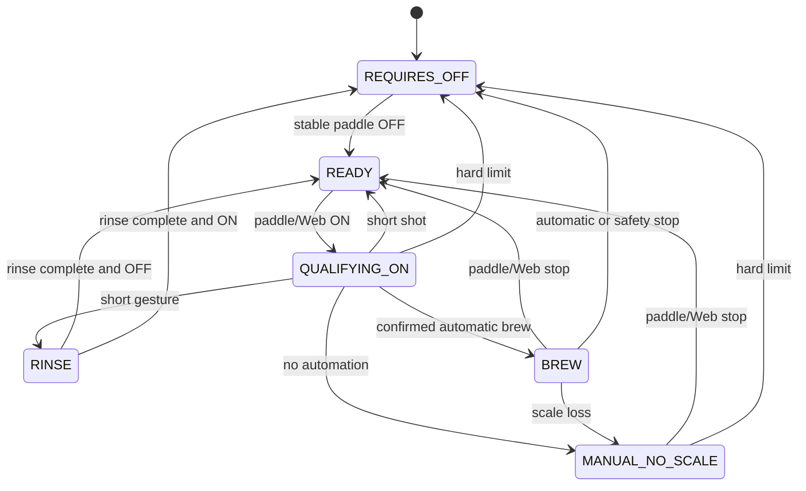

# Micra Shot Stopper Implementation Plan

This document records the implementation scope for the Micra-only stopper. The physical paddle is a GPIO input to the ESP32, and only the relay COM/NO contact controls Micra CN9. The former direct paddle-to-CN9, momentary and reed-switch variants are unsupported.

## Control requirements

- Boot, reset, power loss and any relay safety failure must leave CN9 open.
- A stable physical paddle OFF is required before the controller is armed.
- CN9 can close only for a qualifying gesture, brew, manual cycle or rinse.
- The hard 50-second closed-CN9 limit applies to every path and cannot be configured away.
- Physical paddle input has priority over Web control.
- Loss of scale automation degrades the current cycle to manual; it never leaves CN9 closed indefinitely.

## State machine

Configuration is accepted only in `READY` and copied into an immutable cycle snapshot. Web, BLE and persistence work must not block relay control.

## Verification

Host tests cover normal, sanitizer and persistence runs. Hardware verification must cover relay continuity, reset/power-loss behavior, physical paddle gestures, scale loss, Web safety stop and the 50-second timer before CN9 is connected to a machine.
