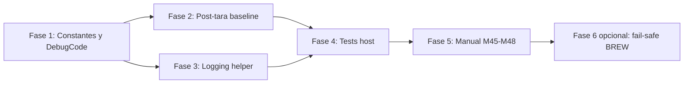

# Plan de implementación: fiabilidad de peso, tara inicial y logging de rechazos

## Objetivo

Corregir los fallos reportados en operación real:

1. **Peso negativo grande** (p. ej. `-230 g` tras cambiar a un vaso más liviano): no se tarifica, no hay brew automático, transición a `MANUAL_NO_SCALE`.
2. **Primer shot tras apagar/encender la balanza**: rechazo masivo de muestras, sin beep de confirmación, modo manual; shots posteriores OK.
3. **Extracción que no se detiene por peso**: cuando el stream entra en `VALIDATING`/`SUSPENDED`, el corte predictivo deja de evaluarse y CN9 permanece cerrado hasta el wall timer o acción manual.
4. **Logging opaco**: múltiples rutas emiten el mismo `scale sample rejected` sin motivo.

Este plan **no** implementa la retarificación completa descrita en `TODO-Retarificacion`; solo corrige las causas raíz actuales y deja la retarificación como trabajo posterior compatible.

---

## Diagnóstico (causa raíz en firmware)

| Síntoma | Mecanismo actual |
| --- | --- |
| `-236 g` no automatiza, `-95 g` sí | `MIN_AUTOMATION_WEIGHT_G = -100` en `ShotStopperDomain.h`; `currentWeightIsFresh()` y `recordWeightSampleWithProvenance()` rechazan muestras fuera de `[-100, 1000]`. La Web UI muestra `observedWeightG` (±10000), no `currentWeightG`. |
| Primer shot post-reconnect falla | `beginCycle()` fija `lastAcceptedWeightG` al peso pre-tara (~236 g); la tara lleva la balanza a ~0 g; el filtro de slew (`AUTOMATION_WEIGHT_SLEW_ALLOWANCE_G` + `MAX_AUTOMATION_WEIGHT_SLEW_G_PER_S`) rechaza el salto; `receivedFreshWeightInCycle` nunca se activa → `MANUAL_NO_SCALE` a los 3 s. |
| Extracción sin parada por peso | `automaticScaleStopDue()` exige `weightControlState == ACTIVE` y muestras aceptadas; rechazos prolongados suspenden el control sin fail-safe de peso. |
| Log genérico | Cinco rutas distintas llaman a `DebugCode::SCALE_SAMPLE_REJECTED`; solo una pasa el peso en `argument1`; el formateador web usa `debugCodeName()` sin contexto. |

---

## Alcance

### Incluido

- Ampliar el rango de peso negativo admisible para automatización a **al menos `-500 g`** (margen sobre tazas de ~300 g).
- Ventana de asentamiento post-tara al inicio de ciclo para no penalizar el salto esperado 236 → 0 g.
- Códigos/mensajes de debug **específicos** por motivo de rechazo, con peso y referencia cuando aplique.
- Tests host nuevos/actualizados y casos manuales Mxx.
- Actualización de `docs/MANUAL_TEST_PLAN.md`.

### Excluido (fase posterior)

- Retarificación automática completa (`TODO-Retarificacion`).
- Cambio de `MAX_AUTOMATION_WEIGHT_G` u otros límites de sobrecarga.
- Fail-safe agresivo en BREW por stream suspendido (se documenta como fase opcional).

---

## Decisiones de diseño

### D1 — Límite negativo: `-500 g`

```cpp
constexpr float MIN_AUTOMATION_WEIGHT_G = -500.0f;
```

**Justificación:** taza hasta ~300 g + margen para variación de taras, ruido y vasos ligeramente más livianos sin cruzar el umbral. Un vaso de 300 g reemplazado por uno liviano puede mostrar ~`-300 g` antes de retarificar; `-500 g` deja ~200 g de holgura.

**Alternativa descartada:** `-300 g` exacto — demasiado ajustado si la tara previa no fue perfecta o hay ruido BLE.

### D2 — Asentamiento post-tara (tare settling)

Introducir en `CycleSession`:

```cpp
bool awaitingPostTareBaseline = false;
uint32_t postTareBaselineDeadlineMs = 0;
```

Constantes sugeridas en `ShotStopperDomain.h`:

```cpp
constexpr uint32_t POST_TARE_BASELINE_GRACE_MS = 2000;
```

**Comportamiento:**

1. En `beginCycle()`, si `session.config.autoTare && session.startedWithScale`:
   - **No** copiar `currentWeight` como ancla (`hasWeightAnchor = false`).
   - Marcar `awaitingPostTareBaseline = true`.
   - Fijar `postTareBaselineDeadlineMs = startedAtMs + POST_TARE_BASELINE_GRACE_MS`.

2. Al procesar `ScaleEventType::TIMER_START_RESULT` con `writeSucceeded && autoTare` para el ciclo activo:
   - Confirmar `awaitingPostTareBaseline = true` (idempotente).
   - Resetear ancla y contadores de recuperación.

3. En `recordWeightSampleWithProvenance()`, mientras `awaitingPostTareBaseline`:
   - **Omitir** la comprobación de slew contra `lastAcceptedWeightG`.
   - Aceptar la primera muestra **dentro de rango** `[-500, 1000]` como nueva ancla.
   - Limpiar `awaitingPostTareBaseline` al aceptar ancla o al expirar la ventana.

4. Si expira la ventana sin muestra aceptada:
   - Limpiar flag; continuar con lógica actual (`VALIDATING` / rechazos normales).
   - Emitir `DebugCode::SCALE_POST_TARE_BASELINE_TIMEOUT`.

**Por qué no basta ampliar el slew:** un salto de 236 g en 100 ms supera ~30 g permitidos; ningún incremento razonable del slew rate cubriría una tara sin debilitar la protección anti-dedo.

### D3 — Elegibilidad de balanza al inicio con peso negativo en rango

Con `MIN_AUTOMATION_WEIGHT_G = -500`, un peso de `-236 g` pasa `currentWeightIsFresh()` y habilita:

- `startedWithScale = true`
- `requestRemoteTimerStart()` (tara + timer)

No se requiere lógica adicional salvo el asentamiento post-tara (D2).

### D4 — Logging: códigos específicos + argumentos tipados

Reemplazar el único `SCALE_SAMPLE_REJECTED` por códigos dedicados:

| Código | Cuándo | `argument1` | `argument2` |
| --- | --- | --- | --- |
| `SCALE_SAMPLE_REJECTED_INVALID` | NaN, inf, `\|w\| > MAX_PARSED_WEIGHT_G` | peso × 100 (cgram) | 0 |
| `SCALE_SAMPLE_REJECTED_RANGE` | fuera de `[-500, 1000]` | peso × 100 | límite violado × 100 (min o max) |
| `SCALE_SAMPLE_REJECTED_SLEW` | slew implausible en `ACTIVE` | peso × 100 | ancla × 100 |
| `SCALE_SAMPLE_REJECTED_RECOVERY` | recuperación fallida en `VALIDATING`/`SUSPENDED` | peso × 100 | última ref. recuperación × 100 |
| `SCALE_SAMPLE_REJECTED_PRE_CYCLE` | evento con `receivedAtMs < session.startedAtMs` | peso × 100 | 0 |
| `SCALE_POST_TARE_BASELINE_TIMEOUT` | grace post-tara expirada sin ancla | ciclo id | grace ms |

**Codificación de peso:** entero en centésimas de gramo (`int32_t`, p. ej. `-23600` → `-236.00 g`) para no usar floats en el ring buffer.

**Mensajes en `debugCodeName()`** (legibles en Web UI y export):

- `"scale sample rejected: invalid weight"`
- `"scale sample rejected: out of automation range"`
- `"scale sample rejected: implausible slew"`
- `"scale sample rejected: recovery failed"`
- `"scale sample rejected: pre-cycle event"`
- `"scale post-tare baseline timeout"`

**Formateo enriquecido** en `ShotStopperNetwork.cpp` (`logHandler`): para estos códigos, construir mensaje con peso humano:

```text
scale sample rejected: implausible slew (weight=0.2g, anchor=236.0g)
```

La Web UI ya concatena `(argument1, argument2)`; mejorar el handler del API para que el campo `message` ya incluya el detalle y los argumentos queden como respaldo numérico.

### D5 — Helper centralizado de rechazo

Evitar duplicación en `shotStopper.ino`:

```cpp
void rejectScaleSample(DebugCode code, float weightG,
                       float referenceG = 0.0f);
```

Todas las rutas actuales que llaman `SCALE_SAMPLE_REJECTED` deben usar este helper.

---

## Fases de implementación

### Fase 1 — Constantes y tipos (bajo riesgo)

**Archivos:** `shotStopper/ShotStopperDomain.h`

1. Cambiar `MIN_AUTOMATION_WEIGHT_G` a `-500.0f`.
2. Añadir `POST_TARE_BASELINE_GRACE_MS`.
3. Añadir nuevos valores a `enum class DebugCode`.
4. Actualizar `debugCodeName()` con mensajes específicos.
5. Añadir helper inline `formatWeightCentigrams(int32_t cg)` si hace falta en Network.

**Criterio de aceptación:** compila; tests existentes que asumen `-100` se actualizan.

---

### Fase 2 — Ventana post-tara

**Archivos:** `shotStopper/shotStopper.ino`

1. Extender `CycleSession` con flags post-tara.
2. Modificar `beginCycle()`:
   - Condicionar ancla inicial a `!autoTare`.
   - Activar `awaitingPostTareBaseline` cuando corresponda.
3. Modificar handler de `TIMER_START_RESULT` en `processScaleWorkerEvents()`.
4. Modificar `recordWeightSampleWithProvenance()`:
   - Rama `awaitingPostTareBaseline` antes del slew check.
   - Timeout en `stateMachineTask()` durante `QUALIFYING_ON` o al procesar peso.
5. Reset de flags en `resetSessionForNewCycle()` / `finalizeCycle()`.

**Criterio de aceptación:**

- Test host: ciclo con ancla 236 g, tara simulada, primera muestra 0 g → aceptada, `receivedFreshWeightInCycle == true`, transición a `BREW` a los 3 s.
- Test host: sin autoTara, comportamiento anterior preservado (`r30` sigue suspendiendo salto abrupto no esperado).

---

### Fase 3 — Logging específico

**Archivos:**

- `shotStopper/shotStopper.ino` — `rejectScaleSample()`, reemplazar 5+ call sites.
- `shotStopper/ShotStopperNetwork.cpp` — formateo en `logHandler`.
- `shotStopper/ShotStopperWebAssets.h` — opcional: mostrar `message` tal cual (ya lo hace).

**Call sites a migrar:**

| Ubicación | Nuevo código |
| --- | --- |
| `recordWeightSampleWithProvenance` L1469 | `INVALID` |
| `recordWeightSampleWithProvenance` L1500 | `RANGE` |
| `recordWeightSampleWithProvenance` L1533 | `SLEW` |
| `recordWeightSampleWithProvenance` L1569 | `RECOVERY` |
| `processScaleWorkerEvents` L2080 | `INVALID` |
| `processScaleWorkerEvents` L2096 | ya existe `SCALE_STALE_EVENT_REJECTED` — mantener |

Eliminar o deprecar `SCALE_SAMPLE_REJECTED` del enum; actualizar tests que lo referencien.

**Criterio de aceptación:** log web muestra motivo y pesos; no queda ningún `scale sample rejected` genérico en código activo.

---

### Fase 4 — Tests host

**Archivo:** `shotStopper/tests/shot_stopper_host_test.cpp`

| ID | Escenario |
| --- | --- |
| `R35` | Peso `-236 g` en Ready → `startedWithScale == true`, tara encolada. |
| `R36` | Peso `-520 g` → `startedWithScale == false`, sin tara. |
| `R37` | Post-tara: ancla 236 g, muestras 0 g durante qualifying → `BREW` confirmado. |
| `R38` | Primer shot post-reconnect simulado: `connectionGeneration` nuevo + peso pre-tara + tara → no `MANUAL_NO_SCALE`. |
| `R39` | Rechazo por slew emite `SCALE_SAMPLE_REJECTED_SLEW` con argumentos correctos. |
| `R40` | Rechazo por rango emite `SCALE_SAMPLE_REJECTED_RANGE` con `-520 g`. |

Actualizar stubs si hace falta simular resultado de tara.

**Comando:** ejecutar suite host existente (`shot_stopper_host_test`).

---

### Fase 5 — Verificación manual

Añadir a `docs/MANUAL_TEST_PLAN.md`:

| ID | Procedimiento | Resultado esperado |
| --- | --- | --- |
| M45 | Tarar con vaso ~300 g, quitar vaso, poner vaso ~50 g (peso ~`-250 g` en UI), iniciar shot con paddle. | Tara/timer enviados; a los 3 s beep (si habilitado) y `BREW`; log muestra a lo sumo rechazos transitorios post-tara, no ráfaga hasta timeout. |
| M46 | Apagar balanza, encender, colocar vaso, primer shot con paddle. | Primer shot confirma brew automático; log no muestra `MANUAL_NO_SCALE` por falta de peso fresco. |
| M47 | Durante qualifying con rechazos, inspeccionar log web. | Cada rechazo incluye motivo (`slew`, `range`, etc.) y valores numéricos. |
| M48 | Brew automático hasta peso objetivo tras M46/M45. | CN9 abre por predicción o umbral antes del wall timer. |

---

## Mapa de archivos

| Archivo | Cambio |
| --- | --- |
| `shotStopper/ShotStopperDomain.h` | Constantes, `DebugCode`, nombres |
| `shotStopper/shotStopper.ino` | Post-tara, rechazos, session flags |
| `shotStopper/ShotStopperNetwork.cpp` | Formateo log API |
| `shotStopper/tests/shot_stopper_host_test.cpp` | R35–R40 |
| `docs/MANUAL_TEST_PLAN.md` | M45–M48 |

Sin cambios en `libraries/AcaiaArduinoBLE/` salvo que la tara falle a nivel BLE (fuera de alcance).

---

## Riesgos y mitigaciones

| Riesgo | Mitigación |
| --- | --- |
| Ampliar rango negativo acepta lecturas erróneas grandes | Mantener slew, recovery y overload (`>1000 g`); solo se relaja el piso. |
| Grace post-tara enmascara salto real (dedo en balanza) | Grace limitada a 2 s y solo durante `awaitingPostTareBaseline`; tras ancla, slew normal. |
| Regresión en `r30` / anti-dedo | Test confirma que salto a 900 g sin contexto post-tara sigue yendo a `VALIDATING`. |
| Enum `DebugCode` crece | Valores nuevos al final del enum; no reordenar existentes. |

---

## Fase opcional 6 — Fail-safe de stream en BREW

Si tras Fase 1–5 persiste “extracción no para por peso”:

- Tras `minAutoStopMs`, si `weightControlState != ACTIVE` durante `> 3000 ms` en `BREW` con `startedWithScale`, abrir CN9 con `EndReason::WEIGHT_STREAM_LOST`.
- Requiere nuevo `EndReason`, indicador y test dedicado.
- **No implementar en la primera entrega** salvo que M48 falle.

---

## Orden de trabajo recomendado



**Estimación:** 1–2 sesiones de desarrollo + 1 sesión de prueba en banco con balanza real.

---

## Definición de “hecho”

- [ ] `-236 g` con balanza conectada inicia ciclo automático con tara.
- [ ] Primer shot tras power-cycle de balanza confirma `BREW` con beep (si configurado).
- [ ] Ningún rechazo de muestra usa mensaje genérico sin motivo.
- [ ] Tests host R35–R40 en verde; suite previa sin regresiones.
- [ ] M45–M48 documentados y ejecutados al menos una vez en hardware.
