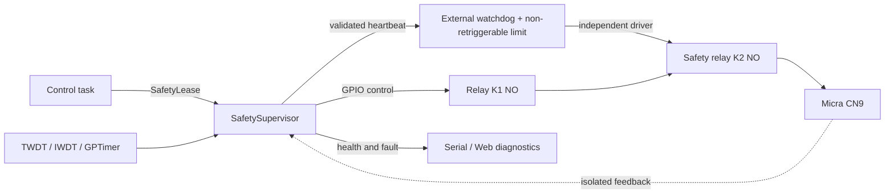

# Implementation Plan: Watchdog and CN9 Safety

Date: 2026-08-09

Status: supervision core and durable reset handling implemented and verified;
K2 barrier and HIL validation still pending

Scope: ESP32, ESP32-C3, and ESP32-S3 with Arduino ESP32 core 3.3.3

## 1. Objective

Prevent a firmware lockup, starvation condition, partial failure, or logic
error from keeping CN9 closed indefinitely or without control.

The objective is stated as a measurable property:

> For every considered single failure, CN9 must return to its electrically open
> state within a documented maximum time without relying on the loop, BLE,
> Wi-Fi, flash, or scheduler continuing to work correctly.

The watchdog must also restart the ESP32 when a critical task stops making
progress. After restart, firmware must never resume the previous cycle or close
CN9 again before safe startup completes.

## 2. Correction of the original diagnosis

Before this implementation, firmware called `enableLoopWDT()` at the end of
`setup()`. In Arduino ESP32 3.3.3, that function only subscribed `loopTask` to
the Task Watchdog Timer (TWDT), and the core fed it before each call to
`loop()`.

That was a useful but insufficient defense:

- it proved only that `loopTask` was scheduled again, not that each control
  cycle completed correctly;
- it did not directly subscribe `scale_worker` or `network_manager`;
- a live `loop()` could feed the watchdog while another task was dead or
  starved;
- the existing CN9 limits used two `esp_timer` instances with `ESP_TIMER_TASK`
  dispatch, sharing the SoC, scheduler, and several failure modes;
- a race window existed between arming timers and publishing/closing CN9;
- an ESP32 reset cannot open a mechanically welded contact or overcome a
  shorted relay transistor.

The implementation removed that implicit dependency and replaced it with
explicit, verifiable configuration covering every critical task.

## Plan execution status

Implemented in firmware:

- a supervisor with `BOOT_SAFE`, `OPEN`, `ARMING`, `CLOSED`, `TRIPPED`, and
  `LOCKOUT` states, transactional generations, and published faults;
- electrical opening before stopping timers and closing only after every
  defense is armed;
- an ISR GPTimer deadline, two `esp_timer` backups, and control-task deadline
  verification;
- an explicit 5-second TWDT for control, BLE, and network tasks, with mandatory
  panic/reboot;
- Web restarts routed through a safe request that opens CN9 first;
- redundant RTC CLOSE/OPEN records, reset cause, a boot-loop breaker after
  three unsafe resets, and local paddle ON→OFF rearming without a Web bypass;
- equal cooperative priority with yields to prevent starvation on single-core
  C3;
- optional K2 heartbeat and isolated feedback interfaces, with
  mismatch/lockout handling;
- Web telemetry and host fault injection, including a timeout during `ARMING`;
- base and external-interface builds validated for ESP32, ESP32-C3, and
  ESP32-S3 with core 3.3.3; ISR opening uses direct GPIO writes from IRAM and
  was verified in all three target ELF files.

Pending and not replaceable by software:

- select, construct, and electrically review K2, its life detector, and its
  non-retriggerable limit after measuring CN9;
- complete HIL bench work, logic-analyzer measurements, brownout/power cuts, a
  72-hour soak, and 10,000 cycles per target.

Passing host tests and compilation therefore does not satisfy gates G3 through
G6 or justify a physical safety claim against a welded K1 contact.

## 3. Safety scope and honest limitations

This plan covers reasonable single software and control-hardware failures:

- stopped loop, BLE worker, or network task;
- starvation, deadlock, spin loop, or blocking call;
- interrupts blocked for too long;
- delayed or lost software timer;
- concurrent flash/Wi-Fi operation;
- reset, brownout, or boot loop;
- frozen GPIO, shorted driver, or welded relay contact;
- a logic error that continues running the loop and feeding a heartbeat;
- an old callback arriving after a new cycle starts.

Absolute safety cannot be promised against both series contacts welding at the
same time, wiring bypassing the barrier, incorrect isolation, fire, an internal
Micra failure, or unknown CN9 electrical requirements. Those risks require
electrical analysis and the machine's original protections; the stopper does
not replace them.

## 4. Mandatory invariants

These rules must be represented in code, tests, and review:

1. `OPEN` always dominates `CLOSE`: opening is idempotent, immediate, and never
   waits on queues, BLE, Web, NVS, or potentially blocking locks.
2. Only the safety module may write GPIOs controlling K1, external permission,
   and the safety heartbeat.
3. Any component may request opening; only the control task may request closing.
4. CN9 may be closed only with a current `SafetyLease`, valid generation,
   future operational deadline, and future absolute deadline.
5. An expired callback invalidates its generation even if CN9 has not yet
   closed. An invalid generation can never close later.
6. Timers are armed and validated before energizing; during opening, GPIO is
   driven safe first and timers are cleaned afterward.
7. No watchdog is fed by another task on behalf of the monitored task.
8. The external physical heartbeat is emitted only after a valid control epoch
   completes, never by PWM, an autonomous timer, or an ISR that could remain
   alive after control logic stops.
9. Flash, NVS, Wi-Fi, or maintenance work begins only under a
   `MaintenanceLease` with CN9 open and new closes inhibited.
10. Every reset, brownout, or unknown cause starts with both contacts open and
    requires self-test plus a stable physical paddle OFF before closing is
    enabled.
11. Web may issue `STOP` at any time but cannot bypass an inhibition, lockout,
    deadline, or physical authorization.
12. Published `relayClosed` is not real feedback; `commandedClosed`,
    `safetyGateClosed`, and `cn9FeedbackClosed` must remain distinct.

## 5. Layered target architecture



### Layer A — safe electrical state

- K1 and K2 must be normally-open contacts.
- Both drivers must remain de-energized during power-up, reset, brownout, and
  GPIO high impedance.
- Install physical pull-down or pull-up resistors according to actual polarity;
  do not depend solely on `pinMode()`.
- Use an oscilloscope and continuity measurement to verify that no close pulse
  occurs before the first `setup()` instruction.
- Preserve galvanic isolation and ratings suitable for actual CN9 voltage and
  current.

### Layer B — second contact and independent physical limit

Add K2 in series with K1. A circuit external to the ESP32 controls K2 and
provides two separate functions:

1. **Life detector:** requires valid pulses from `SafetySupervisor`. If pulses
   stop, K2 opens after a short deadline.
2. **Non-retriggerable absolute limit:** when energization begins, permits K2 to
   remain closed only for a physical maximum. Heartbeats cannot extend it. Only
   a stable OPEN dwell rearms the next cycle.

The non-retriggerable function covers a case where software continues to run
and feed the life detector while incorrectly preserving a CLOSE command. K2
also covers a welded K1 or shorted K1 driver. A simple retriggerable watchdog
on the same relay is insufficient.

The exact electrical implementation must be selected after measuring CN9 and
reviewed as a safety circuit. An ESP32 board with an integrated relay is
acceptable only if this series barrier can be added and isolation, startup
polarity, and electrical clearances are adequate.

### Layer C — real electrical feedback

Add an isolated input observing actual CN9 electrical state or mechanically
linked auxiliary contacts. Choose the method according to the actual CN9
signal; it must not inject dangerous voltage or join CN9 to ESP32 GND.

Required behavior:

- OPEN command with CLOSED feedback beyond the allowed mechanical time:
  `FEEDBACK_STUCK_CLOSED`, K2 opening, and lockout;
- CLOSE command with OPEN feedback: abort the cycle, open everything, and log
  `FEEDBACK_FAILED_TO_CLOSE`;
- unexpected transition during a cycle: open K1/K2 and lock out;
- invalid or missing startup feedback: `SAFE_LOCKOUT` with no ability to close.

If initial hardware cannot provide real feedback, firmware may compile in a
bench mode, but that variant must not be labeled a safety release.

### Layer D — single relay owner

Create `shotStopper/ShotStopperSafety.h` and
`shotStopper/ShotStopperSafety.cpp`. The module encapsulates:

- GPIO and polarities for K1, heartbeat, K2 permission, and feedback;
- `SafetyState { BOOT_SAFE, OPEN, ARMING, CLOSED, TRIPPED, LOCKOUT }`;
- generation, deadlines, and `SafetyLease`;
- operational timer, absolute limit, and fault counters;
- emergency opening callable from a task or authorized callback;
- read-only snapshots for control, Web, and diagnostics.

Conceptual public functions:

```cpp
bool begin(const SafetyHardwareConfig &hardware);
CloseResult requestClose(const SafetyLease &lease);
void requestOpen(SafetyOpenReason reason);
void emergencyOpenFromTimer(uint32_t generation);
bool completeHealthyControlEpoch(const ControlHealth &health);
SafetySnapshot snapshot();
```

The CN9 opening path will not use dynamic memory, `String`, Serial, NVS, BLE,
or blocking calls.

### Layer E — internal timers independent from the control task

Retain deadline verification during every loop epoch and add a low-latency
GPTimer alarm. The installed core supports GPTimer on ESP32, C3, and S3 and
places its handler in IRAM.

Before selecting a final primitive, prove that the complete ISR path that
de-energizes K1 is IRAM-safe on all three targets. If direct GPIO register
access is required, isolate it behind a per-SoC HAL with compilation tests. The
ISR must only:

- write the OPEN level;
- invalidate the current generation;
- set an atomic/volatile trip flag;
- return without logging, allocation, blocking locks, or context switching.

GPTimer improves latency but remains on the same SoC. It does not replace K2 or
the external limit.

### Layer F — internal watchdogs

Explicitly configure the ESP32's existing mechanisms:

- **TWDT:** reconfigure with `trigger_panic=true`, check every return, and
  confirm the panic handler reboots production builds;
- **IWDT:** keep it enabled to detect blocked interrupts/critical sections;
- **brownout detector:** keep it enabled and validate its threshold with power
  supply, relays, Wi-Fi, and BLE active;
- **bootloader watchdog:** verify that it remains enabled on all three targets.

Core 3.3.3 currently uses a 5-second TWDT with panic/reboot and a 300 ms IWDT,
but firmware must not silently depend on defaults. It must print and publish
effective configuration and enter `SAFE_LOCKOUT` if required supervision
cannot be established or verified.

Minimum TWDT subscriptions:

| Subscriber | Permitted feed point |
| --- | --- |
| Control/loop | Only after a full epoch completes with valid invariants |
| `scale_worker` | After one complete, bounded BLE iteration |
| `network_manager` | After completing one nonblocking FSM iteration |
| Persistence | After each finite operation, never inside an infinite wait |

Replace the `void`-returning `enableLoopWDT()` with verifiable initialization
and subscription through `esp_task_wdt_*`. No central task may feed TWDT for
another task based only on a timestamp; every owner must prove its own progress.

### Layer G — health table and recovery

In addition to TWDT, retain a health table for diagnostics and policy:

| Resource | Progress signal | First response | Terminal response |
| --- | --- | --- | --- |
| Control | valid epoch completed | open CN9 | watchdog/reset |
| SafetySupervisor | lease/deadline validated | open K1/K2 | lockout/reset |
| BLE | iteration and recent valid packet | degrade to manual | reset if task is stuck |
| Network | FSM iteration completed | disable Web | reset if task is stuck |
| NVS | operation completed | mark dirty/retry | lockout if safety is affected |
| Feedback | expected physical transition | open everything | persistent lockout |

Web health must not be required for an already-started local physical operation,
but a truly stuck network task must recover to avoid partially dead firmware.

## 6. Proposed timing budget

The following values are starting points. Adjust them using p99.999
measurements and component tolerances, never intuition alone.

| Limit | Initial value | Purpose |
| --- | ---: | --- |
| Healthy control epoch | ≤ 100 ms | detect degraded loop |
| External heartbeat | every 50–100 ms | prove live control |
| External life timeout | ≤ 750 ms | open K2 if control stops |
| IWDT | current 300 ms | blocked interrupts/scheduler |
| TWDT | initial 5 s | reset critical task without progress |
| Configurable operational maximum | ≤ 60 s | workflow-requested limit |
| Software absolute limit | 60 s | final internal software boundary |
| Physical K2 absolute limit | ≤ 60 s | non-retriggerable external boundary |
| Opening confirmation | ≤ 100 ms | detect stuck contact/feedback |

The implemented configuration must satisfy:

```text
operational deadline <= 60 s
software absolute deadline = 60 s
physical K2 absolute cutoff <= 60 s
```

For a software lockup during CLOSE, the external life timeout must open CN9
well before the TWDT reset. For a logic bug that continues emitting heartbeats,
the physical absolute cutoff must open it no later than 60 seconds. An
installation that requires diagnostic margin between normal workflow and the
absolute boundary should configure its operational deadline below 60 seconds;
the UI may never accept a value above 60,000 ms.

## 7. Transactional closing protocol

`requestClose()` must implement this sequence and expose fault-injection hooks
between every step:

1. Confirm `SafetyState::OPEN`, stable OPEN feedback, and no lockout.
2. Validate origin, configuration, deadline, and an inactive
   `MaintenanceLease`.
3. Increment generation and publish `ARMING`, deadlines, and lease.
4. Arm the non-retriggerable physical limit first and verify K2 permission.
5. Arm GPTimer/software timers with the same generation.
6. Reread clock, generation, feedback, and state; open if anything changed.
7. Energize K1 inside the smallest possible critical section.
8. Publish `CLOSED` and immediately confirm that generation/deadline remain
   current.
9. Wait for CLOSED feedback only for the bounded mechanical window; on failure,
   open and lock out.

The deadline callback must turn both `ARMING` and `CLOSED` into `TRIPPED`. If a
timer expires before step 7, resumed execution therefore cannot close.

## 8. Opening and reset protocol

`requestOpen()` must follow the reverse risk order:

1. De-energize K1 immediately, even when logical state says OPEN.
2. Remove the permission/heartbeat keeping K2 closed.
3. Invalidate the generation and publish `TRIPPED` or `OPEN`.
4. Verify OPEN feedback within the mechanical deadline.
5. Only then stop/clean timers and finish the software session.

A failure to stop a timer can never prevent or reverse opening. Old callbacks
compare generations and may only write OPEN.

Every voluntary restart path must pass through `safeRestart(reason)`:

1. inhibit new closes;
2. execute `requestOpen()`;
3. verify OPEN feedback;
4. save only minimal diagnostics when safe;
5. call `esp_restart()`.

A watchdog or brownout can prevent that sequence, which is why default
electrical state and K2 are mandatory.

## 9. Recovery after reset

At the earliest part of `setup()`, before Serial, EEPROM, BLE, or Wi-Fi:

1. apply de-energized levels to K1 and K2 permission;
2. configure GPIO and apply OPEN again;
3. read feedback and reset reason;
4. initialize timer and watchdog while checking return values;
5. validate hardware configuration and polarities;
6. enter `REQUIRES_OFF` or `SAFE_LOCKOUT`.

Record in RTC memory with a CRC, without writing flash from an ISR/panic:

- most recent generation and safety state;
- whether CN9 was commanded closed;
- latest valid control epoch;
- fault code and consecutive-reset count.

At the next boot, combine that record with `esp_reset_reason()`. If reset was
caused by WDT, panic, brownout, an unknown source, occurred during closing, or
repeats three times in a defined window, preserve `SAFE_LOCKOUT`. Lockout is
released only with the physical paddle OFF, OPEN feedback, a correct self-test,
and an explicit local action—never by an automatic remote command.

## 10. Concrete changes by file

| File | Planned change |
| --- | --- |
| `shotStopper/ShotStopperSafety.h/.cpp` | owner of GPIO, leases, timers, feedback, heartbeat, and lockout |
| `shotStopper/ShotStopperDomain.h` | pure types: safety state, fault codes, health, and timing policies |
| `shotStopper/shotStopper.ino` | remove direct relay access; integrate control epochs and per-task TWDT |
| `shotStopper/ShotStopperNetwork.cpp` | replace direct `ESP.restart()` with `safeRestart`; nonblocking FSM and maintenance lease |
| `shotStopper/ShotStopperPersistence.h` | reset record, boot-loop policy, and safe read-back outside cycles |
| `shotStopper/ShotStopperWebAssets.h` | display reset reason, lockout, feedback, and health; no safety-bypass control |
| `shotStopper/tests/` | supervisor model, interleavings, fake clocks, and fault injection |
| `.github/workflows/ci.yml` | per-target builds, ownership tests, and flash budget |

As an architectural defense, CI must fail if a write to safety GPIOs appears
outside `ShotStopperSafety.cpp`.

## 11. Implementation phases

### Phase 0 — specification and safe bench

- Measure CN9 voltage, current, polarity, and behavior.
- Document the actual board, relay module schematic, and reset states.
- Define final timing-budget values and tolerances.
- Prepare a bench with simulated load, logic analyzer, continuity measurement,
  and programmable power interruption.
- Create a fault tree and FMEA with owner and evidence for each risk.

**Exit:** approved electrical specification and tests that can run without
connecting the Micra. Until K2 is complete, firmware is not released as a
safety boundary or for unsupervised operation.

### Phase 1 — SafetySupervisor and race correction

- Move all relay control into the single module.
- Implement states/generations and closing/opening protocols.
- Fix the arming race and the dangerous ordering that stopped timers before
  opening.
- Create a fake HAL with an injectable pause/timeout at every instruction.
- Preserve existing non-safety functional behavior.

**Criterion:** across every tested interleaving, CN9 ends OPEN or closing is
rejected; no old callback can close or affect a new cycle.

### Phase 2 — internal supervision and scheduling

- Explicitly configure and verify TWDT/IWDT.
- Subscribe control, BLE, and network; feed each only from its own progress.
- Convert long network/persistence operations into bounded FSMs before
  supervising them.
- Eliminate C3 starvation using measured yield/event waits, without blindly
  raising priorities.
- Add GPTimer and verify an IRAM-safe path on all three targets.
- Implement the health table, `safeRestart()`, and stack/heap/latency telemetry.

**Criterion:** freezing each task individually produces safe degradation or
reset within its deadline; control, Idle, BLE, and network show bounded
progress on single-core C3 and dual-core targets.

### Phase 3 — physical barrier, feedback, and lockout

- Build K2, the life detector, and non-retriggerable limit.
- Add isolated feedback and startup resistors.
- Make heartbeat conditional on a healthy epoch.
- Implement mismatch detection and lockout.
- Add test points for K1, K2, heartbeat, feedback, and CN9.

**Criterion:** stopping the clock/CPU, fixing a GPIO, shorting a driver, or
welding K1 cannot keep CN9 closed beyond the measured K2 limit.

### Phase 4 — durable reset and recovery

- Record reset reason and prior state in RTC with CRC.
- Implement boot-loop breaking and lockout startup.
- Replace all direct restarts with safe requests.
- Expose diagnostics without allowing remote bypass.

**Criterion:** no reset resumes an extraction; a reset during CLOSE always
starts OPEN and requires local rearming conditions.

### Phase 5 — fault injection and HIL validation

- Run the complete matrix on ESP32, C3, and S3.
- Measure actual times with a logic analyzer, not firmware timestamps.
- Exercise brownout, power cuts, saturated RF/Wi-Fi, and blocked flash/HCI.
- Test disconnected relays, shorted drivers, and one welded contact at a time.
- Run at least a 72-hour soak and 10,000 close/open cycles per target.

**Criterion:** zero spontaneous closes, zero closes beyond the physical limit,
zero resets that resume a cycle, and zero undiagnosed false-OPEN feedback.

### Phase 6 — controlled release

- Create inseparable hardware and firmware revision identifiers.
- Build production without K2/feedback bypasses.
- Publish HIL results, tolerances, and residual risks.
- Deploy first on the bench, then with a supervised machine, and expand only
  while evidence remains stable.

## 12. Minimum fault-injection matrix

| Injected failure | Mandatory result |
| --- | --- |
| frozen `loopTask` | K2 opens on life timeout; TWDT restarts |
| `scale_worker` frozen in HCI | automatic mode degrades or K2 opens; TWDT restarts |
| frozen `network_manager` | Web fails; TWDT restarts; CN9 stays within limits |
| disabled interrupts | IWDT/reset and K2 fail-open |
| starved `ESP_TIMER_TASK` | GPTimer/control/K2 preserve limits |
| pause at every `requestClose()` step | never closes without generation/timer |
| old callback after rearming | can only be ignored or open |
| full queue / low memory | close rejected or safe manual cycle |
| NVS/flash write during cycle attempt | maintenance lease prevents closing |
| slow and fast brownout | no CLOSE pulse; safe-state boot |
| software reset during CLOSE | prior opening or K2; no automatic resume |
| K1 GPIO stuck at active level | K2 limits closing |
| shorted K1 driver | K2 limits closing |
| welded K1 contact | K2 opens and feedback causes lockout |
| disconnected/shorted feedback | close rejected or lockout |
| external heartbeat stuck high/low | detector rejects static signal and opens |
| endless valid heartbeat with logic bug | absolute monostable opens on time |
| three consecutive WDT resets | boot-loop lockout without enabling CN9 |
| connected JTAG debugger | test marked invalid for certification |

OpenOCD commonly disables internal watchdogs while stopped at a breakpoint.
No result obtained with JTAG connected counts as evidence of real watchdog
behavior.

## 13. Required automated tests

### Host

- complete `SafetySupervisor` transition table;
- clock and generation wrap;
- timeout before, during, and after energizing;
- concurrent `OPEN` and `CLOSE`;
- duplicate, late, and out-of-order callbacks;
- failure of every HAL call;
- corrupted boot record and reset loop;
- property tests: never `GPIO_CLOSE` without valid lease/deadline/generation.

### Bench firmware

- an artificially frozen task on each target;
- spin with and without interrupts;
- simulated blocking inside BLE, HTTP, and NVS;
- measure control-to-OPEN, timer-to-OPEN, lost-heartbeat-to-K2-OPEN, and
  reset-to-safe-GPIO latency;
- stack high-water mark, minimum heap, jitter, and control-loop misses;
- saturated RF and blocked Serial.

### Hardware

- COM/NO continuity during power-up, reset, brownout, and 3.3 V loss;
- minimum/maximum monostable tolerance across temperature and supply;
- isolation and electrical clearance;
- single K1/K2/driver/feedback failures;
- no bounce that allows a new cycle without OPEN dwell.

## 14. Release gates

Compilation and host tests do not indicate completion. All gates are required:

1. **G1 — software ownership:** single owner, SS-02 race fixed, and green
   interleaving tests.
2. **G2 — watchdog:** every critical task supervised, reboot verified, and reset
   cause observable.
3. **G3 — hardware:** validated K2, non-retriggerable limit, fail-open startup,
   and real feedback.
4. **G4 — HIL:** complete failure matrix with measurements on ESP32/C3/S3.
5. **G5 — soak:** 72 hours per target and 10,000 cycles without violations.
6. **G6 — operation:** published wiring documentation, HW/FW review, residual
   risks, and lockout/recovery procedure.

Release authorization must fail closed: when a safety capability or its
self-test is missing, firmware remains available for diagnostics but CN9 stays
open.

## 15. Final acceptance criteria

- CN9 is physically open at power-off, boot, reset, and lockout.
- No tested single failure keeps CN9 closed indefinitely.
- A stopped control task opens K2 within the measured external timeout.
- A logic error that continues feeding heartbeat cannot exceed 60 seconds.
- A welded K1 or shorted K1 driver is contained by K2.
- Every close has traceable lease, generation, deadlines, and feedback.
- Every open is idempotent and nonblocking.
- Every critical task stops feeding its own watchdog when it stops progressing.
- Every production WDT/panic leads to a reboot and is diagnosed after return.
- No cycle automatically resumes after any reset.
- Measurements, not only internal state, demonstrate opening times.

## 16. Technical references

- [ESP-IDF Watchdogs](https://docs.espressif.com/projects/esp-idf/en/v5.5/esp32/api-reference/system/wdts.html)
- [ESP-IDF ESP Timer](https://docs.espressif.com/projects/esp-idf/en/latest/esp32/api-reference/system/esp_timer.html)
- [ESP-IDF GPTimer](https://docs.espressif.com/projects/esp-idf/en/v5.1.2/esp32/api-reference/peripherals/gptimer.html)
- [ESP-IDF Fatal Errors and panic behavior](https://docs.espressif.com/projects/esp-idf/en/latest/esp32/api-guides/fatal-errors.html)
- [ESP-IDF reset reason and system reset](https://docs.espressif.com/projects/esp-idf/en/v5.5/esp32/api-reference/system/misc_system_api.html)
- [Arduino ESP32 loop watchdog API](https://github.com/espressif/arduino-esp32/blob/3.3.3/cores/esp32/esp32-hal-misc.c)
- [Arduino ESP32 loop task feeding](https://github.com/espressif/arduino-esp32/blob/3.3.3/cores/esp32/main.cpp)
- [Shot Stopper audit](../audits/SHOT_STOPPER_ROBUSTNESS_SAFETY_AUDIT.md)
