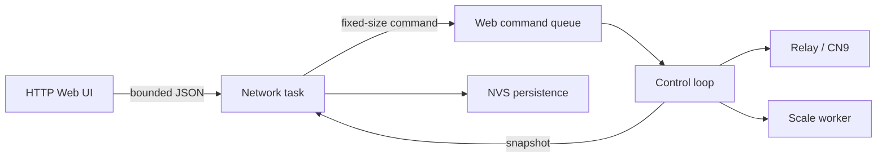

# Wi-Fi and Web UI Implementation Plan

## Goals

- Remove the old BLE configuration peripheral while retaining BLE central support for the scale.
- Provide a password-protected recovery AP and a simple local Web UI.
- Keep all Web operations isolated from real-time relay and paddle control.
- Persist validated workflow, Wi-Fi and AP password settings safely.

## Architecture

The HTTP server handles only authentication, parsing, validation and snapshots. The control loop is the sole owner of the state machine and relay. A command is validated again when it reaches the control loop, so a request racing with the start of a cycle is rejected instead of being applied later.

## Network policy

Saved STA credentials cause a 15-second STA/DHCP attempt. On success, the server remains available for the lifetime of the connection and Serial prints the assigned IP. On failure, or when no credentials exist, AP recovery starts at `192.168.4.1` for three minutes. AP and STA are mutually exclusive. Network scanning is asynchronous, limited, and cancelled as soon as control leaves Ready.

## Security and limits

The AP has a configurable WPA2 password, initially `Micra1234`; the same password protects the UI. Password verification uses a salted SHA-256 verifier with constant-time comparison. Sessions, CSRF tokens, request bodies, command queues and log batches are bounded. Passwords are never exposed in status or logs.

CN9 has an independent hard timer. The Web UI cannot change configuration during a cycle, cannot access the relay directly, and a virtual paddle stops when its heartbeat expires. These are safety boundaries, not merely UI restrictions.
