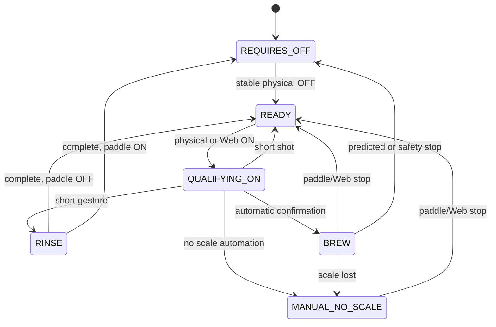
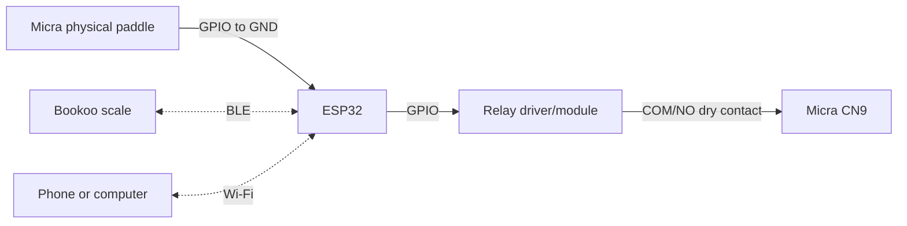

# Micra Shot Stopper

This firmware uses an ESP32 and an isolated relay contact to control the La Marzocco Micra CN9 paddle circuit. The physical Micra paddle is **not** connected to CN9: it connects only between the configured ESP32 GPIO and GND. The relay COM/NO contact is the only connection to CN9.

> Safety notice: validate continuity, relay-open behavior at boot/reset/power loss, and every manual test before connecting the machine. This project cannot make an unsafe relay module or wiring safe.

## Functional behavior

At boot the relay is open. The controller requires a stable physical paddle OFF before it becomes Ready. From Ready, paddle ON closes CN9 and begins gesture qualification.

- Releasing within the rinse-gesture time starts a rinse. CN9 remains closed for the configured rinse duration; subsequent paddle changes are ignored during rinse.
- Holding ON to the brew-confirmation time begins an automatic brew when scale automation was available at cycle start; otherwise it becomes a manual no-scale cycle.
- Releasing after the rinse window but before confirmation is a short manual shot and opens CN9.
- Releasing during brew or manual operation opens CN9 immediately.
- A scale disconnect during an automatic brew changes the rest of that cycle to manual. It never changes an active manual cycle into automatic.
- Weight prediction can end a confirmed brew only after its configured minimum time. Timer-only mode keeps timer/tare behavior but disables prediction and learning.
- Every closed-CN9 path is constrained by the configurable operational wall limit and by an absolute 50-second safety limit.



## Scale and prediction

The firmware uses the existing Acaia BLE central connection. It does not expose a BLE configuration peripheral. For an automatic brew, the scale session begins with the cycle and the predictor uses a regression of the latest valid samples to estimate when `target - learned offset` will be reached. It does not simply stop at the first target-weight sample. Post-shot drip analysis updates the offset only when the required valid, new scale readings are available.

New settings use a 1,500 ms rinse gesture and enable both the Bookoo combined tare/start command and **Beep when brew is confirmed**. The latter sends a Bookoo-compatible independent beep after a confirmed automatic brew; it is ignored in timer-only mode, never tares the scale, and cannot change the BLE connection state.

The default-on **Scale reminder beep until the physical paddle is switched OFF** emits a state-safe scale beep every 15 seconds while the physical paddle GPIO is ON (circuit closed), CN9 is open, and the scale is connected. This helps the operator notice a paddle left ON after a completed shot. It is configurable in the Web UI and only emits on scales that support the independent, non-taring beep command.

## Web UI and Wi-Fi

See [Wi-Fi and Web UI Guide](WIFI_WEB_UI_GUIDE.md). The embedded Web UI uses English only and provides an ON/OFF virtual-paddle switch, rinse, stop, restart, workflow configuration, Wi-Fi setup, asynchronous scanning, a confirmed factory reset and a bounded diagnostic log.

The UI cannot alter workflow settings during an active cycle. It never owns GPIO, relay or BLE access; it sends bounded commands to the control loop. Thus a slow HTTP client, scan, DHCP operation or NVS write cannot intentionally block control processing.

## Hardware



Use a relay/contact rating and isolation appropriate to CN9. Never connect CN9 to ESP32 GND, VCC or a GPIO, and use COM/NO rather than NC.

## Build and upload

Install `esp32 by Espressif Systems` 3.3.3 and ArduinoBLE 2.1.0. From the repository root:

```sh
arduino-cli compile --fqbn esp32:esp32:esp32 examples/shotStopper
arduino-cli upload --port /dev/cu.usbserial-0001 --fqbn esp32:esp32:esp32 --input-dir examples/shotStopper/build examples/shotStopper
```

Select the board-specific preprocessor block in `shotStopper.ino`. The normal ESP32 DevKit V4 mapping is paddle GPIO 27 and relay GPIO 26. Verify your relay module polarity before connecting CN9.

Run automated checks before upload:

```sh
./examples/shotStopper/tests/run_host_tests.sh
./examples/shotStopper/tests/run_coverage.sh
```

The compiled application image is `shotStopper.ino.bin`; `arduino-cli upload --input-dir` is preferred because it writes the bootloader, partitions and application at their required offsets.
